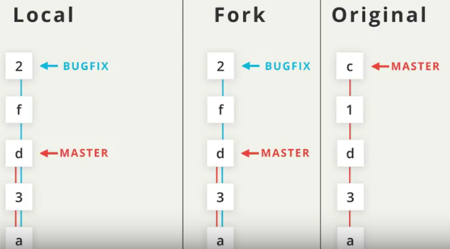

# GitHub: staying in sync with a remote repository

**Udacity Full Stack Web Developer Nanodegree program**

Part 02. Developer Tools

Lesson 10. Staying in sync with a remote repository (from [free Git course](https://www.udacity.com/course/version-control-with-git--ud123))

Brendon Smith

br3ndonland


## Create a pull request

**Create pull requests from topic branches.**

* Forked the course-collaboration-travel-plans repo, then cloned it to desktop. 
* Created a topic branch: `$ git checkout -b include-brendons-destinations`
* Made changes and committed to topic branch: `$ git commit -m "Add Brendon's destinations"`
* Configured repo for ssh: `$ git remote set-url origin git@github.com:br3ndonland/course-collaboration-travel-plans.git`
* Pushed the topic branch to GitHub: `$ git push origin include-brendons-destinations`
* At first, I was a little confused as to why you would need to branch if you have already forked. It's for practical reasons. When submitting a pull request, the pull request name is auto-populated from the branch name.
* On the "Open a pull request" screen:
  - the `base fork` is the original repo that the fork was created from. 
  - The `head fork` is the branch in your fork that is currently set to `HEAD` on GitHub. 
  - When I first got to the pull request screen, it showed `base fork: udacity/course-collaboration-travel-plans`. If I had submitted the pull request this way, it would have gone to Udacity. Instead, I switched to `base fork: br3ndonland/course-collaboration-travel-plans`. This basically becomes a merge. Udacity didn't clearly instruct the students to fork before submitting pull requests, which is why the [repo has thousands of pull requests](https://github.com/udacity/course-collaboration-travel-plans/pulls).


### Instructor comments

>   A pull request is a request for the source repository to pull in your commits and merge them with their project. To create a pull request, a couple of things need to happen:
> 
>   * you must fork the source repository
>   * clone your fork down to your machine
>   * make some commits (ideally on a topic branch!)
>   * push the commits back to your fork
>   * create a new pull request and choose the branch that has your new commits
>
>   As you can see, it's actually not too difficult to create a pull request. When I was first learning Git, GitHub, and how to collaborate, I was extremely nervous about making commits, and working with remote repos, but especially submitting a pull request to another developer's project! As long as you following the steps we covered in the previous section on:
> 
>   * reviewing the project's CONTRIBUTING.md file
>   * checking out the project's existing issues
>   * talking with the project maintainer
> 
>   ...your pull request is sure to be included!


## Staying in sync with the source project

### Stars and popularity

> Starring can be a useful feature to help you keep track of repositories you're interested in. But stars have also turned into a means of measuring a repo's popularity.
> 
> If you'd rather not increase a repository's stars, then check out "watching" a repository.


### Watching

Watching enables notification of changes to a repo


### Including Upstream Changes

*We have a clone of a fork. How do we stay in sync with the original master?*



* We can either pull from the master into the origin fork and then to the clone, or just pull directly from the origin master and then push to our fork.
* Richard named the master `upstream`. It could be any name. The name `upstream` was already provided by Udacity:
  ```bash
  $ git remote -v
  ```
  ```
  origin  git@github.com:br3ndonland/course-collaboration-travel-plans.git (fetch)
  origin  git@github.com:br3ndonland/course-collaboration-travel-plans.git (push)
  upstream  https://github.com/udacity/course-collaboration-travel-plans.git (fetch)
  upstream  https://github.com/udacity/course-collaboration-travel-plans.git (push)
  ```
* Note that `origin` points to the fork.
* *Using git fetch upstream master pulled in the changes from the master branch on the upstream remote repository. What single command would we use if we want to fetch the upstream/master changes and merge them into the master branch?*
  - `git pull upstream master`
  - Remember that `pull` does both a `fetch` and `merge`.


## Manage an active PR

> The project maintainer may decide not to accept your changes right away. They might request you to make some additional changes to your code before accepting your request and merging in your changes. Most likely they will communicate their desired changes through the conversation on the pull requests page.
> 
> 
> One thing that I've grown to love about both the Git command line tool and the GitHub interface is how helpful they are with recommendations on what to do next. Near the bottom of the comments, there's a suggestion by GitHub that tells us how to add more commit; we need to add them to the same branch and push to my fork:
> 
>   > Add more commits by pushing to the include-richards-destinations branch on richardkalehoff/course-collaboration-travel-plan.
> 
> When you submit a pull request, remember that you're asking another developer to add your code changes to their project. If they ask you to make some minor (even major!) changes to your pull request, that doesn't mean they're rejecting your work! It just means that they would like the code added to their project in a certain way.
> 
> The CONTRIBUTING.md file should be used to list out all information that the project's maintainer wants, so make sure to follow the information there. But that doesn't mean there might be times where the project's maintainer will ask you to do a few additional things.
> 
> So what should you do? Well, if you want your pull request to be accepted, then you make the change! Remember that the tab in GitHub is called the "Conversation" tab. So feel free to communicate back and forth with the project's maintainer to clarify exactly what they want you to do.
> 
> It also wouldn't hurt to thank them for taking the time to look over your pull request. Most of the developers that are working on open source projects are doing it unpaid. So remember to:
> 
> * be kind - the project's maintainer is a regular person just like you
> * be patient - they will respond as soon as they are able
> 
> So Lam is asking that I combine my changes together before she'll merge in my pull request. Combining commits together is a process called squashing. Let's look at how to do that!
> Recap
> 
> As simple as at may seem, working on an active pull request is mostly about communication!
> 
> If the project's maintainer is requesting changes to the pull request, then:
> 
> * make any necessary commits on the same branch in your local repository that your pull request is based on
> * push the branch to the your fork of the source repository
> 
> The commits will then show up on the pull request page.
> 

## Squash commits with rebase

`git rebase -i <base>`

* To reference commits, `HEAD~3`, SHA, branch name, or tag name can be used.
* Richard recommends making a backup branch before rebasing.


## Course wrap-up

* [http://up-for-grabs.net/](http://up-for-grabs.net/#/)
* [http://www.firsttimersonly.com/](http://www.firsttimersonly.com/)
* [first-timers-only label on GitHub](https://github.com/search?utf8=%E2%9C%93&q=label%3Afirst-timers-only+is%3Aopen&type=Issues&ref=searchresults)
* ["first timers only" blog post](https://medium.com/@kentcdodds/first-timers-only-78281ea47455)
* try tackling some Git and GitHub challenges with the [Git-it app](https://github.com/jlord/git-it-electron)

Wanna see what a developer's very first pull request is? Check out at http://firstpr.me/

