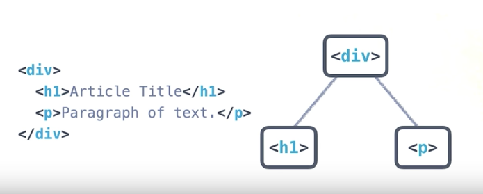

# HTML

<a href="https://www.udacity.com/">
  
</a>

Udacity Full Stack Web Developer Nanodegree program

Brendon Smith

br3ndonland

[Intro to HTML and CSS](https://www.udacity.com/course/intro-to-html-and-css--ud001)

Lesson 1. HTML

## Table of Contents

- [Table of Contents](#table-of-contents)
- [Lesson](#lesson)
  - [01. Lesson Introduction](#01-lesson-introduction)
  - [02. HTML Structure Part 1](#02-html-structure-part-1)
  - [03. Quiz: Make Your First Element](#03-quiz-make-your-first-element)
  - [04. Environments](#04-environments)
  - [05. Text Editors](#05-text-editors)
  - [06. Browsers](#06-browsers)
  - [07. Udacity Front End Feedback Extension](#07-udacity-front-end-feedback-extension)
  - [08. Workflow](#08-workflow)
  - [09. Quiz: Make All the Headers](#09-quiz-make-all-the-headers)
  - [10. Trees](#10-trees)
  - [11. HTML and Trees](#11-html-and-trees)
  - [12. Quiz: Spot the Bug](#12-quiz-spot-the-bug)
  - [13. Quiz: Tree to HTML](#13-quiz-tree-to-html)
  - [14. Quiz: HTML Research](#14-quiz-html-research)
  - [15. Quiz: Make a List](#15-quiz-make-a-list)
  - [16. A Guide to Paths](#16-a-guide-to-paths)
  - [17. Constructing Links](#17-constructing-links)
  - [18. Quiz: Add an Image](#18-quiz-add-an-image)
  - [19. Quiz: Figures](#19-quiz-figures)
  - [20. HTML Forms](#20-html-forms)
  - [21. HTML Structure Part 2](#21-html-structure-part-2)
  - [22. HTML Documents in Depth](#22-html-documents-in-depth)
  - [23. Mockup to Website](#23-mockup-to-website)
  - [24. HTML Syntax Outro](#24-html-syntax-outro)

## Lesson

### 01. Lesson Introduction

The instructor Cameron starts off talking about massive redwood trees. Trees will be a recurring theme in web development. HTML has a tree structure.

### 02. HTML Structure Part 1

- Anything within `<>` is a type of HTML element called a **tag**.
- Other tags include `<p></p>`, `<h1></h1>`, and `<span></span>`.
  - `<p></p>` will be on its own, `<span></span>` is inline.
- There is always an opening and closing tag.
- The tag, and the content within the tag, is called an **element**.

### 03. Quiz: Make Your First Element

**I typed this in Sublime Text. So much faster with tag autocompletion.**

```html
<span><i>Why do you think you'll be a good web developer?</i></span>

<p>I am motivated by two primary outcomes in my life: personal growth and positive impact. Web development fulfills both these outcomes.

I am most happy when I am improving myself. Web development provides an almost unlimited set of tools and skills to be learned, and the resources to learn them. I have enjoyed my web development work so far, and appreciate how quickly I can see myself making progress.

Web development will also enable me to have a positive impact on the world by building technology tools for science. I am convinced that science is central to our existence as modern intelligent humans, but concerned that we are not doing scientific research effectively. I will be able to deliver improved technology tools that will make science more efficient, reproducible, and sustainable.</p>

<span><i>Great answer brohan!</i></span>
```

*Congratulations! You made your first element! No issues!*

### 04. Environments

- The development environment includes all software and code that you're running. The text editor and browser are two key aspects of the development environment.
- Apple XCode and Microsoft Visual Studio are IDEs. We won't need IDEs for web development because the browser runs the code.

### 05. Text Editors

- Sublime text 3
- Atom
- Notepad++
- Emacs
- Vi/Vim
- Microsoft Word displays rich text. **Never, ever use Word for coding.** Code should be written in plain-text ASCII characters.

### 06. Browsers

- We will be working with Chrome.
- They also speak highly of Firefox.

### 07. Udacity Front End Feedback Extension

> While writing code in the Udacity classroom is a great way to learn web development, we think it's really important that you practice working with a text editor and a web browser on your own computer. We also think it's incredibly important that you get feedback on your code as you write it. So, we created the Udacity Front End Feedback Extension to give you feedback on your sites as you work on your own computer.
>
> To use the extension, you'll write code in your text editor (doesn't matter which one) and then load your site in Google Chrome (or Mozilla Firefox) with the extension enabled. For some quizzes, the extension will give you a code that you'll copy and paste back into the classroom to let us know that you've finished the quiz successfully.

### 08. Workflow

- Edit files in text editor as HTML.
- Open in browser

### 09. Quiz: Make All the Headers

index.html

```html
<!DOCTYPE html>
<html lang="en">
<head>
  <meta charset="UTF-8">
  <title>Headers Quiz</title>
  <!-- the next line loads the tests for the Udacity Feedback extension -->
  <meta name="udacity-grader" content="http://udacity.github.io/fend/fend-refresh/lesson2/problem-set/headers/tests.json">
</head>
<body>
  <p>Add your headers below this paragraph element! Add an h1, h2, h3, and h4 to finish the quiz. And make sure every header has text content :)</p>
  <h1>big big header</h1>
  <h2>big header</h2>
  <h3>header 3</h3>
  <h4>hey I'm h4! Don't forget about me!</h4>
</body>
</html>
```

### 10. Trees

Trees are used in computer science to represent hierarchical data.

### 11. HTML and Trees

HTML uses a tree structure. Content is nested within divs. Div stands for division.



### 12. Quiz: Spot the Bug

We looked at ways to correctly format and nest HTML tags.

### 13. Quiz: Tree to HTML

Build this:


```html
<!DOCTYPE html>
<html lang="en">
<head>
  <meta charset="UTF-8">
  <title>Tree to HTML</title>
  <!-- the next line loads the tests for the Udacity Feedback extension -->
  <meta name="udacity-grader" content="http://udacity.github.io/fend/fend-refresh/lesson2/problem-set/tree-to-html/tests.json">
</head>
<body>
  <!-- Did you notice that the body tag - the top of the sample tree - is already here? You don't need to add another one. -->
  <!-- Your code goes here! -->
  <h1>Tree to HTML</h1>
  <div>
      <p>I want you to build this tree with HTML.</p>
      <p>Here is another paragraph!</p>
  </div>
</body>
</html>
```

### 14. Quiz: HTML Research

- [MDN HTML Element Reference page](https://developer.mozilla.org/en-US/docs/Web/HTML/Element)
- [MDN](https://developer.mozilla.org/en-US/docs/Web/Guide/HTML/HTML5)
- [HTML5 cheat sheet](https://www.wpkube.com/html5-cheat-sheet/)

```html
<p><b>This text should be bold.</b></p>
<p><i>And this text should have emphasis (italics).</i></p>
```

The b and i are used for other purposes. Recommended alternative tags:

```html
<p><strong>This text should be bold.</strong></p>
<p><em>And this text should have emphasis (italics).</em></p>
```

### 15. Quiz: Make a List

> Did you know that web developers spend 90% of their time looking things up?
>
> Ok, I made up that number.
>
> But seriously, making sense of documentation and looking up new techniques and technologies is a huge part of any web developer's work. And that's what I want you to do for this quiz.
>
> Actually, you might find that you can make an `<li>` element appear on the page without putting it inside a `<ul>` or `<ol>`. Just because this works doesn't mean that you should ever do this. It's the equivalent of writing a sentence with bad grammar - most people will probably understand what you mean but some people will get confused. In this case, "people" are browsers and "confused" means "render your website incorrectly."

### 16. A Guide to Paths

**I found this guide very interesting. It emphasized how websites are just collections of files on a computer that we call a server.**

> You'll soon make a website that displays an image that is stored locally on your computer. In order to display a local image, you need to be able to write a **path**.
>
> **tl;dr** If there is a file called `index.html` in a directory and there is another directory called `example/` in the same directory, you can access any files in `example/` from `index.html` with the URL (path) `example/filename.html`, e.g. `<a href="example/filename.html">Example Path</a>`.
>

#### Paths

> A path is a way of describing where a file is stored.
>
> Think of it like this:
>
> Anyone in the world can use the address 1600 Pennsylvania Ave NW, Washington DC, USA 20006 to find the White House. A street address is an absolute path to a location.
>
> But, if you were at the [Eisenhower Executive Office](https://www.google.com/maps/place/Eisenhower+Executive+Office+Building/@38.8974712,-77.0390948,17z/data=!4m7!1m4!3m3!1s0x89b7b7bcdec17ee3:0xf920b148b3d45e45!2s1600+Pennsylvania+Ave+NW,+Washington,+DC+20500!3b1!3m1!1s0x0000000000000000:0x054470506cffbeb3), you could also use the phrase "next door" to find the White House. "Next door" is a relative path because it depends on your current location.
>
> There are essentially two domains for paths that you'll need to consider as a web developer: paths to find files on your computer, **local** files, and paths to find files on other computers, **external** files.
>
>
> ##### Local Paths
>
> Computers have folders (also called "directories"). Operating systems like Windows, Mac and Linux organize _all_ of your files into a tree of directories called a **file system**. There's a top-most directory, often called the **root**, that contains all of the other directories. Within the root, there are files and directories. Within those directories are more files and more directories. And within those directories are even more files and directories, and so on.
>
> Compare this part of the file system on my computer:
>
> 
> <!-- Cloud source for image: https://d17h27t6h515a5.cloudfront.net/topher/2016/September/57ed86e8_local-paths/local-paths.png -->
>
> to a tree diagram showing the same directory structure:
>
> 
> <!-- Cloud source for image: https://d17h27t6h515a5.cloudfront.net/topher/2016/September/57ed8715_directory-structure-tree/directory-structure-tree.png -->
>
> Every file has an address, which we call the "path." An absolute path is written in relation to the computer's root directory. For instance, a file in the Documents folder on a Mac has a path that looks like this:
>
> ```text
> /Users/cameron/Documents/file.txt
> ```
>
> `file.txt` is stored inside `Documents/`. `Users/`, `cameron/` and `Documents/` are all names of directories. `Documents/` lives inside `cameron/` and `cameron/` lives inside `Users/`. `Users/` is inside the root directory, which is represented by the first `/`. The rest of the `/` are used to separate directories.
>
> When you open an HTML file in your browser, you're seeing the absolute path to the file on your computer.
>
> 
> <!-- Cloud source for image: https://d17h27t6h515a5.cloudfront.net/topher/2016/September/57ed87c3_absolute-path-browser/absolute-path-browser.png -->
>
> This URL will _only_ work for you on your computer. As no one else has your file system, this URL is unique to your computer. If you want other people to be able to access it, then you need an...
>
>
> ##### External Paths
>
> The process of loading a website from a URL like `https://www.udacity.com` mimics opening an HTML file that you've written and saved to your computer. Every website starts with an HTML file. It just so happens that when you want to visit a website, the HTML file that you want to open lives on a different computer. The computer responsible for giving you a website's files is called a **server**.
>
> Pointing your browser to `https://www.udacity.com` sends a request to Udacity's server for the HTML file (and others) that your computer needs to load the Udacity website. You can think of `udacity.com` as the root path of Udacity's server (computer) that anyone can access (the reality of the situation is actually much more complicated but the general idea is true). Unlike your personal computer (for now!), Udacity's servers run software that **expose** files to the web, which means that they make them available to anyone who wants them. Servers have an **external path** that anyone can access and is the reason why the web works.
>
> Different websites are just different collections of files. Every website is really just a server (or many servers) with an external address, which we call a URL. Servers store files and send them to computers who request them (the requesting computers are called **clients**).
>
> There are different **protocols** for serving files, the most common of which on the web are HTTP and HTTPS. When you open a file on your own computer, you're using the file protocol. You don't need to know much more about protocols for now, but if you're interested in learning (a lot!) more about HTTP, check out [Networking for Web Developers](https://www.udacity.com/course/networking-for-web-developers--ud256).
>
>
> ##### Relative Paths
>
> The relative path is similar to the absolute path, but it describes how to find to a file from a directory that is not the root directory. Like using the phrase "next door" to tell someone how to find the White House from the Eisenhower Executive Office, a relative path takes advantage of the location of one file to describe where another file can be found.
>
> Relative paths work the same for both local and external paths. Let's break down two examples of absolute paths to see how relative paths work.
>
> **External**:
>
> ```html
> <a href="http://labs.udacity.com/fend/example/hello-world.html">Hello, world!</a>
> ```
>
> **Local**:
>
> ```html
> <a href="/Users/cameron/Udacity/etc/labs/fend/example/hello-world.html"> Hello, world!</a>
> ```
>
> `href` is really just a path to a file.
>
> Both examples are links to the same file using absolute paths, but the external example would work for anyone and only my computer can use the link in the local example.
>
> Pay attention to the `fend/example/hello-world.html` portion of both paths - they mean the same thing.
>
> Imagine that you are editing `/Users/cameron/Udacity/etc/labs/fend/test.html`. `test.html` can reference `hello-world.html` by describing how to get from it's location in `fend/` to `hello-world.html`. The relative path would look like:
>
> ```text
> example/hello-world.html
> ```
>
> This relative path takes advantage of the fact that `test.html` and `example/` are in the same directory.
>
> But what if I'm editing a file in `/Users/cameron/Udacity/etc/labs/` and I want to write a path to `hello-world.html`? In that case, the relative path would be:
>
> ```text
> fend/example/hello-world.html
> ```
>
> Now that I'm in `labs/`, not `fend/`, I have to include `fend/` in a relative path to `hello-world.html`.
>
> To finish this off, let's imagine there are two files:
>
> ```text
> http://labs.udacity.com/science/sciences.html
> ```
>
> and
>
> ```text
> http://labs.udacity.com/science/physics/relativity.html
> ```
>
> In order to write a relative path from `sciences.html` to `relativity.html`, I only need to include the part of the path that describes how to get from `science/` to `relativity.html`:
>
> ```html
> <a href="physics/relativity.html">Einstein's Special Relativity</a>
> ```
>
> And that's it! Now it's time to apply your new skills.

### 17. Constructing Links

Type in a link that points to [https://www.google.com](https://www.google.com) and displays as Google.

```html
<a href="https://www.google.com">Google</a>
```

### 18. Quiz: Add an Image

```html
    <!-- Sample image element:

    

How to complete this quiz:

- Create an image element at the designated spot in the paragraph below.
- Set the source to: http://udacity.github.io/fend/images/udacity.png
- Set the alt description to a quick description of the image (maybe something like, "Udacity logo").
- Play around with the URL! See if you can make a different image appear.
-->

<p>
    This is a big paragraph of text about Udacity. Cool. Cool. And here is an image!
    <!-- put the image element here! -->
    
</p>

```

> Here's another question for you: how is the text reacting to the image? Is the image on its own line or is it showing up in the same last as the rest of the text?

### 19. Quiz: Figures

The `<figure></figure>` [element](https://developer.mozilla.org/en-US/docs/Web/HTML/Element/figure) was new to me.

There were two ways to complete the quiz. I used option 2.

Option 1

```html

  <p>
    Stout Memorial Grove in Jedediah Smith Redwoods State Park in 2011 by Chmee2 (Own work) GFDL or CC BY-SA 3.0, via Wikimedia Commons -
    <a href="https://commons.wikimedia.org/wiki/File%3AStout_Memorial_Grove_in_Jedediah_Smith_Redwoods_State_Park_in_2011_(22).JPG">Source</a>
  </p>
```

Option 2 (adding figure tag)

```html
<figure>
  
  <figcaption>Stout Memorial Grove in Jedediah Smith Redwoods State Park in 2011 by Chmee2 (Own work) GFDL or CC BY-SA 3.0, via Wikimedia Commons -
  <a href="https://commons.wikimedia.org/wiki/File%3AStout_Memorial_Grove_in_Jedediah_Smith_Redwoods_State_Park_in_2011_(22).JPG">Source</a>
  </figcaption>
</figure>
```

> **Indentation Discussion**
>
> I usually indent child elements inside parents. Notice that the img and figcaption are both indented inside the figure in the solution to option 2. I don't indent when a child element is part of a line or sentence. For instance, I don't indent links because their content is read as part of a sentence.
>
> I also indented the text content inside the p in option 1 and the figcaption in option 2. I did this because the text looks like a big block in my code editor and it's easier to read if it is on its own line.

### 20. HTML Forms

I love forms and user input! It's **Human-Computer Intelligent Interaction.**

[HTML5 input types](https://developer.mozilla.org/en-US/docs/Web/HTML/Element/input)

> #### Forms
>
> Forms are everywhere on the web. Here's a form you filled out when you signed up for Udacity!
>
> 
> <!-- Cloud source for image: https://d17h27t6h515a5.cloudfront.net/topher/2016/October/57f808b9_udacity-sign-up/udacity-sign-up.png -->
>
> And, here's a form I filled out when I ordered a new blender online.
>
> 
> <!-- Cloud source for image: https://d17h27t6h515a5.cloudfront.net/topher/2016/October/57f80a1e_shipping-form/shipping-form.png -->
>
> Forms allow users to interact with your site. Normally, forms take the information submitted by a user and send it somewhere to be processed. The sending and receiving of information using a form will be covered in later courses; however, for this next quiz, you'll learn how to plan out and structure a form given some specifications.
>
> To do this, you'll first need to know about the different HTML form tags available to you.
>
>
> ##### `<form>` tag
>
> The `<form>` tag will be the parent element that contain all of the code for the form. The form fields, the buttons, etc. need to be enclosed inside these tags.
>
> ```html
> <form action="" method="">
>   <!-- stuff goes here -->
> </form>
> ```
>
> the `action` and `method` attributes tell the form where and how to send the form data, respectively. You will not need them in this course, so we will leave them blank for now.
>
>
> ##### `<input>` tags
>
> The `<input>` tag lets you add form fields for the user to enter their information. Each input tag will have an attribute called `type` to indicate what type of form field to put in the form:
>
> ```html
> <input type="text">
> ```
>
> There are a ton of input types available with HTML5. You can check out the [list](https://developer.mozilla.org/en-US/docs/Web/HTML/Element/input) here if you're curious. Each different input type changes the type of form field that's rendered on the page. Here's an example using the date, radio, and checkbox input types.
>
> ```html
> <input type="checkbox"> You can check me off the list!
> ```
>
> You can check me off the list!
>
> ```html
> <input type="radio"> On the radio... oh oh.
> ```
>
> On the radio... oh oh.
>
> ```html
> <input type="date">
> ```
>
> One particular example that's a little different than the others is the `<textarea>` tag. It's similar to `<input type="text">` but you can use it to create a multi-line text input box for your user.
>
> ```html
> <textarea>
> ```
>
> Here's a place to write a lot of stuff.
>
>
> ##### `<label>` tag
>
> A form is no good if your user doesn't know what to put in each box! The `<label>` tag adds text to an `<input>` field so the user knows what information is being asked for.
>
> 
> <!-- Cloud source for image: https://d17h27t6h515a5.cloudfront.net/topher/2016/October/57f81304_example-no-label-form/example-no-label-form.png -->
>
> For accessibility reasons, it's important to associate each input element with a label. One way to do this is to use the `<label>` tag. Screen readers and other programs designed for accessibility will help bring focus to an input field and its description when labels are appropriately linked to their input fields using the `for` and `id` attributes.
>
> ```html
> <label for="name">What is your name?</label> <input type="text" id="name">
> <!-- for= and id= are both "name" -->
> <label for="age">How old are you?</label> <input type="number" id="age">
> <!-- for= and id= are both "age" -->
> ```
>
> > What is your name?
> >
> > How old are you?
>
> ##### `<button></button>`
>
> Finally, the user needs to be able to do something with the data. There are buttons for this!
>
> HTML5 has the `<button></button>` element. Buttons also have a type (you can read about them [here](https://developer.mozilla.org/en-US/docs/Web/HTML/Element/button)) so you can specify whether the button submits data or resets (clears) it. Buttons also have the added benefit of being able to display anything in the button by just adding content inside the button tags.
>
> ```html
> <button>I am just a button.</button>
> <button type="submit">I am a submit button!</button>
> <button type="reset">I am a reset button!</button>
> <button type="button">I am a button with an image! <br> </button>
> ```
>
> > I am just a button.
> >
> > I am a submit button!
> >
> > I am a reset button!
> >
> > I am a button with an image!
> > 
> <!-- Cloud source for image: https://d125fmws0bore1.cloudfront.net/assets/svgs/icon-rocket-3d59dfa75cb89b0356997dcb453c534f7c5837fb21a612652cdd15d264a84d9c.svg -->
>
> Often, you will use a submit button to submit and process the information in the form. For now, focus on making your forms look great and you'll make those submit buttons functional in a later course. 😊
>
> Great! Now that you have all the pieces of an HTML form, try making a form in the next quiz.

### 21. HTML Structure Part 2

### 22. HTML Documents in Depth

- We went through doctypes, head, body
- tried just typing `<h1>This is a title</h1>` without the doctype into the [W3C HTML Validator](https://validator.w3.org/#validate_by_input) and got an error:

> Thanks for completing that!
> Nice work! The validator didn’t know what type of document it was, so it assumed it was HTML 4.01. There are also errors and warnings about missing doctypes and unknown character encodings.

```html
<!DOCTYPE html>
<html>
<head>
    <title>title fo sho</title>
</head>
<body>
    <h1>This is a title</h1>
</body>
</html>
```

> #### HTML Doctypes
>
> An HTML document will usually start with a type declaration (which is not a tag, so it should not have a closing tag). The declaration helps the browser determine what type of HTML document it’s trying to parse and display.
>
> If you’ve ever looked at an [older website](http://www.3riversstadium.com/index2.html) using dev tools, you might have noticed a doctype that looks like this:
>
> ```html
> <!DOCTYPE HTML PUBLIC "-//W3C//DTD HTML 4.01//EN" "http://www.w3.org/TR/html4/strict.dtd">
> ```
>
> (Triggers Standards mode but specifies an older form of validation.)
>
> Or maybe you didn’t see a doctype at all?
>
> ```html
>     <html>
>
>     </html>
> ```
>
> (Triggers “Quirks” mode. This is bad.)
>
> But newer websites (and your websites!) will have a declaration that looks like this:
>
> ```html
> <!DOCTYPE html>
> ```
>
> (Triggers Standards mode with all updated features.) 😊
>
>
> Browsers look for this doctype declaration to determine which **rendering mode** to use to render the site. Generally, newer sites follow standard HTML specifications. The current standard HTML specification is called HTML5 (which is what you're learning!). On the other hand, older sites, created before HTML standards really existed, might use a different rendering mode that imitates the behavior of older browsers.
>
> If you are interested in reading more about doctype declarations and different rendering modes, you can read about them [here](https://developer.mozilla.org/en-US/docs/Quirks_Mode_and_Standards_Mode).
>
> Once you’ve declared the doctype, the next part of your HTML document is the `<html>` tag, which tells the browser that everything enclosed inside the `<html> ... </html>` should be parsed as HTML. Then you have the two main sections of your HTML document: `<head>` and `<body>`
>
> 
> <!-- Cloud source for image: https://d17h27t6h515a5.cloudfront.net/topher/2016/July/578ea34e_html-tree/html-tree.png -->
>
> #### Basic HTML Tree Structure
>
>
> `<head>` and `<body>`
>
> The `<head>` will contain general information and metadata about the page, while the `<body>` will contain the content that will be displayed on the page. Here’s an example tree structure for a full HTML document:
>
> 
> <!-- Cloud source for image: https://d17h27t6h515a5.cloudfront.net/topher/2016/July/578ea3b9_full-html-tree/full-html-tree.png -->
>
> All of the HTML syntax that you’ve learned in this lesson will help you create the **content** of the page, which is always contained inside the `<body>` tags. The `<body>` is always visible.
>
> The `<head>`, on the other hand, is never visible, but the information in it describes the page and links to other files the browser needs to render the website correctly. For instance, the `<head>` is responsible for:
>
> - the document’s title (the text that shows up in browser tabs): `<title>About Me</title>`.
> - associated CSS files (for style): `<link rel="stylesheet" type="text/css" href="style.css">`.
> - associated JavaScript files (multipurpose scripts to change rendering and behavior): `<script src="animations.js"></script>`.
> - the charset being used (the text's [encoding](https://en.wikipedia.org/wiki/Character_encoding)): `<meta charset="utf-8">`.
> - keywords, authors, and descriptions (often useful for [SEO](https://en.wikipedia.org/wiki/Search_engine_optimization)): `<meta name="description" content="This is what my website is all about!">`.
> - and more!
>
> At this point, just focus on these two tags:
>
> - `<title>About Me</title>`
> - `<meta charset="utf-8">`
>
> `<meta charset="utf-8">` is pretty standard, and will allow your website to display any [Unicode character](http://unicode-table.com/en/). ([Read more on how UTF-8 works here](https://en.wikipedia.org/wiki/UTF-8).) `<title>` will define the title of the document and will be displayed in the tab of the browser window when a user visits the page.
>
> 
> <!-- Cloud source for image: https://d17h27t6h515a5.cloudfront.net/topher/2016/July/578ea580_full-html-template/full-html-template.png -->

#### HTML Validators

> This might seem like a lot to remember, but thankfully, there are tools out there to help you. Much like how the Udacity Feedback Extension tells you when you've met all the requirements for a particular project, [HTML validators](https://validator.w3.org) analyze your website and verify that you're writing valid HTML.
>
> I want you to try one out now!
>
>
> ##### Question 1 of 2
>
> Using the [W3C HTML Validator](https://validator.w3.org/#validate_by_input), what happens when you enter the following HTML into the "validate by input" text box:
>
> ```html
> <h1>This is a title</h1>
> ```
>
> - The validator found errors or warnings in the HTML
> - The validator crashed because the HTML was in the incorrect format
> - The validator assumed the document was HTML5
> - The validator assumed the document was something other than HTML5
>
>
> ##### Question 2 of 2
>
> Now, modify the HTML you entered previously so it follows the HTML template. Make sure to set doctype for HTML5!
>
> What is the message displayed once the validator successfully validates your code?
>
> - No errors found while checking this document as HTML5!
> - Document checking completed.
> - No errors or warnings to show.
> - Document checking completed. No errors or warnings to show.

### 23. Mockup to Website

Going from designers/UX who provide images to the actual website.

> #### Mockup to Website
>
> It's common for web developers to work with designers who focus on creating user interfaces and user experiences. Designers use software like Adobe Photoshop to mock up - draw - websites. The mockups that they create are usually just images of websites with some annotations and descriptions.
>
> As a web developer, one of the tasks you might be asked to do is take a mockup created by a visual designer and translate it into a live website. I use the word "translate" because the process of going from mockup to website is similar to the process of translating between natural languages. Just as you can create the same meaning using different words and phrases with a natural language, you can create the same website design using different HTML elements.
>
> I want you to practice the process of going from a mockup to a website now! Here is a website mockup (note: I zoomed in for the screen shot):
>
> 
> <!-- Cloud source for image: https://d17h27t6h515a5.cloudfront.net/topher/2017/June/593763fd_mockup/mockup.png -->
>
> You can find a copy of this image in `web-dev-blog.zip` in the instructor notes. You'll also find a file to start editing (`index.html`) and a copy of the mockup.
>
> There are many ways to turn this mockup into website. As such, you won't be getting feedback on your site using the Chrome extension. Rather, I want you to compare your website to the mockup. You'll know you've finished this exercise when your site looks the same :)
>
>
> #### How to Complete this Quiz
>
> 1. Download and unzip [web-dev-blog.zip](https://www.udacity.com/api/nodes/7231514902/supplemental_media/web-dev-blogzip/download?_ga=1.140458419.1290139238.1470161293).
> 2. Open the mockup and decide how you want to create the article.
> 3. Edit `index.html` until your website looks identical to the mockup.
> 4. Practice indenting children elements. I'll show you how I indented my HTML in the solution.
>
> Just to be clear, there is no feedback from the Chrome extension. It's up to you to decide when your website looks identical to the mockup.
>
> **Task List**
>
> Edit the HTML so your website looks _exactly_ like the mock up. Click here when you're done.
>
> #### Supporting Materials
>
> [web-dev-blog.zip](https://www.udacity.com/api/nodes/7231514902/supplemental_media/web-dev-blogzip/download)

<details>
  <summary>Solution code</summary>

```html
<!DOCTYPE html>
<html lang="en">
<head>
  <meta charset="UTF-8">
  <title>Web Dev Blog Post</title>
</head>
<body>
  <!-- This is adapted from: http://blog.udacity.com/2016/01/hottest-jobs-in-2016-2-web-developer.html -->
  <!-- Format the text below! -->
  Hottest Jobs in 2016 #2: Web Developer

  By Christopher Watkins

  January 19, 2016

  http://i1.wp.com/blog.udacity.com/wp-content/uploads/2016/01/Slack-for-iOS-Upload.jpg?zoom=2&amp;resize=320%2C168

  There is a simple reason why Web Developer is such a hot job right now. Put simply, what Web Developers do is create how we experience … the web. If you proceed from the notion that every person who engages with the web would prefer a great experience, then you can say that everyone who engages with the web would prefer that a Web Developer have done a great job. Companies of course know this, so they hire Web Developers to ensure their sites provide great experiences. So, lots of websites and lots of users means lots of demand. LOTS of demand. 🔥
</body>
</html>
```

</details>

### 24. HTML Syntax Outro

[(Back to TOC)](#table-of-contents)