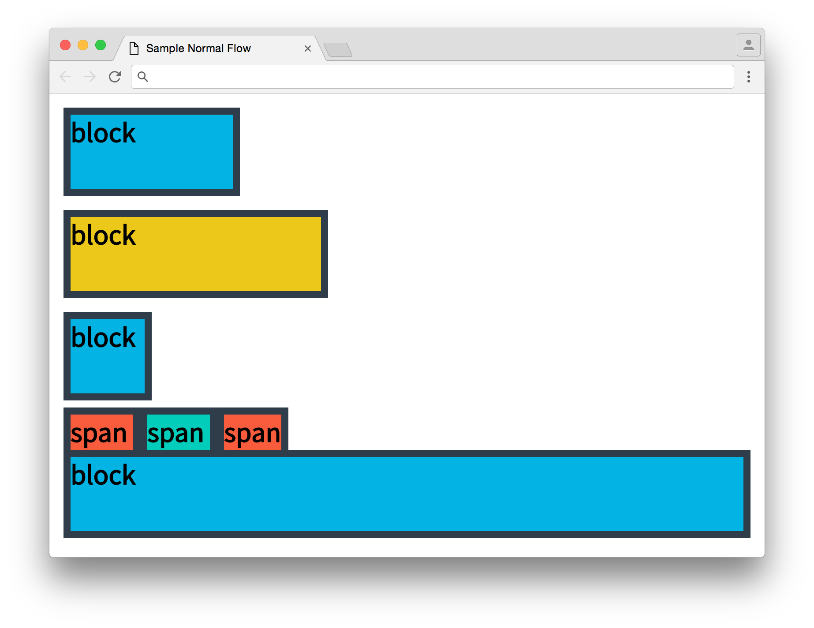

# Positioning

<a href="https://www.udacity.com/">
  
</a>

Udacity Full Stack Web Developer Nanodegree program

Brendon Smith

br3ndonland

## Table of Contents

- [Table of Contents](#table-of-contents)
- [Lesson](#lesson)
  - [01. Intro](#01-intro)
  - [02. Normal Flow](#02-normal-flow)
  - [03. Normal Flow Quiz](#03-normal-flow-quiz)
  - [04. Inline-Block](#04-inline-block)
  - [05. Why Two Lines](#05-why-two-lines)
  - [06. Anonymous Boxes](#06-anonymous-boxes)
  - [07. Relative Flow](#07-relative-flow)
  - [08. Relative Flow Quiz](#08-relative-flow-quiz)
  - [09. Relative Neighbors](#09-relative-neighbors)
  - [10. 3D Websites](#10-3d-websites)
  - [11. Document and Viewport](#11-document-and-viewport)
  - [12. Fixed Flow](#12-fixed-flow)
  - [13. Fixed Flow Quiz](#13-fixed-flow-quiz)
  - [14. Absolute Flow](#14-absolute-flow)
  - [15. Inline Formatting](#15-inline-formatting)
  - [16. Debugging CSS Part 1](#16-debugging-css-part-1)
  - [18. Debugging CSS Solution](#18-debugging-css-solution)
  - [19. Outro](#19-outro)

## Lesson

### 01. Intro

Positioning elements is a lot like Tetris. It's easy to learn the basics, but mastery requires practice.

Web developers don't spend time memorizing positioning syntax.

Strategies:

- **Make good guesses**
- **Read documentation**
- **test, fix, iterate** to get it right.

I appreciate that they are teaching us how to think like programmers, rather than simply showing us.

### 02. Normal Flow

Instructor notes:

> The Game of Positions starts with this CSS property: `position`.
>
> #### `position: static;`
>
> Let's start with an analogy. Take a look at the image below. The arrows show how currents **flow** around the Australian continent.
>
> 
> <!-- Cloud source for image: https://lh3.googleusercontent.com/3D_WvaIJ1mBEISeNuSxiNYn6ixEYmrZv6mZBTOSbWqPZogUt8DcJdp_KSl0pMMETNBhWL6JrFJBYrWmtkDE=s0#w=550&h=358 -->
>
> © Commonwealth of Australia 2013 \[CC BY 3.0 au ([http://creativecommons.org/licenses/by/3.0/au/deed.en](http://creativecommons.org/licenses/by/3.0/au/deed.en))\], via Wikimedia Commons
>
> An object floating in the oceans around Australia ([like a rubber ducky](https://en.wikipedia.org/wiki/Friendly_Floatees)) would follow the path of the [currents](https://en.wikipedia.org/wiki/Ocean_current).
>
> The Game of Positions actually can be played with a few different sets of rules, which we sometimes call **flows** because of the way most developers think of elements flowing into place as if they were being pushed by a force, much like the currents flowing around Australia (and every other landmass, for that matter).
>
> So, how does this look with CSS?
>
> ```css
> .default {
>   position: static;
> }
> ```
>
> The default position is `static`, which gets called the **normal flow**. This is what you’ve been using in all of your sites so far. The `relative`, `absolute` and `fixed` flows are variations of the normal flow.
>
>
> #### How the Normal Flow Works
>
> The way elements will move in the normal flow depends on their display state as `block` elements or `inline` elements.
>
> 1. Block elements are aligned **vertically**.
> 2. Inline elements are aligned **horizontally**.
>
> <video src="img/fsnd01_15_02-normal-flow3.mp4" controls>
>   <a href="https://s3.amazonaws.com/content.udacity-data.com/courses/fend/normal-flow3.mp4">Animation showing positioning of webpage elements</a>
> </video>
> <!-- Cloud source for image: https://s3.amazonaws.com/content.udacity-data.com/courses/fend/normal-flow3.mp4 -->
>
> _(Elements don’t actually have a starting point on the screen. I picked the bottom middle arbitrarily. Depending on the flow that you’re using, you might do better thinking that your elements are coming in from the bottom left, or bottom right, or appearing randomly!)_
>
> Notice how the `<div>`s (block elements) stack vertically while the `<span>`s (inline elements) stack horizontally.
>
> Let's look at another example. Here is some HTML:
>
> ```html
> <!DOCTYPE html>
>     <html lang="en">
>     <head>
>       <meta charset="UTF-8">
>       <title>Sample Normal Flow</title>
>       <style> /- nothing but colors, widths and margins */ </style>
>     </head>
>     <body>
>       <div>block</div>
>       <div>block</div>
>       <div>block</div>
>       <span>span </span>
>       <span>span </span>
>       <span>span</span>
>       <div>block</div>
>     </body>
>     </html>
> ```
>
> And here is the [resulting website](http://udacity.github.io/fend/fend-refresh/lesson6/normal-flow/keynote-sample.html):
>
> 
> <!-- Cloud source for image: https://d17h27t6h515a5.cloudfront.net/topher/2016/July/578533c5_screen-shot-2016-07-12-at-13.23/screen-shot-2016-07-12-at-13.23.png -->
>
> Take a look at the way the block elements line up.
>
> The left edges of block elements line up.
>
> Block elements are laid out vertically. Their left outer edges will line up with their parent’s left outer edges. Even though these blocks do not take up the full width of the page, they still stack.
>
> Inline elements push together side by side.
>
> Inline elements are laid out horizontally inside their parents. The left edge of an element’s line box will touch the right edge of the preceding element’s line box.
>
> If a line box is too big for a line, it wraps around to the next line.
>
> And that’s it! The rules of the positioning game are pretty simple by themselves, but they can get complicated when they start building on each other. For instance, take a look at how the spans end up on a line of their own. The block elements seem to treat the inline elements _as a whole_ like a block. There's an interesting reason for this which you'll encounter later in this lesson.

### 03. Normal Flow Quiz

They gave us some CSS and HTML, and we had to predict how the website would look. I got it on my first try.

### 04. Inline-Block

Instructor notes:

> So far, there's been a distinction between inline and block elements. However, there’s a hybrid of the two!
>
> ```css
> .example {
>   display: inline-block;
> }
> ```
>
> `display: inline-block` elements can be sized like block elements but are laid out like inline elements.
>
> Take a look at this example. Notice that the `.random` span in the middle of the text has a width and height assigned to it but the span in the [resulting website](http://udacity.github.io/fend/fend-refresh/lesson6/inline-block/inline-block-example-start.html) (shown below) acts like a regular inline element - it is rendered as a line-box and the `width` and `height` are ignored.
>
> ```html
> <!DOCTYPE html>
>   <html lang="en">
>   <head>
>     <meta charset="UTF-8">
>     <title>Inline-Block Example</title>
>     <style>
>     {
>       box-sizing: border-box;
>       font-family: 'Source Sans Pro', sans-serif;
>       font-weight: bold;
>       }
>       .inline-block { /- hasn't been assigned! */
>         display: inline-block;
>       }
>       .random {
>         border: 2px solid #2e3d49;
>         background-color: #ecc81a;
>         width: 20em;
>         height: 40px;
>       }
>     </style>
>     <link href='https://fonts.googleapis.com/css?family=Source+Sans+Pro' rel='stylesheet' type='text/css'>
>   </head>
>   <body>
>     <div class="container">
>       <span>...</span>
>       <span class="random">This is a random span.</span>
>       <span>...</span>
>     </div>
>   </body>
>   </html>
> ```
>
> 
> <!-- Cloud source for image: https://d17h27t6h515a5.cloudfront.net/topher/2016/July/578665a4_screen-shot-2016-07-13-at-11.00.13/screen-shot-2016-07-13-at-11.00.13.png -->
>
> Looks like the random span is acting like a normal inline element.
>
> Now, I'll add `.inline-block` to the `.random` span.
>
> ```html
> <span class="random inline-block">This is a random span.</span>
> ```
>
> Take a look at [the website now](http://udacity.github.io/fend/fend-refresh/lesson6/inline-block/inline-block-example-inline.html) to see how it looks!
>
> 
> <!-- Cloud source for image: https://d17h27t6h515a5.cloudfront.net/topher/2016/July/578666a3_screen-shot-2016-07-13-at-11.04.41/screen-shot-2016-07-13-at-11.04.41.png -->
>
> Now the random span has a defined width and height and still appears in the same line as the rest of the text!
>
> You can see that the `.random` span is mixing the behavior of a block element and an inline element. But what if `display: inline-block` is applied to a block element, like a `<div>`?
>
> ```html
>
> <!DOCTYPE html>
>   <html lang="en">
>   <head>
>     <meta charset="UTF-8">
>     <title>Inline-Block Example</title>
>     <style>
>       {
>         box-sizing: border-box;
>         font-family: 'Source Sans Pro', sans-serif;
>         font-weight: bold;
>       }
>       .inline-block {
>         display: inline-block;
>       }
>       .random {
>         border: 2px solid #2e3d49;
>         background-color: #ecc81a;
>         /- no width this time, but you could certainly apply one */
>         height: 40px;
>       }
>     </style>
>     <link href='https://fonts.googleapis.com/css?family=Source+Sans+Pro' rel='stylesheet' type='text/css'>
>   </head>
>   <body>
>     <div class="container">
>       <span>...</span>
>       <div class="random inline-block">This is a random div.</div>
>       <div class="random inline-block">This is a second random div.</div>
>       <span>...</span>
>     </div>
>   </body>
>   </html>
> ```
>
> [This is what you'll see](http://udacity.github.io/fend/fend-refresh/lesson6/inline-block/inline-block-example-final.html):
>
> 
> <!-- Cloud source for image: https://d17h27t6h515a5.cloudfront.net/topher/2016/July/57866835_screen-shot-2016-07-13-at-11.09.20/screen-shot-2016-07-13-at-11.09.20.png -->
>
> Same thing!
>
> Regardless of the tag, any element with `display: inline-block` takes on the layout behaviors of an inline element with the sizing behaviors of a block element.
>
> Now that you've seen inline-block elements, I want to show you a quirk of HTML that shows up from time to time.

### 05. Why Two Lines

### 06. Anonymous Boxes

I figured this out quickly. He had two boxes that should have been on the same line, but they were on two lines. I viewed the page with developer tools and changed the width to 40%. The two elements were written as separate lines, and the browser interpreted the whitespace, newline, and tab as an **anonymous box**.

Quiz response:

> Thanks for completing that!
> Right! Believe it or not, tabs, spaces and newlines in HTML can actually become elements! The resulting elements are called "anonymous boxes," which get created in a number of scenarios. This is just one example of an anonymous box. Usually, anonymous boxes from whitespace don't affect the way a page displays, but this is an example of where they do!

References:

- [https://www.w3.org/TR/CSS2/visuren.html#anonymous-block-level](https://www.w3.org/TR/CSS2/visuren.html#anonymous-block-level)
- [http://book.mixu.net/css/1-positioning.html#anonymous-box-generation](http://book.mixu.net/css/1-positioning.html#anonymous-box-generation)

### 07. Relative Flow

**Relative flow allows objects to be shifted relative to the other elements in the flow, after elements are laid out in the normal flow.**

```css
.relative {
  position: relative;
  top: 10px;
  left: 10px;
  bottom: 10px; /- redundant if you've already defined top */
  right: 10px; /- redundant if you've already defined left */
}
```

Instructor notes
>
> ```css
> {
>   position: relative;
> }
> ```
>
> The **relative flow** is a variant of the normal flow and behaves basically the same. But, the relative flow adds some new abilities.
>
> The **relative flow** allows you to shift the position of elements _after_ they've been laid out in the normal flow.
>
> ```css
> .relative {
>   position: relative;
>   top: 10px;
>   left: 10px;
>   bottom: 10px; /- redundant if you've already defined top */
>   right: 10px; /- redundant if you've already defined left */
> }
> ```
>
> You can think of these new CSS properties, `top`, `left`, `bottom` and `right`, as adjustments to the normal flow. Setting any of them to any pixel value will shift the element by that much from where it _would_ have ended up in the normal flow.
>
> [Here is the example](http://udacity.github.io/fend/fend-refresh/lesson6/relative-flow/shift-two.html) from the animation.
>
> Note that you can use positive and negative pixel values. You aren't changing the width or height, only the position. As you can't shift an element both directions in one axis simultaneously, you should only use one of `top` and `bottom` or one of `left` and `right` at a time.
>
> Let's add another `<div>` and break down this example some more. Here's the HTML to start (notice that `position: relative` is commented out):
>
> ```html
> <!DOCTYPE html>
>   <html lang="en">
>   <head>
>     <meta charset="UTF-8">
>     <title>Relative Flow Example</title>
>     <link href='https://fonts.googleapis.com/css?family=Source+Sans+Pro' rel='stylesheet' type='text/css'>
>     <style>
>       {
>         box-sizing: border-box;
>         font-family: 'Source Sans Pro', sans-serif;
>         font-weight: bold;
>       }
>       div {
>         display: inline-block;
>         border: 2px solid #2e3d49;
>         width: 300px;
>         height: 50px;
>       }
>       div:nth-child(even) {
>         background-color: #02b3e4;
>       }
>       div:nth-child(odd) {
>         background-color: #ecc81a;
>       }
>       .shift {
>         /*position: relative;*/
>         top: 10px;
>         left: 10px;
>       }
>       .relative {
>         position: relative;
>       }
>     </style>
>   </head>
>   <body>
>     <div>I'm an inline-block div!</div>
>     <div class="shift">I'm an inline-block div!</div>
>     <div>I'm an inline-block div!</div>
>   </body>
>   </html>
> ```
>
> 
> <!-- Cloud source for image: https://d17h27t6h515a5.cloudfront.net/topher/2016/July/578e93af_screen-shot-2016-07-19-at-53.03/screen-shot-2016-07-19-at-53.03.png -->
>
> As all three divs are inline-block, they display in the same line.
>
> [This shows](http://udacity.github.io/fend/fend-refresh/lesson6/relative-flow/shift-three.html) exactly what you'd expect with the normal flow. Now I'll uncomment `position: relative` in the `.shift` ruleset, which should change the position of the second `<div>` (you should try this out with developer tools on your own!).
>
> ```css
> .shift {
>   position: relative;
>   top: 10px;
>   left: 10px;
> }
> ```
>
> 
> <!-- Cloud source for image: https://d17h27t6h515a5.cloudfront.net/topher/2016/July/578e9d95_screen-shot-2016-07-19-at-16.37.15/screen-shot-2016-07-19-at-16.37.png -->
>
> The second div is in a new position!
>
> The relatively positioned `.shift` element moved from its original position down by 10 pixels and right by 10 pixels. Now, it may seem weird that the element moved _down_ when the `top` property was added, but it makes sense when you consider the [coordinate system](https://en.wikipedia.org/wiki/Coordinate_system) that browsers use.
>
> You're probably familiar with the [Cartesian coordinate system](https://en.wikipedia.org/wiki/Cartesian_coordinate_system) from geometry or the [Polar coordinate system](https://en.wikipedia.org/wiki/Polar_coordinate_system) from trigonometry. Browsers use a slightly different coordinate system.
>
> 
> <!-- Cloud source for image: https://d17h27t6h515a5.cloudfront.net/topher/2016/July/578eb0d1_screen-shot-2016-07-19-at-17.58.34/screen-shot-2016-07-19-at-17.58.34.png -->
>
> The coordinate system that browsers use. The vertical axis, y, starts at 0 at the top and gets more positive as you go down, while the horizontal axis, x, starts at 0 on the left and gets more positive as you move right.
>
> Similar to the Cartesian coordinate system, there are _x_ and _y_ axes. But while the _y_-axis in the Cartesian system gets more positive as you go _up_, the _y_-axis in browsers starts with 0 at the top and gets more positive as you move _down_.
>
> Thus, when you set `top` to a positive number, you're actually moving the element down. And if you make `left` a positive number, you move the element to the right!
>
> Did you notice how the third element didn't move in the last example? Even after the second element shifted, the third element stayed in place. You'll be exploring why in the next quiz.

### 08. Relative Flow Quiz

Children of a relative element shift with the parent. Siblings don't shift.

### 09. Relative Neighbors

Browsers use a layering system, so some elements will be on top of others.

### 10. 3D Websites

> Browsers also have a third dimension: the z-dimension (also known as the z-axis). While x and y run along the computer screen's surface, z is the dimension that extends in to and out of the screen. By adding a third dimension, you can think of elements as appearing on different layers, similar to the kind of layers you would find in image-editing software like Adobe® Photoshop®.
>
> In CSS you can often use the z-index property to control the stacking order of overlapping elements on different layers (but [there are many gotchas!](https://philipwalton.com/articles/what-no-one-told-you-about-z-index/)).

### 11. Document and Viewport

- Document is the entire DOM
- Window is the total visible portion of the DOM
- Viewport is the portion of the DOM currently shown on the screen

### 12. Fixed Flow

`position: absolute` and `position: fixed`

|  | Relative | Absolute | Fixed |
|--|----------|----------|-------|
| **When** |  After normal flow | Before normal flow | Before normal flow |
| **Positioned relative to...** |  position in normal flow | parent | viewport

### 13. Fixed Flow Quiz

I added the following code to the sticky footer CSS:

```css
.sticky-footer {
  background-color: #15C26B;
  width: 100%;
  height: 50px;
  position: fixed;
  bottom: 0px;
}
```

### 14. Absolute Flow

> **When Would You Actually Use `position: absolute`?**
>
> Frankly, `position: absolute` is best thought of as a last resort. If all the other flows fail, then maybe absolute is your best option. Off the top of my head, I can't actually think of an instance where I wanted to use `position: absolute`. There are, in fact, other CSS techniques for achieving the same kind of shift, of which my favorite is `transform: translate`. ([Transform](https://developer.mozilla.org/en-US/docs/Web/CSS/transform) is a more advanced CSS property and it's incredibly powerful. I recommend checking it out).
> It's good to know what `position: absolute` does, but it's rarely your best positioning option.

### 15. Inline Formatting

Horizontal alignment: `text-align`. Left, right, center, justify.

Vertical alignment: `vertical-align`.

> There are two sets of values you can use to change text vertical alignment. The first set focuses on the parent's size, while the second set focuses on the element's line.
> `vertical-align: text-top`, `vertical-align: text-bottom` and `vertical-align: middle` are options for aligning text to the eponymous locations in the parent.
> `vertical-align: top` and `vertical-align: bottom` will align with the line instead.
> Deciding how and when to use vertical-align is usually more of an exercise in trial-and-error than careful consideration.

### 16. Debugging CSS Part 1

> Simple ideas form the basis of even the most complex system.

**Yes!**

Quiz part 1: add one line of CSS on the .sibling class, to move the "Relative Sibling" box down.

`vertical-align: top`

### 18. Debugging CSS Solution

**I didn't have the alignment problem the instructor was referring to, so I just moved on.**

I'll paste the explanation below:

> As I said earlier, I came across this problem on accident. I'm presenting the solution in an order that's efficient and effective for your understanding, but I want you to know that this is the end product of a lot of experimentation. I spent quite a bit of time in developer tools playing with CSS properties, predicting what would happen before I made a change and then drawing conclusions after. I'm not alone in my approach. Here's a quote from Warren Ouyang, our lead front-end engineer, to whom I gave this problem. After he finished it, he said,
>
> I would love to say I just looked at the code and figured it out, but **I also did a bunch of playing around with it to understand it**.
>
> Here we go!
>
> Remember, the shift from `position: relative` happens _after_ the normal flow finishes. Let's start with the normal flow. Ignore `position: relative` for now.
>
> Unchecking `position: relative` gives you this:
>
> Notice that the layout of two non-relative siblings stays the same!
>
> Here is your smoking gun. Look at how the text lines up. You've seen this before.
>
> 
> <!-- Cloud source for image: https://d17h27t6h515a5.cloudfront.net/topher/2016/August/57bb7f71_screen-shot-2016-08-22-at-17.39.27/screen-shot-2016-08-22-at-17.39.27.png -->
>
> Without relative positioning, the text lines up!
>
> The sibling is an inline box and the "Child" text inside it is its text. As you learned a few pages ago, text will line up with the baseline of a parent. The baseline of the parent is lowered by the extra text inside the relative sibling. As a result, the text of the other siblings is lowered.
>
> Now, realize that the _text_ lines up, not the whole inline block. Siblings have a defined height, which then extends below the text. The parent extends lower to fit all of the children.
>
> **So where is the gap coming from?** It _just so happens_ that the relative shift puts the `.relative` div slightly higher than its siblings.
>
> There's something curious about solving the last problem when you applied `vertical-align: top` to `.sibling`. You could have actually solved the problem by applying `vertical-align: top` to `.relative` too! `vertical-align: top` shifts the baseline of the relative element to the top, which means that the parent's baseline is back to the top. As a result, the two other siblings no longer get pushed up. Try it yourself and see what happens!

### 19. Outro

James explained that inline blocks are not the best option for the reasons we saw above.

[(Back to TOC)](#table-of-contents)