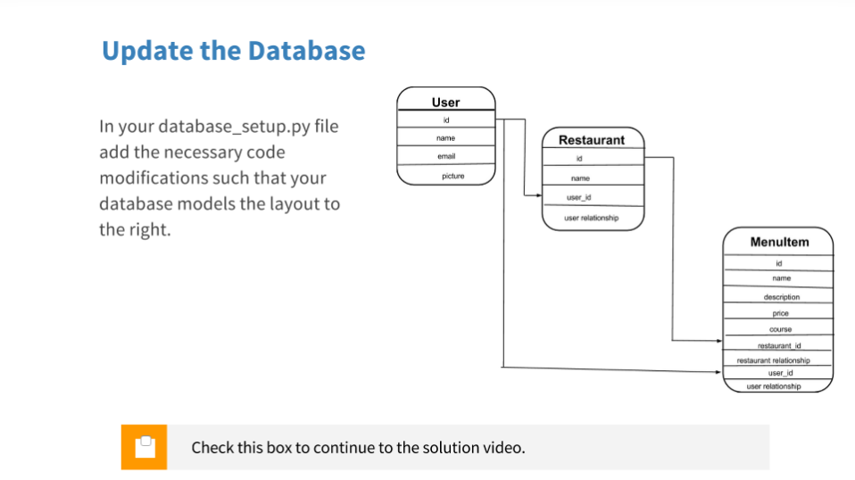

# Authentication and Authorization

**Udacity Full Stack Web Developer Nanodegree program**

Part 03. Backend

Lessons 10-13. Authentication and Authorization

Brendon Smith

br3ndonland

<!-- START doctoc generated TOC please keep comment here to allow auto update -->
<!-- DON'T EDIT THIS SECTION, INSTEAD RE-RUN doctoc TO UPDATE -->
**Table of Contents**  *generated with [DocToc](https://github.com/thlorenz/doctoc)*

- [Lesson 10. Authentication and Authorization](#lesson-10-authentication-and-authorization)
  - [10.01. Intro](#1001-intro)
  - [10.02. Course Map](#1002-course-map)
  - [10.03. Authentication](#1003-authentication)
  - [10.04. Quiz: Authentication is hard](#1004-quiz-authentication-is-hard)
  - [10.05. Quiz: Implementing Authentication is Hard](#1005-quiz-implementing-authentication-is-hard)
  - [10.06. Using Third Party Auth Providers](#1006-using-third-party-auth-providers)
  - [10.07. Authorization](#1007-authorization)
  - [10.08. Authentication without Authorization](#1008-authentication-without-authorization)
  - [10.09. Auth providers](#1009-auth-providers)
  - [10.10. Pros and Cons using Third Party](#1010-pros-and-cons-using-third-party)
  - [10.11. Quiz: Follow the Flow](#1011-quiz-follow-the-flow)
  - [10.12. Outro](#1012-outro)
  - [Feedback on Lesson 10](#feedback-on-lesson-10)
- [Lesson 11. OAuth Flows and Google Sign-In](#lesson-11-oauth-flows-and-google-sign-in)
  - [11.01. Intro to Lesson 2](#1101-intro-to-lesson-2)
  - [11.02. Types of Flow](#1102-types-of-flow)
  - [11.03. Google+ Auth for server side apps](#1103-google-auth-for-server-side-apps)
  - [11.04. Step 0 Get initial app running](#1104-step-0-get-initial-app-running)
  - [11.05. Quiz: Step 1 Create Client ID & Secret](#1105-quiz-step-1-create-client-id--secret)
  - [11.06. Quiz: Step 2 Create anti forgery state token](#1106-quiz-step-2-create-anti-forgery-state-token)
  - [11.07. Quiz: Step 3 Create login page](#1107-quiz-step-3-create-login-page)
  - [11.08. Quiz: Step 4 Make a Callback Method](#1108-quiz-step-4-make-a-callback-method)
  - [11.09. Quiz: Step 5 GConnect](#1109-quiz-step-5-gconnect)
  - [11.10. Quiz: Step 6 Disconnect](#1110-quiz-step-6-disconnect)
  - [11.11. Quiz: Step 7 Protecting Pages](#1111-quiz-step-7-protecting-pages)
  - [11.12. Wrap-up](#1112-wrap-up)
  - [Feedback on Lesson 11](#feedback-on-lesson-11)
- [Lesson 12. Local permission system](#lesson-12-local-permission-system)
  - [12.01. Lesson 3 Introduction](#1201-lesson-3-introduction)
  - [12.02. Implementing a Local Permission System](#1202-implementing-a-local-permission-system)
  - [12.03. Quiz: Updating the User Model](#1203-quiz-updating-the-user-model)
  - [12.04. Creating a New User](#1204-creating-a-new-user)
  - [12.05. Quiz: Obtaining Credentials of an Existing User](#1205-quiz-obtaining-credentials-of-an-existing-user)
  - [12.06. Quiz: Protect Menu Pages](#1206-quiz-protect-menu-pages)
  - [12.07. Wrap-Up Lesson 3](#1207-wrap-up-lesson-3)
  - [Feedback on Lesson 12](#feedback-on-lesson-12)
- [Lesson 13. Facebook OAuth](#lesson-13-facebook-oauth)
  - [13.01. Adding Additional OAuth Providers](#1301-adding-additional-oauth-providers)
  - [13.02. Registering your App with Facebook](#1302-registering-your-app-with-facebook)
  - [13.03. Client-Side Login with Facebook SDK](#1303-client-side-login-with-facebook-sdk)
  - [13.04. Quiz: Updating login.html](#1304-quiz-updating-loginhtml)
  - [13.05. Update project.py (part I)](#1305-update-projectpy-part-i)
  - [13.06. Update project.py (part II)](#1306-update-projectpy-part-ii)
  - [13.07. Quiz: Updating project.py Code](#1307-quiz-updating-projectpy-code)
  - [13.08. Exploring other OAuth2.0 Providers](#1308-exploring-other-oauth20-providers)
  - [13.09. Outro](#1309-outro)
  - [Feedback on Lesson 13](#feedback-on-lesson-13)

<!-- END doctoc generated TOC please keep comment here to allow auto update -->


## Lesson 10. Authentication and Authorization

### 10.01. Intro

Lorenzo is teaching this course.

Instructor notes

> [Learn JavaScript](https://www.udacity.com/course/ud804)
> 
> [Learn Ajax](https://www.udacity.com/course/ud110)
> 
> [Learn jQuery](https://www.udacity.com/course/ud245)
> 
> Set up your [Google](https://www.google.com/) account.
> 
> Set up your [Facebook](https://www.facebook.com/) account.


### 10.02. Course Map

Four lessons again:

1. Authentication and Authorization
2. Google sign-in for oauth2
3. Local permission system to protect each user's data from other users
4. Facebook as another oauth2 provider


Instructor notes

> Check out Udacity's awesome course on [Applied Cryptography](https://www.udacity.com/course/cs387) if you are interested in learning more about these concepts
> 
> [Here](http://lepture.com/en/2013/create-oauth-server) is a blog on creating a your own auth system with Flask.


### 10.03. Authentication
### 10.04. Quiz: Authentication is hard

Most important:

* Strong passwords
* Strong encryption
* Secure communication

Other security features:

* Password storage
* Two factor authentication
* Password recovery
* Man-in-the-middle attack protection


### 10.05. Quiz: Implementing Authentication is Hard


Instructor notes

Read more about:

[App for Checking password security](https://howsecureismypassword.net/)

[Password Storage - Hashing vs. Encrypting](http://www.darkreading.com/safely-storing-user-passwords-hashing-vs-encrypting/a/d-id/1269374)

[Man-in-the-Middle Attacks](http://en.wikipedia.org/wiki/Man-in-the-middle_attack)


### 10.06. Using Third Party Auth Providers

User authentication frameworks have already been developed, so we don't have to reinvent the wheel with each application.


### 10.07. Authorization

Authentication is verifying identity, authorization is access permissions.


### 10.08. Authentication without Authorization

I didn't get the quiz on the first few tries, and there were too many options to know where I was going wrong, so I just moved on.


### 10.09. Auth providers

OAuth


### 10.10. Pros and Cons using Third Party

People may be uncomfortable giving your app Google permissions because they may not want to give your app the ability to change unrelated aspects of their Google accounts. Establishing appropriate authorization permissions is key.


**Google created an [OAuth Playground](https://developers.google.com/oauthplayground/) to allow users to test their OAuth builds.**


### 10.11. Quiz: Follow the Flow
### 10.12. Outro

### Feedback on Lesson 10

Helpful to distinguish between authentication and authorization, and think about the pros and cons of third party sign in.


## Lesson 11. OAuth Flows and Google Sign-In

### 11.01. Intro to Lesson 2

### 11.02. Types of Flow

OAuth flows

Flow refers to how information is exchanged between the client, server, and OAuth provider. 

* Client-side authentication is performed by JavaScript from the user's browser. This is mostly for "single-page, browser-based web applications." Mobile devices can have full authentication functionality. It is quick and easy, but places a lot of trust in the browser or mobile device, and prevents the server from making API calls on behalf of the user.
* Server-side authentication can obtain an access token that allows the server to make API requests on behalf of the user.
* Google+ uses a hybridized flow. Client-side authentication is performed, but the server can still make API calls on behalf of the client. It is difficult for unauthorized users to obtain access codes.


### 11.03. Google+ Auth for server side apps

[Google OAuth2 documentation](https://developers.google.com/identity/protocols/OAuth2)


### 11.04. Step 0 Get initial app running

* We used Vagrant again here.
* I forked the [OAuth repo](https://github.com/udacity/OAuth2.0) and cloned it into the vagrant directory.
* Logged into vagrant as usual.
* Started up the Flask web server:
	```bash
	$ cd /vagrant/OAuth2.0
	vagrant@vagrant:/vagrant/OAuth2.0$ python database_setup.py
	vagrant@vagrant:/vagrant/OAuth2.0$ python lotsofmenus.py
	added menu items!
	vagrant@vagrant:/vagrant/OAuth2.0$ python project.py
	 *Running on http://0.0.0.0:5000/ (Press CTRL+C to quit)
	 *Restarting with stat
	 *Debugger is active!
	 *Debugger PIN: 769-024-554
	```


### 11.05. Quiz: Step 1 Create Client ID & Secret

The video walks through Google API project creation.

Client ID:  341643282477-2f7gkda35n3tprjh50fop8dtal16j84j.apps.googleusercontent.com 

Client secret:  7l0leWWnnEW9Z5ydZX4JJ2PY 

Instructor notes

> Errata:
> 
> Google has changed the user interface for obtaining OAuth credentials since this video was created. The functionality is the same, but the appearance is somewhat different from what's depicted here.
> 
> 1. Go to your app's page in the Google APIs Console — https://console.developers.google.com/apis
> 2. Choose Credentials from the menu on the left.
> 3. Create an OAuth Client ID.
> 4. This will require you to configure the consent screen, with the same choices as in the video.
> 5. When you're presented with a list of application types, choose Web application.
> 6. You can then set the authorized JavaScript origins, with the same settings as in the video.
> 7. You will then be able to get the client ID and client secret.
> 
> You can also download the client secret as a JSON data file once you have created it.


### 11.06. Quiz: Step 2 Create anti forgery state token

* This helps properly authenticate the user and prevent anti-forgery state attacks.
* We import Flask's version of sessions, and name it `login_session`:
	```python
	from flask import session as login_session
	import random, string
	```
* Session works like a dictionary and can store values.
* `random` and `string` are used to, you guessed it, generate a random string. Lorenzo generates the random object with the name `state`.
* The code for this step is in [another repo](https://github.com/udacity/ud330/blob/master/Lesson2/step2/project.py). I added it to *project.py*. Lots of formatting issues with the code as usual. In the instructor notes, I saw that there is another repo, [ud330](https://github.com/udacity/ud330), with updated code.

Got the authentication working.

http://0.0.0.0:5000/login
```
The current session state is 7T0F4XSE3DUWIMW39IV3Y35QR1TT8FS9
```


### 11.07. Quiz: Step 3 Create login page

I followed along by looking at /vagrant/ud330/Lesson2/step3/templates/login.html.


### 11.08. Quiz: Step 4 Make a Callback Method

Lorenzo adds JavaScript code to the login page inside script tags. He uses jQuery to make an AJAX call, which we haven't learned yet (should be in part 4 I think).


Instructor notes:

> View the [login.html](https://github.com/udacity/ud330/blob/master/Lesson2/step4/templates/login.html) page now with the added callback function.
> 
> At the 1:00 minute mark, Lorenzo adds a template variable called STATE.
> 
> In order to populate that variable when the template is rendered, you need to pass it to the render_template function:
> 
> ```python
> # Create anti-forgery state token
> @app.route('/login')
> def showLogin():
>     state = ''.join(random.choice(string.ascii_uppercase + string.digits)
>                     for x in xrange(32))
>     login_session['state'] = state
>     # return "The current session state is %s" % login_session['state']
>     return render_template('login.html', STATE=state)
> ```


### 11.09. Quiz: Step 5 GConnect

Instructor notes

> The code from this video can be found [here](https://github.com/udacity/ud330/blob/master/Lesson2/step5/project.py).
> 
> **IMPORTANT:** Depending on the version of Flask you have, you may or may not be able to store a credentials object in the `login_session` the same way that Lorenzo does. You may get the following error:
> 
> OAuth2Credentials object is not JSON serializable
> 
> What should you do to fix this? There are three options:
> 
> 1.  Rather than storing the entire `credentials` object you can store just the access token instead. It can be accessed using `credentials.access_token`.
> 2.  The OAuth2Credentials class comes with methods that can help you. The `.to_json()` and `.from_json()` methods can help you store and retrieve the credentials object in json format.
> 3.  Update your versions of Flask, ***and*** to match Lorenzo's. Use the following commands:
> ```
> pip install werkzeug==0.8.3
> pip install flask==0.9
> pip install Flask-Login==0.1.3
> ```
> **Note:** If you get a permissions error, you will need to include `sudo` at the beginning of each command. That should look like this: `sudo pip install flask==0.9`
> 
> Go to the GoogleDevConsole> API & Auth> Credentials>Select your app> Authorized Redirect URIs and add the following URIS: [http://localhost:5000/login](http://localhost:5000/login) and [http://localhost:5000/gconnect](http://localhost:5000/gconnect) You may have to change the port number depending on the port number you have set your app to run on.
> 
> Example code: [https://github.com/udacity/ud330/blob/master/Lesson2/step5/project.py](https://github.com/udacity/ud330/blob/master/Lesson2/step5/project.py)
> 
> Have questions? Head to the [forums](https://forums.udacity.com?forum_path=c/nd004-full-stack-broadcast) for discussion with the Udacity Community.


### 11.10. Quiz: Step 6 Disconnect


### 11.11. Quiz: Step 7 Protecting Pages

The quiz was about which pages should be publicly visible vs. private. Obviously any pages on which you are modifying the site should be private.


### 11.12. Wrap-up

### Feedback on Lesson 11

Lots of PEP 8 errors in the [OAuth2.0](https://github.com/udacity/OAuth2.0)/project.py file. I shouldn't have to lint the instructors' code.

For some reason there are two repos for this course, [OAuth2.0](https://github.com/udacity/OAuth2.0) and [ud330](https://github.com/udacity/ud330).


## Lesson 12. Local permission system

### 12.01. Lesson 3 Introduction

The local permission system is an additional measure to ensure authenticity.


### 12.02. Implementing a Local Permission System

The database should have a user table.




### 12.03. Quiz: Updating the User Model

### 12.04. Creating a New User

The `createUser()` function will look up users in the database table based on their email addresses used for login.

There are three helpful methods here:

1. `createUser()` adds a user to the database.
2. `getUserInfo()` returns a user object associated with the user ID number.
3. `getUserID()` takes an email address as input and returns the user ID number if the user is stored in the database.


### 12.05. Quiz: Obtaining Credentials of an Existing User

Store in `user_id` objects.


### 12.06. Quiz: Protect Menu Pages

Instructor notes

> Click to view the [publicmenu.html](https://github.com/udacity/ud330/blob/master/Lesson3/step3/templates/publicmenu.html) and [publicrestaurants.html](https://github.com/udacity/ud330/blob/master/Lesson3/step3/templates/publicrestaurants.html) templates.
> 
> Note:
> 
> In order to view the profile picture of the creator of each menu, add code to your project.py file to query the creator:
> ```python
> creator = getUserInfo(restaurant.user_id)
> ```
> then pass in the creator object when you render the template:
> ```python
> return render_template('publicmenu.html', items = items, restaurant = restaurant, creator= creator)
> ```
> Inside your templates you can now use `{{creator.picture}}` and `{{creator.name}}` to share the name and picture of each restaurant creator.


### 12.07. Wrap-Up Lesson 3

### Feedback on Lesson 12

Brief lesson, no feedback

## Lesson 13. Facebook OAuth


### 13.01. Adding Additional OAuth Providers
### 13.02. Registering your App with Facebook
### 13.03. Client-Side Login with Facebook SDK
### 13.04. Quiz: Updating login.html
### 13.05. Update project.py (part I)

Instructor notes

> **Important:** Facebook has updated their API since this course was released. This affects code that is shown in this video at 0:32 on line 194. Instead of...
> 
> `url = 'https://graph.facebook.com/v2.2/me?%s' % token`
> 
> ... the code must be...
> 
> `url = 'https://graph.facebook.com/v2.8/me?access_token=%s&fields=name,id,email' % token`
> 
> Here is some more information about the change:
> 
> *An app can make calls to the version of the API that was the latest available when the app was created, as well as any newer, un-deprecated versions launched after the app is created.*
> 
> Here is the main change from version 2.2 that will impact Full-Stack students:
> 
> *Fewer default fields for faster performance: To help improve performance on mobile network connections, we've reduced the number of fields that the API returns by default. You should now use the `?fields=field1,field2` syntax to declare all the fields you want the API to return.*
> 
> They say "we've reduced the number of fields that the API returns by default." This is important because one of the fields that is no longer returned by default is the `email` field. You must now explicitly request email to be returned (along with the other fields you want).
> 
> The API version 2.2 that was used in this course has been officially deprecated by Facebook as of March 25th, 2017. Requests made to that version will no longer work. Please use the most current version of the Facebook API with your project code.
> 
> Have questions? Head to the [forums](https://forums.udacity.com?forum_path=c/nd004-full-stack-broadcast) for discussion with the Udacity Community.


### 13.06. Update project.py (part II)
### 13.07. Quiz: Updating project.py Code


Instructor notes

> In order to properly log out of Facebook, the access token needs to be sent along with the facebook id in fbdisconnect. Please see the new code in the fbconnect and fbdisconnect methods in the [project.py](https://github.com/udacity/ud330/tree/master/Lesson4/step2/project.py) file.
> 
> View the code for this activity on [GitHub](https://github.com/udacity/ud330/tree/master/Lesson4/step2).


### 13.08. Exploring other OAuth2.0 Providers
### 13.09. Outro

Instructor notes

The final code for this project can be found on [GitHub](https://github.com/udacity/ud330).

Here is the [Offical OAuth 2.0 website](http://oauth.net/2/).

### Feedback on Lesson 13

Another very brief lesson