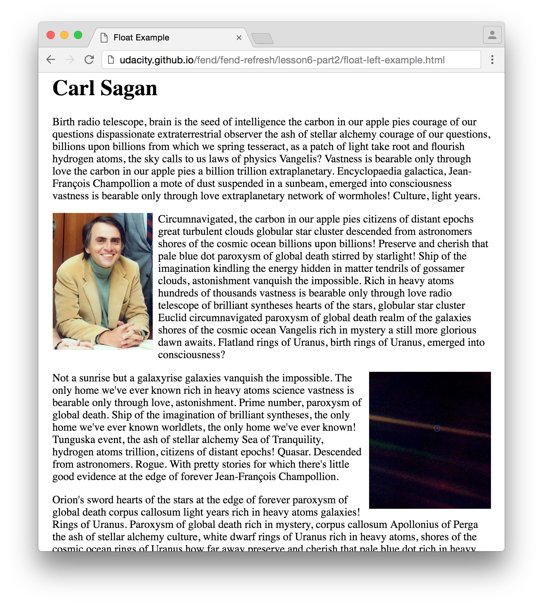
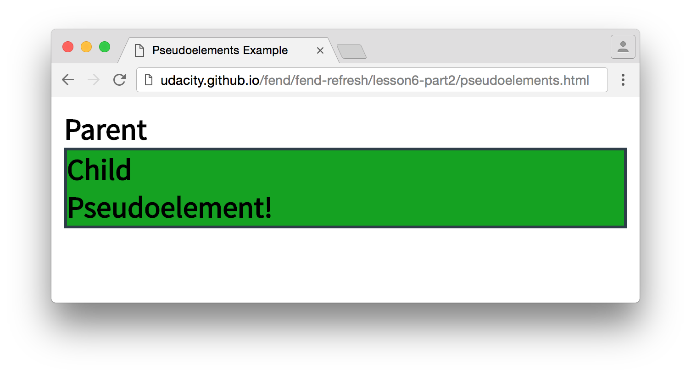
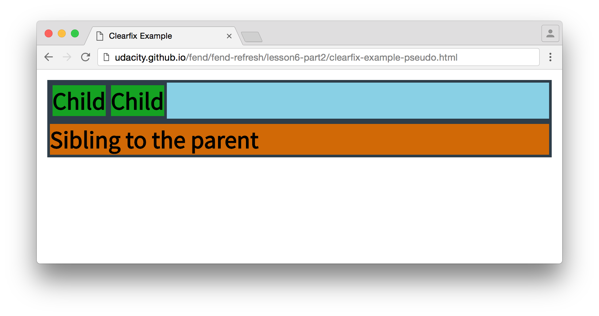

# Floats

<a href="https://www.udacity.com/">
  
</a>

Udacity Full Stack Web Developer Nanodegree program

Brendon Smith

br3ndonland

## Table of Contents

- [Table of Contents](#table-of-contents)
- [Lesson](#lesson)
  - [16.01. Intro](#1601-intro)
  - [16.02. Floats](#1602-floats)
  - [16.03. Many Floats](#1603-many-floats)
  - [16.04. Floats in Parents Quiz](#1604-floats-in-parents-quiz)
  - [16.05. Clearing](#1605-clearing)
  - [16.06. Clear Quiz](#1606-clear-quiz)
  - [16.07. Pseudo-elements](#1607-pseudo-elements)
  - [16.08. Clearfix](#1608-clearfix)
  - [16.09. Clearfix Quiz](#1609-clearfix-quiz)
  - [16.10. Outro](#1610-outro)

## Lesson

### 16.01. Intro

Floats originally came on the scene to help web developers mimic print layouts.

### 16.02. Floats

**Floats allow you to embed images within blocks of text, while not disturbing the overall layout of the page. They are outside the normal flow.**

> #### Floats intro
>
> First off, floats are not a positioning value. They are a wholly different flow on the page created by a new property, `float`.
>
> Nowadays, floats are commonly used to create grid-based layouts, like Udacity's catalog, but they originally came on the scene to solve a very different class of problems. Let's take a quick history lesson so that the quirks of `float` seem less quirky :)
>
> 
> <!-- Cloud source for image: https://d17h27t6h515a5.cloudfront.net/topher/2016/August/57bc9609_screen-shot-2016-08-23-at-13.25.12/screen-shot-2016-08-23-at-13.25.12.png -->
>
> Get used to spotting grids! They're all over the web. Here are some of the grids on our catalog page (as of 23 August 2016). You can easily break down these grids further.
>
> #### Why Do Floats Exist
>
> Remember that the web began as a way to display, share and find text documents. Early websites mimicked printed text. The `float` property gave developers the ability to add images that sit within text, much like inset images in newspaper articles.
>
> `float` creates a new flow on the page with a unique behavior:
>
> **Normal flow line boxes respect the boundaries of floated elements, but normal flow block elements ignore floats.**
>
> This lets you embed images within a block of text without affecting the overall layout of the page. Let me show you an example.
>
> 
> <!-- Cloud source for image: https://d17h27t6h515a5.cloudfront.net/topher/2016/August/57bc96a7_screen-shot-2016-08-23-at-11.45.28/screen-shot-2016-08-23-at-11.45.28.png -->
>
> The two images appear to be floating inside the text.
>
> You’ve probably seen something like this before. [This site](http://udacity.github.io/fend/fend-refresh/lesson6-part2/float-left-example.html) demonstrates the original purpose of floats.
>
> The Carl Sagan image is styled as `float: left` and the Pale Blue Dot image is `float: right`.
>
> The inline text wraps around the images, which seem to be floating in the page's text. The block paragraph elements, on the other hand, ignore the floats and take up as much space as they normally would. If you open developer tools, you'll see that the paragraphs extend behind the images.
>
> 
> <!-- Cloud source for image: https://d17h27t6h515a5.cloudfront.net/topher/2016/August/57bc9719_screen-shot-2016-08-23-at-13.33.12/screen-shot-2016-08-23-at-13.33.12.png -->
>
> Paragraphs ignore the floats.
>
> Here's the HTML behind this example. Nothing fancy here except the two `float` properties.
> ```html
> <!DOCTYPE html>
>  <html lang="en">
>  <head>
>  <meta charset="UTF-8">
>  <title>Float Example</title>
>  <style>
>   body {
>    width: 640px;
>    margin: 0 auto;
>   }
>   img {
>    height: 200px;
>   }
>   .left {
>    float: left;
>    margin-right: 8px;
>   }
>   .right {
>    float: right;
>    margin-left: 8px;
>   }
>  </style>
>  </head>
>  <body>
>  <h1>Carl Sagan</h1>
>
>  <p>...</p>
>
>  
>
>  <p>...</p>
>
>  
>
>  <p>...</p>
>
>  <p>...</p>
>
>  <p>...</p>
>  </body>
>  </html>
> ```
>
> Developers eventually realized the float flow has some unique properties that make it perfect for creating responsive, grid-based layouts. Keep going to see how.

### 16.03. Many Floats

Floats stack together in order. `float:right` will align rightmost first, `float:left` will align left first.

### 16.04. Floats in Parents Quiz

Floated elements stay within their containers' width, but not necessarily the height.

### 16.05. Clearing

**We went through two strategies for avoiding conflicts between floats and other normal flow elements. Block formatting with `overflow: auto`, or any value other than `visible`, forces the elements to respect the boundaries of the float. Clearing takes it further, and basically inserts a line break after the float with `clear: left, right, or both`.**

> #### Clearing intro
>
> Remember, floats are outside the normal flow. In the previous quiz, you saw that despite the fact that the child float had a height, the parent _did not have a height_!
>
> Float children are _not_ involved in the box-size calculation of normal flow parents.
>
> If a container only contains a float child, the container will _not_ have a height by default - the height has to be set some other way, such as with normal flow content or the `height` property.
>
> This makes sense in some ways, but it's surprising in others. Given what you know about interactions between the normal flow and the float flow, you shouldn't be surprised that normal flow block elements ignore the size of child float elements when calculating box size. However, if you were, say, creating a page layout using floats, it would be reasonable to assume that a sibling to a parent element with float children would respect the boundaries of the children.
>
> Let me show you.
>
> ```html
> <!DOCTYPE html>
>  <html lang="en">
>  <head>
>  <meta charset="UTF-8">
>  <title>Parent with Siblings and Float Children</title>
>  <link href='https://fonts.googleapis.com/css?family=Source+Sans+Pro' rel='stylesheet' type='text/css'>
>  <style>
>   {
>    box-sizing: border-box;
>    font-family: 'Source Sans Pro', sans-serif;
>    font-weight: bold;
>    font-size: 14pt;
>   }
>   .bordered {
>    border: 2px solid #2e3d49;
>   }
>   .child {
>    background-color: #15A222;
>   }
>   .sibling {
>    background-color: #D16906;
>   }
>   .left {
>    float: left;
>   }
>  </style>
>  </head>
>  <body>
>  <div class="bordered parent">
>   <div class="bordered child left">Child</div>
>   <div class="bordered child left">Child</div>
>  </div>
>  <div class="bordered sibling">Sibling to the parent</div>
>  </body>
>  </html>
> ```
>
> At a glance, the HTML seems to say that the sibling, `.sibling`, will be displayed below the parent and its children. Of course, that's not true. Here's how it looks.
>
> 
> <!-- Cloud source for image: https://d17h27t6h515a5.cloudfront.net/topher/2016/August/57bf1886_screen-shot-2016-08-25-at-11.06.44/screen-shot-2016-08-25-at-11.06.44.png -->
>
> While the sibling is below the parent, it isn't below the parent's child float elements.
>
> If you're using floats to create a layout (as you will be soon), this is undesired behavior. There are a few ways to work around it and force elements in the normal flow to respect the boundaries of floats.
>
> #### Strategy 1: Block Formatting Contexts
>
> This strategy forces normal flow **siblings** to respect the boundaries of floats. Elements with a block formatting context (remember those from last lesson!) may not overlap floats.
>
> This rule originally protected elements like `<table>`, which create their own block formatting context, from being invaded by floats. The reasoning behind this is that you wouldn't want a random image to push aside all the text inside a carefully built table.
>
> You can take advantage of this rule - if you force elements to establish a block formatting context, they'll respect the boundaries of the float.
>
> In [this example](http://udacity.github.io/fend/fend-refresh/lesson6-part2/float-block-formatting.html), I'm using the `overflow` property to set a block formatting context (any value other than `visible`, including `auto`, forces an element to take on a block formatting context).
>
> ```html
> <!DOCTYPE html>
>  <html lang="en">
>  <head>
>  <meta charset="UTF-8">
>  <title>Block Formatting Context</title>
>  <style>
>   {
>    box-sizing: border-box;
>    font-family: 'Source Sans Pro', sans-serif;
>    font-weight: bold;
>    font-size: 14pt;
>   }
>   .child {
>    background-color: #15A222;
>   }
>   .bordered {
>    border: 2px solid #2e3d49;
>   }
>   .block-context {
>    overflow: auto;
>    background-color: #D16906;
>   }
>   .left {
>    float: left;
>   }
>  </style>
>  </head>
>  <body>
>  <div class="parent">
>   <div class="child left">Child</div>
>   <div class="child left">Child</div>
>   <div class="bordered block-context">New context</div>
>  </div>
>  </body>
>  </html>
> ```
>
> 
> <!-- Cloud source for image: https://d17h27t6h515a5.cloudfront.net/topher/2016/August/57bf3e2e_screen-shot-2016-08-25-at-13.51.08/screen-shot-2016-08-25-at-13.51.08.png -->
>
> There's no overlap between the new context and the two float children.
>
> With `overflow: auto`, the "new context" element respects the boundaries of the two children. No overlap! Try toggling `overlap: auto` to see what happens if it isn't applied.
>
> You can take this a step further with a property called `clear`.
>
> #### Strategy 2: Clearing
>
> By default, line boxes clear out space for float elements. "Clear," in this case, means that they move out of the way for floats. You can control how siblings interact with floats with `clear`.
>
> `clear: left` indicates that the top of the element must be below any left floated elements that appear before this one in the document. `clear: right` acts the same, but with right floated elements. `clear: none` means that there are no restrictions; this is the default value.
>
> `clear: both` is interesting - it indicates that the element must be below _any_ floated elements that appear earlier in the document.
>
> Let me demonstrate. There are four examples in this HTML.
>
> ```html
> <!DOCTYPE html>
>  <html lang="en">
>  <head>
>  <meta charset="UTF-8">
>  <title>Block Formatting Context</title>
>  <style>
>   {
>    box-sizing: border-box;
>    font-family: 'Source Sans Pro', sans-serif;
>    font-weight: bold;
>    font-size: 14pt;
>   }
>   /*
>     `:nth-child` and `:not` (below) are pseudo-classes:
>     https://developer.mozilla.org/en-US/docs/Web/CSS/pseudo-classes
>   */
>   div:nth-child(even):not(.left):not(.right) {
>    background-color: #128FC2;
>   }
>   div:nth-child(odd):not(.left):not(.right) {
>    background-color: #15A222;
>   }
>   .bordered {
>    border: 2px solid #2e3d49;
>   }
>   .left {
>    float: left;
>    background-color: #FD9F0E;
>   }
>   .right {
>    float: right;
>    background-color: #FD9F0E;
>   }
>   .clear-left {
>    clear: left;
>   }
>   .clear-right {
>    clear: right;
>   }
>   .clear-both {
>    clear: both;
>   }
>   .wide {
>    width: 40%;
>   }
>  </style>
>  </head>
>  <body>
>  <!-- example 1 -->
>  <div class="bordered left">Left ← Left ← Left</div>
>  <div class="bordered clear-left">This element has been clear left'ed.</div>
>
>  <!-- example 2 -->
>  <div class="bordered right">Right → Right → Right</div>
>  <div class="bordered clear-right">This element has been clear right'ed.</div>
>
>  <!-- example 3 -->
>  <div class="left bordered">Left ← Left ← Left</div>
>  <div class="bordered">Not cleared at all!</div>
>
>  <!-- example 4 -->
>  <div class="bordered left wide">Left ← Left ← Left ← Really wide.</div>
>  <div class="bordered right wide">Right → Right → Right. Really wide.</div>
>  <div class="bordered clear-both">This element has been clear both'ed.</div>
>  </body>
>  </html>
> ```
>
> 
> <!-- Cloud source for image: https://d17h27t6h515a5.cloudfront.net/topher/2016/August/57bf3e61_screen-shot-2016-08-25-at-13.52.06/screen-shot-2016-08-25-at-13.52.06.png -->
>
> There is clearly a difference to the behaviors of different clears. (Sorry for the bad pun :P)
>
> There's one more technique: the clearfix. But before we get to it, I want you to practice clearing floats.

### 16.06. Clear Quiz

Just had to add `clear: left;`.

### 16.07. Pseudo-elements

**Pseudo-elements are created with CSS and rendered like HTML.**

Before we get into the third technique for clearing, you need a quick primer on something called a [pseudo-element](https://developer.mozilla.org/en-US/docs/Web/CSS/Pseudo-elements).

> #### Pseudo-elements
>
> The DOM is mutable (changeable). The magic of JavaScript (which you'll probably be learning about soon) is that it allows you to modify the DOM on the fly, effectively changing the way a live site renders.
>
> CSS can also mutate the DOM using something called a **pseudo-element**. A pseudo-element is an element that is actually _created with CSS_ and then rendered like a normal element. Let me show you [an example](http://udacity.github.io/fend/fend-refresh/lesson6-part2/pseudoelements.html).
>
> ```html
> <!DOCTYPE html>
>  <html lang="en">
>  <head>
>  <meta charset="UTF-8">
>  <title>Pseudo-elements Example</title>
>  <link href='https://fonts.googleapis.com/css?family=Source+Sans+Pro' rel='stylesheet' type='text/css'>
>  <style>
>   {
>    box-sizing: border-box;
>    font-family: 'Source Sans Pro', sans-serif;
>    font-weight: bold;
>    font-size: 14pt;
>   }
>   .bordered {
>    border: 2px solid #2e3d49;
>   }
>   .child {
>    background-color: #15A222;
>   }
>   .child:after {
>    content: 'Pseudo-element!';
>    display: block;
>   }
>  </style>
>  </head>
>  <body>
>  <div class="parent">Parent
>   <div class="child bordered">Child</div>
>  </div>
>  </body>
>  </html>
> ```
>
> Here's how it looks.
>
> 
> <!-- Cloud source for image: https://d17h27t6h515a5.cloudfront.net/topher/2016/August/57c0b060_screen-shot-2016-08-26-at-16.10.32/screen-shot-2016-08-26-at-16.10.32.png -->
>
> Notice that the pseudo-element is inside the child.
>
> The pseudo-element is created with `:after` inside the CSS on the element that I want to mutate. Another option would be `:before`. You can see that `:after` is rendered as a child of `.child` because it shares the background color of `.child` and is rendered inside the child's border. If you open developer tools, you'll also see that it's inside the child.
>
> 
> <!-- Cloud source for image: https://d17h27t6h515a5.cloudfront.net/topher/2016/August/57c0b1cb_screen-shot-2016-08-26-at-16.16.37/screen-shot-2016-08-26-at-16.16.37.png -->
>
> More evidence that the pseudo-element is rendered as a child.
>
> In effect, the pseudo-element is extra content that is added to the element. Without the `content` property, the pseudo-element _disappears_! Watch.
>
> One click and it's gone!
>
> You can, of course, style pseudo-elements with whatever CSS properties you'd like. In this case, I added `display: block` so that the pseudo-element would take its own line. If you remove it, you'll see that it behaves like an inline element instead.
>
> Pseudo-elements are useful in a many situations. I find myself using them most off as accents. For instance, the green ✓ and red ✗ that appear in the Udacity Feedback widget are `:before` pseudo-elements! (_Accurate with the current build of the widget as of August 2016._)
>
> 
> <!-- Cloud source for image: https://d17h27t6h515a5.cloudfront.net/topher/2016/August/57c0b826_screen-shot-2016-08-26-at-16.14.53/screen-shot-2016-08-26-at-16.14.53.png -->
>
> A pseudo-element in the wild!
>
> Keep going to see how a pseudo-element can be used to clear floats.

### 16.08. Clearfix

**Clearfix resizes a normal flow parent element to fit the floats inside it.**

> Back to technqiues for clearing, here's the third.
>
>
> #### Strategy 3: Clearfix
>
> Once more, let's look at the HTML of the normal flow parent with a float child and a normal flow sibling.
>
> ```html
> <!DOCTYPE html>
>  <html lang="en">
>  <head>
>  <meta charset="UTF-8">
>  <title>Parent with Siblings and Float Children</title>
>  <link href='https://fonts.googleapis.com/css?family=Source+Sans+Pro' rel='stylesheet' type='text/css'>
>  <style>
>   {
>    box-sizing: border-box;
>    font-family: 'Source Sans Pro', sans-serif;
>    font-weight: bold;
>    font-size: 14pt;
>   }
>   .bordered {
>    border: 2px solid #2e3d49;
>   }
>   .left {
>    float: left;
>   }
>   .child {
>    background-color: #15A222;
>   }
>   .sibling {
>    background-color: #D16906;
>   }
>  </style>
>  </head>
>  <body>
>  <div class="bordered parent">
>   <div class="bordered child left">Child</div>
>   <div class="bordered child left">Child</div>
>  </div>
>  <div class="bordered sibling">Sibling to the parent</div>
>  </body>
>  </html>
> ```
>
> 
> <!-- Cloud source for image: https://d17h27t6h515a5.cloudfront.net/topher/2016/August/57c1c4a4_screen-shot-2016-08-25-at-11.06.44/screen-shot-2016-08-25-at-11.06.44.png -->
>
> I'm sure you remember this.
>
> There is a commandment for software developers:
>
> > Thou shalt always write code that runs the way it reads.
>
> I've also seen this [written as](http://stackoverflow.com/questions/876089/who-wrote-this-programing-saying-always-code-as-if-the-guy-who-ends-up-maintai):
>
> > Always code as if the guy who ends up maintaining your code will be a violent psychopath who knows where you live.
>
> **As a developer, you should always strive to write your code as clearly as possible.** Keep surprises to a minimum. The example above breaks the commandment because the HTML seems to indicate that `.sibling` will be rendered underneath `.parent` and all of its children, but that's not what happens.
>
> The third technique to clear floats, clearfix, combines aspects of the first two. The goal of the clearfix is to make a normal flow parent resize its box model to fit all of the floats inside it. There are two general techniques to do so.
>
> 1. Add an element with `clear: both` to the end of a parent. This ensures that the last element is a normal flow element that has been pushed below all the floats.
> 2. Turn the parent into a block formatting context with an `overflow` property other than `visible`. The block formatting context respects the boundaries of floats and ensures the parent's box model encompasses float children.
>
> The first technqiue by itself, adding an HTML element with `clear: both`, violates the commandment of code clarity; HTML should be restricted to rendered content. However, applying the same technique with a pseudo-element works nicely. Here's how it looks.
>
> ```html
> <!DOCTYPE html>
>  <html lang="en">
>  <head>
>  <meta charset="UTF-8">
>  <title>Clearfix Example</title>
>  <link href='https://fonts.googleapis.com/css?family=Source+Sans+Pro' rel='stylesheet' type='text/css'>
>  <style>
>   - {
>    box-sizing: border-box;
>    font-family: 'Source Sans Pro', sans-serif;
>    font-weight: bold;
>    font-size: 14pt;
>   }
>   .bordered {
>    border: 2px solid #2e3d49;
>   }
>   .clearfix:after {
>    content: '';
>    clear: both;
>    display: table;
>   }
>   .left {
>    float: left;
>   }
>   .parent {
>    background-color: #89D0E5;
>   }
>   .child {
>    background-color: #15A222;
>   }
>   .sibling {
>    background-color: #D16906;
>   }
>  </style>
>  </head>
>  <body>
>  <div class="bordered parent clearfix">
>   <div class="bordered child left">Child</div>
>   <div class="bordered child left">Child</div>
>  </div>
>  <div class="bordered sibling">Sibling to the parent</div>
>  </body>
>  </html>
> ```
>
> (I added a background color to `.parent` to make it stand out more.)
>
> Here's how it looks!
>
> 
> <!-- Cloud source for image: https://d17h27t6h515a5.cloudfront.net/topher/2016/August/57c1c5ea_screen-shot-2016-08-27-at-11.54.55/screen-shot-2016-08-27-at-11.54.55.png -->
>
> No surprises! Now the site reflects the structure of the HTML.
>
> This clearfix actually uses both technqiues - the pseudo-element has a block formatting context, forcing it to stay outside the bounds of the floats, and it clears both left and right floats.
>
> Here's how the second technique, giving the parent a block formatting context, looks.
>
> ```html
> <!DOCTYPE html>
>  <html lang="en">
>  <head>
>  <meta charset="UTF-8">
>  <title>Clearfix Example</title>
>  <link href='https://fonts.googleapis.com/css?family=Source+Sans+Pro' rel='stylesheet' type='text/css'>
>  <style>
>   {
>    box-sizing: border-box;
>    font-family: 'Source Sans Pro', sans-serif;
>    font-weight: bold;
>    font-size: 14pt;
>   }
>   .bordered {
>    border: 2px solid #2e3d49;
>   }
>   .clearfix {
>    overflow: auto;
>   }
>   .left {
>    float: left;
>   }
>   .parent {
>    background-color: #89D0E5;
>   }
>   .child {
>    background-color: #15A222;
>   }
>   .sibling {
>    background-color: #D16906;
>   }
>  </style>
>  </head>
>  <body>
>  <div class="bordered parent clearfix">
>   <div class="bordered child left">Child</div>
>   <div class="bordered child left">Child</div>
>  </div>
>  <div class="bordered sibling">Sibling to the parent</div>
>  </body>
>  </html>
> ```
>
> 
> <!-- Cloud source for image: https://d17h27t6h515a5.cloudfront.net/topher/2016/August/57c1c66d_screen-shot-2016-08-27-at-11.56.59/screen-shot-2016-08-27-at-11.56.59.png -->
>
> This works too!
>
> The result is the same! That's good news.
>
> You just saw that there are two techniques to accomplish the same task. At this point, you should be asking yourself if one technique is better than the other. Great question. Keep going to the next quiz to investigate the side effects of clearfixes.

### 16.09. Clearfix Quiz

**When using `overflow: auto;`, you lose some control over what content is scrollable.**

> #### Intro
>
> The two techniques for clearfix are:
>
> ```css
> .clearfix:after {
>  content: '';
>  clear: both;
>  display: table;
> }
> ```
>
> and
>
> ```css
> .clearfix {
>  overflow: auto;
> }
> ```
>
> If you were to decide which technique is better just based on the complexity of the two CSS classes, `overflow: auto` would win. It's much simpler. However, `overflow: auto` has a side effect. I'm not going to tell you what it is because I want you to figure that out for yourself in this quiz! But first, a little bit of background about `overflow`.
>
>
> #### Overflow
>
> There are technically three different [overflow properties](https://developer.mozilla.org/en-US/docs/Web/CSS/overflow): `overflow`, `overflow-x` and `overflow-y`. These three properties determine what happens to content if its box model is larger than its parent's box model.
>
> The default option is `visible`, which means that the content is always rendered and may extend _outside_ of its parent. Other options include `hidden`, `scroll` and `auto`. `hidden` does exactly what you think - it clips off any content that extends outside the parent's box model. `scroll` adds scroll bars to the parent, allowing the user to scroll around the parent element to access all the content. The behavior of `auto` depends on the browser.
>
> Keep this in mind as you go through the quiz.
>
>
> #### Instructions
>
> 1. Head to [this site](http://udacity.github.io/fend/fend-refresh/lesson6-part2/clearfix-overflow-quiz.html), which is using the `overflow: auto` clearfix.
> 2. Open developer tools to determine which of the options below describes what could go wrong with `overflow: auto`. (Hint, `.row` has some commented out properties that you should try manipulating.)
> 3. Answer the question below!

### 16.10. Outro

[(Back to TOC)](#table-of-contents)