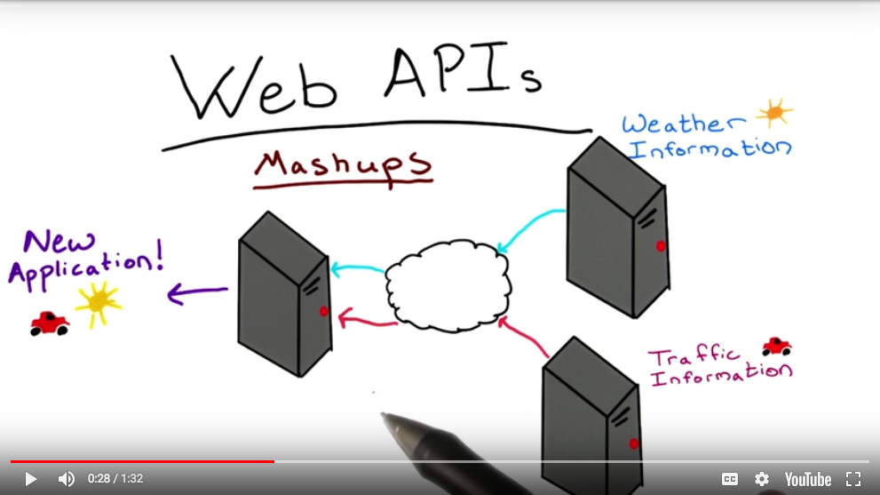

# APIs

<a href="https://www.udacity.com/">
  
</a>

Udacity Full Stack Web Developer Nanodegree program

Brendon Smith

br3ndonland

[Designing RESTful APIs](https://www.udacity.com/course/designing-restful-apis--ud388)

## Table of Contents

- [Table of Contents](#table-of-contents)
- [Lesson 1. Whats and whys of APIs](#lesson-1-whats-and-whys-of-apis)
  - [1.01. Course Intro](#101-course-intro)
  - [1.02. Prerequisites](#102-prerequisites)
  - [1.03. What are APIs](#103-what-are-apis)
  - [1.04. Web APIs](#104-web-apis)
  - [1.05. Web API Protocols](#105-web-api-protocols)
  - [1.06. Digging into The Application Layer](#106-digging-into-the-application-layer)
  - [1.07. The Web Service Layer](#107-the-web-service-layer)
  - [1.08. Content Formatting Layer](#108-content-formatting-layer)
  - [1.09. Choosing the Right Technologies Soap vs Rest](#109-choosing-the-right-technologies-soap-vs-rest)
  - [1.10. XML vs JSON](#110-xml-vs-json)
  - [1.11. Quiz: Developer Discussions](#111-quiz-developer-discussions)
  - [1.12. Quiz: Developer Discussions](#112-quiz-developer-discussions)
  - [1.13. Quiz: Developer Discussions](#113-quiz-developer-discussions)
  - [1.14. REST Constraints](#114-rest-constraints)
  - [1.15. Quiz: Why Stateless](#115-quiz-why-stateless)
  - [1.16. Lesson 1 Wrap Up](#116-lesson-1-wrap-up)
- [Lesson 2. Accessing published APIs](#lesson-2-accessing-published-apis)
  - [2.01. Lesson 2 Intro](#201-lesson-2-intro)
  - [2.02. Parts of an HTTP Request](#202-parts-of-an-http-request)
  - [2.03. HTTP Response](#203-http-response)
  - [2.04. Sending API Requests with Postman and Curl](#204-sending-api-requests-with-postman-and-curl)
  - [2.05. Quiz: Sending API Requests](#205-quiz-sending-api-requests)
  - [2.06. Searching for API Documentation](#206-searching-for-api-documentation)
  - [2.07. Quiz: Delving Into APIs](#207-quiz-delving-into-apis)
  - [2.08. Quiz: Using the Foursquare API](#208-quiz-using-the-foursquare-api)
  - [2.09. Requesting From Python Code](#209-requesting-from-python-code)
  - [2.10. Parsing Your Response](#210-parsing-your-response)
  - [2.11. Quiz: Make Your Own API Mashup](#211-quiz-make-your-own-api-mashup)
  - [2.12. Lesson 2 Wrap Up](#212-lesson-2-wrap-up)
  - [Feedback on lesson 2](#feedback-on-lesson-2)
- [Lesson 3. Creating your own API endpoints](#lesson-3-creating-your-own-api-endpoints)
  - [3.01. Lesson 3 Intro](#301-lesson-3-intro)
  - [3.02. API Endpoints with Flask](#302-api-endpoints-with-flask)
  - [3.03. Quiz: Making an Endpoint with Flask Quiz](#303-quiz-making-an-endpoint-with-flask-quiz)
  - [3.04. Quiz: Respond to Different Kinds of Requests](#304-quiz-respond-to-different-kinds-of-requests)
  - [3.05. Quiz: Serializing Data from the Database](#305-quiz-serializing-data-from-the-database)
  - [3.06. Quiz: Adding features to your Mashup](#306-quiz-adding-features-to-your-mashup)
  - [3.07. Lesson 3 Wrap Up](#307-lesson-3-wrap-up)
- [Lesson 4. Securing your API](#lesson-4-securing-your-api)
  - [4.01. Lesson 4 Intro](#401-lesson-4-intro)
  - [4.02. Adding Users and Logins](#402-adding-users-and-logins)
  - [4.03. User Registration](#403-user-registration)
  - [4.04. Password Protecting a Resource](#404-password-protecting-a-resource)
  - [4.05. Quiz: Mom & Pop’s Bagel Shop](#405-quiz-mom-pop’s-bagel-shop)
  - [4.06. Token Based Authentication](#406-token-based-authentication)
  - [4.07. Implementing Token Based Authentication in Flask](#407-implementing-token-based-authentication-in-flask)
  - [4.08. Quiz: Regal Tree Foods](#408-quiz-regal-tree-foods)
  - [4.09. OAuth 2.0](#409-oauth-20)
  - [4.10. Adding OAuth 2.0 for Authentication](#410-adding-oauth-20-for-authentication)
  - [4.11. Quiz: Pale Kale Salads & Smoothies](#411-quiz-pale-kale-salads-smoothies)
  - [4.12. Rate Limiting](#412-rate-limiting)
  - [4.13. Rate Limiting Exercise](#413-rate-limiting-exercise)
  - [4.14. Quiz: Bargain Mart](#414-quiz-bargain-mart)
  - [4.15. Lesson 4 Wrap Up](#415-lesson-4-wrap-up)
- [Lesson 5. Writing developer-friendly APIs](#lesson-5-writing-developer-friendly-apis)
  - [5.01. Lesson 5 Intro](#501-lesson-5-intro)
  - [5.02. Developer Friendly Documentation](#502-developer-friendly-documentation)
  - [5.03. Using Proper URIs](#503-using-proper-uris)
  - [5.04. Versioning Your API](#504-versioning-your-api)
  - [5.05. Communicating With Developers](#505-communicating-with-developers)
  - [5.06. Learning From The Best](#506-learning-from-the-best)
  - [5.07. Course Wrap Up](#507-course-wrap-up)
- [General API course feedback](#general-api-course-feedback)

## Lesson 1. Whats and whys of APIs

### 1.01. Course Intro

### 1.02. Prerequisites

#### Vagrant virtual machine

This course will use the Vagrant virtual machine again, which I had previously configured for the SQL relational databases work (see [notes](https://github.com/br3ndonland/udacity-fsnd) and [database logs analysis project](https://github.com/br3ndonland/udacity-fsnd03-p01-logs)).

- *Oracle [VirtualBox](https://www.virtualbox.org/wiki/Downloads) Version 5.2.6 r120293 (Qt5.6.3)- - Software that runs special containers called  virtual machines, like Vagrant.
- *[Vagrant](https://www.vagrantup.com/) 2.0.1 with Ubuntu 16.04.3 LTS (GNU/Linux 4.4.0-75-generic i686)- -  Software that provides the Linux operating system in a defined configuration, allowing it to run identically across many personal computers. Linux can then be run as a virtual machine with VirtualBox.
- *[Udacity Virtual Machine configuration](https://github.com/udacity/fullstack-nanodegree-vm)- - Repository from Udacity that configures Vagrant.
  - Instructions are provided [here](https://www.udacity.com/wiki/ud388/vagrant).
    - I installed and ran Vagrant from within the directory *fullstack-nanodegree-vm/vagrant*.
    - I forked and cloned the lesson materials into */vagrant/apis*.

#### Instructor notes

> Want to brush up on your Python, Flask, and SQLAlchemy skills?
>
> Go ahead and check out [Full Stack Foundations](https://www.udacity.com/course/full-stack-foundations--ud088) to make sure you have an understanding of the python topics used in this course.
>
> Documentation for [Flask](http://flask.pocoo.org/docs/0.10/) and [SQLAlchemy](http://docs.sqlalchemy.org/en/rel_1_0/) can be found here as well.
>
> The [Authentication and Authorization](https://www.udacity.com/course/authentication-authorization-oauth--ud330) will come in handy when we cover API Security.
>
> Checkout these instructions for configuring the [Vagrant machine](https://www.udacity.com/wiki/ud388/vagrant) for this course.
>
> You will also need [Google Developer](https://console.developers.google.com) and [Foursquare Developer](https://developer.foursquare.com) accounts for this course.

### 1.03. What are APIs

**Finally learning about APIs!**

- Application Programming Interface
- Refers to any communication between two methods of code.
- APIs allow access to some of the application functions without exposing all the code.
- Developers can combine information from multiple APIs into a "mashup" application.
    
- Providing APIs helps the company's reputation. Some companies depend on their API as a primary revenue stream, like Twilio.

### 1.04. Web APIs

### 1.05. Web API Protocols

The OSI abstraction layers:

- *Message formatting*
  - JSON
  - XML
- *Web service*
- Application
- Presentation
- Session
- Transport
- Network
- Data Link
- Physical

Each layer is served by the layer below, and serves the layer above.

> Learn more about the [OSI model](https://en.wikipedia.org/wiki/OSI_model).

### 1.06. Digging into The Application Layer

### 1.07. The Web Service Layer

REST is a set of guidelines that leverage HTTP requests to transmit information.

> Update: While SOAP is still used in some contexts, RESTful APIs currently dominate the API landscape. It is no longer an 'up and coming' technology, but rather simply the best practice for API development.

### 1.08. Content Formatting Layer

JSON or XML

### 1.09. Choosing the Right Technologies Soap vs Rest

- Soap was developed by Microsoft and uses XML.
- REST first appeared in a [dissertation by Roy Thomas Fielding in 2000](https://www.ics.uci.edu/~fielding/pubs/dissertation/rest_arch_style.htm).
- REST is far more popular than SOAP, as reported by [ProgrammableWeb](https://www.programmableweb.com).
  - I searched around for the chart that Lorenzo shows but couldn't find it.
  - Lots of other helpful resources though, like [APIs 101](https://www.programmableweb.com/api-university/what-are-apis-and-how-do-they-work).

### 1.10. XML vs JSON

XML

- Developed in 1997
- Uses identifying tags similar to HTML

JSON

- Developed in 2001
- Derived from JavaScript
- Can be condensed to reduce file size

JSON has been gaining popularity.

### 1.11. Quiz: Developer Discussions

### 1.12. Quiz: Developer Discussions

### 1.13. Quiz: Developer Discussions

**Got all of these on my first try. We had to identify the subject that two coworkers were discussing at the water cooler.**

### 1.14. REST Constraints

REST applies a few additional specifications on top of HTML.

1. Separation of client and server
2. Stateless
    - Stateful server remembers client's activity between requests.
    - RESTful architecture does not allow retention of client information between requests. Each request is independent.
    - Tokens provide some memory functionality in RESTful architectures.
3. Cacheable
4. Uniform interface
5. Layered system
6. Code on demand

### 1.15. Quiz: Why Stateless

> In short, stateless servers make your applications scalable. Check out [this article](http://ruben.verborgh.org/blog/2012/08/24/rest-wheres-my-state/) if you are interested in learning more about why RESTful applications are stateless.

### 1.16. Lesson 1 Wrap Up

BOOM! Got it done in three pomodoros (75 min).

---

[(Back to TOC)](#table-of-contents)

## Lesson 2. Accessing published APIs

### 2.01. Lesson 2 Intro

### 2.02. Parts of an HTTP Request

Brief review of HTTP requests. It's a **pull protocol**.

#### Structure of an HTTP request

- Header
  - Request line
    - HTTP verb
    - URI
    - HTTP/version
  - Optional request headers
    - name:value, name:value
- Blank line
- Body (optional)
  - Additional information

#### Example HTTP request

```text
GET puppies.html HTTP/1.1
Host: www.puppyshelter.com
Accept: image/gif, image/jpeg, */*
Accept-Language: en-us
Accept-Encoding: gzip, deflate
User-Agent: Mozilla/4.0
Content-Length: 35

puppyId=12345&name=Fido+Simpson
```

### 2.03. HTTP Response

#### Structure of an HTTP response

- Header
  - Status line
    - HTTP/version
    - Status code
    - Reason phrase
  - Optional response headers
- Blank line
- Body (optional)

#### Example HTTP response

```text
HTTP/1.1 OK
Date: Fri, 04 Sep 2015 01:11:12 GMT
Server: Apache/1.3.29 (Win32)
Last-Modified: Sat, 07 Feb 2014
ETag: "0-23-4024c3a5:
ContentType: text/html
ContentLength: 35
Connection: KeepAlive
KeepAlive: timeout=15, max = 100

<h1>Welcome to my home page!</h1>
```

### 2.04. Sending API Requests with Postman and Curl

- Curl is a popular command line tool for sending and receiving HTTP.
- Postman provides a GUI.

#### 2.04 Instructor notes

> Check out the official cURL [documentation](http://curl.haxx.se/docs/manpage.html) and this [blog post](http://www.ethanmick.com/getting-started-with-curl/) for getting started with cURL.
>
> Check out the [Postman Documentation](https://www.getpostman.com/docs) as well.
>
> You should also be familiar with [query strings](https://en.wikipedia.org/wiki/Query_string) as option to pass in variables straight from the URI.

### 2.05. Quiz: Sending API Requests

#### 2.05 Instructor notes

> Download the code for api_server.py [here](https://github.com/udacity/APIs/blob/master/Lesson_2/06_Sending%20API%20Requests/api_server.py).
>
> There are some exceptions, but for most use cases:
>
> ```text
> HTTP <--> CRUD
> GET <--> READ
> POST<--> CREATE
> PUT <--> UPDATE/CREATE
> PATCH <--> UPDATE
> DELETE-<-->DELETE
> ```

#### Quiz

Setup

- Downloaded a Python web server file to access APIs. I cloned the repo into my vagrant directory.
- Started up vagrant as usual, changed into the directory with the API server file, and ran it. Took me a few tries to change into the proper directory because they put spaces in the directory names.

    ```bash
    $ cd <path>
    $ vagrant up
    $ vagrant ssh
    vagrant@vagrant:~$ cd /vagrant/APIs/Lesson_2/06_Sending\ API\ Requests
    $ python api_server.py
    ```

    ```text
     - Running on http://0.0.0.0:5000/ (Press CTRL+C to quit)
     - Restarting with stat
     - Debugger is active!
     - Debugger PIN: 769-024-554
    ```

<details>
    <summary><em>Solution</em></summary>

HTTP requests

- I elected to use `curl` because it's good practice.
- Open up a separate terminal window from the server.
- Enter the requests:

    ```bash
    $ curl http://localhost:5000/readHello
    $ curl http://localhost:5000/createHello
    $ curl http://localhost:5000/updateHello
    $ curl http://localhost:5000/deleteHello
    ```
- The only successful one was read:

    ```text
    Hi, I got your GET Request!
    ```
- The others returned the same error:

    ```text
    <!DOCTYPE HTML PUBLIC "-//W3C//DTD HTML 3.2 Final//EN">
    <title>405 Method Not Allowed</title>
    <h1>Method Not Allowed</h1>
    <p>The method is not allowed for the requested URL.</p>
    ```
- The solution was not provided.

</details>

### 2.06. Searching for API Documentation

> Errata:
>
> As of December 2017, SoundCloud is no longer accepting new API sign-ups.

### 2.07. Quiz: Delving Into APIs

#### 2.07 Instructor notes

> [Google Maps API](https://developers.google.com/maps/?hl=en)
>
> First, get your [Google Maps API key](https://developers.google.com/maps/documentation/geocoding/get-api-key)
>
> Then use the [Google Maps Geocoding API](https://developers.google.com/maps/documentation/geocoding/intro).

#### 2.07 Quiz

<details>
    <summary><em>Solution</em></summary>

##### API key

Got my API key. Keep track of API keys on the [dashboard](https://console.developers.google.com/apis/dashboard).

##### [Google Geocoding API Developer's Guide](https://developers.google.com/maps/documentation/geocoding/intro)

> *What is Geocoding?*
>
> **Geocoding** is the process of converting addresses (like "1600 Amphitheatre Parkway, Mountain View, CA") into geographic coordinates (like latitude 37.423021 and longitude -122.083739), which you can use to place markers on a map, or position the map.
>
> [Reverse geocoding](https://developers.google.com/maps/documentation/geocoding/intro#ReverseGeocoding) is the process of converting geographic coordinates into a human-readable address.
>
> You can also use the Google Maps Geocoding API to find the address for a given [place ID](https://developers.google.com/maps/documentation/geocoding/intro#place-id).
>
> The Google Maps Geocoding API provides a direct way to access these services via an HTTP request. The following example uses the Geocoding service through the Google Maps JavaScript API to demonstrate the basic functionality.

##### First query

Used the [geocoding start page](https://developers.google.com/maps/documentation/geocoding/start) to help me format my queries. After a few tries, I got the Tokyo query formatted correctly:

```bash
$ curl https://maps.googleapis.com/maps/api/geocode/json?address=tokyo,+japan
```

We just needed to enter latitude and longitude for the quiz. The JSON returns more information:

<details>
    <summary>See JSON here</summary>

JSON

```json
{
   "results" : [
      {
         "address_components" : [
            {
               "long_name" : "Tokyo",
               "short_name" : "Tokyo",
               "types" : [ "administrative_area_level_1", "locality", "political" ]
            },
            {
               "long_name" : "Japan",
               "short_name" : "JP",
               "types" : [ "country", "political" ]
            }
         ],
         "formatted_address" : "Tokyo, Japan",
         "geometry" : {
            "bounds" : {
               "northeast" : {
                  "lat" : 35.8986468,
                  "lng" : 153.9876115
               },
               "southwest" : {
                  "lat" : 24.2242626,
                  "lng" : 138.942758
               }
            },
            "location" : {
               "lat" : 35.6894875,
               "lng" : 139.6917064
            },
            "location_type" : "APPROXIMATE",
            "viewport" : {
               "northeast" : {
                  "lat" : 35.817813,
                  "lng" : 139.910202
               },
               "southwest" : {
                  "lat" : 35.528873,
                  "lng" : 139.510574
               }
            }
         },
         "place_id" : "ChIJ51cu8IcbXWARiRtXIothAS4",
         "types" : [ "administrative_area_level_1", "locality", "political" ]
      }
   ],
   "status" : "OK"
}
```

</details>

##### Authentication issue

The second query returned an error:

```bash
$ curl https://maps.googleapis.com/maps/api/geocode/json?address=jakarta,+indonesia
```

```json
{
   "error_message" : "You have exceeded your daily request quota for this API. We recommend registering for a key at the Google Developers Console: https://console.developers.google.com/apis/credentials?project=_",
   "results" : [],
   "status" : "OVER_QUERY_LIMIT"
}
```

I attached my API key to the end:

```bash
$ curl https://maps.googleapis.com/maps/api/geocode/json?address=jakarta,+indonesia&key=paste_the_key_here
```

This still didn't work. I found if I entered the query directly into my web browser first, then tried curl, it worked, but not if using curl first.

**I solved the issue by adding my IP address as a restriction on the API key, in the Credentials section of the Google APIs dashboard.**

##### Moving on

Maputo and Geneva were the same. Los Angeles worked with "ca" for California.

```bash
$ curl https://maps.googleapis.com/maps/api/geocode/json?address=los+angeles,+ca+usa&key=paste_the_key_here
```

##### Quiz solutions

| Location | Address query string |Latitude | Longitude |
|---------|---------|-----|----------|
| Tokyo, Japan | `tokyo,+japan` | 35.6894875 | 139.6917064 |
| Jakarta, Indonesia | `jakarta,+indonesia` | -6.17511 | 106.8650395 |
| Maputo, Mozambique | `maputo,+mozambique` | -25.891968 | 32.6051351 |
| Geneva, Switzerland | `geneva,+switzerland` | 46.2043907 | 6.1431577 |
| Los Angeles, California, USA | `los+angeles,+ca+usa` | 34.0522342 | -118.2436849 |

</details>

### 2.08. Quiz: Using the Foursquare API

#### 2.08 Instructor notes

> Here's the Foursquare API.
>
> You may have realized that Foursquare has a geolocating capability as well, but since you already learned how to use the google maps one, you might as well put it to good use ;-)
>
> You can copy and paste the coordinates below: Mountain View, California (37.392971, -122.076044)
> Miami, Florida (25.773822, -80.237947)
> Washington, DC (38.897478, -77.000147)
> New York, New York (40.768349, -73.96575)

#### Foursquare

I read through the [Foursquare docs](https://developer.foursquare.com/docs/api/getting-started) and got queries set up for cURL and Python:

```bash
curl -X GET -G \
  'https://api.foursquare.com/v2/venues/search' \
    -d client_id="paste_client_id_here" \
    -d client_secret="paste_client_secret_here" \
    -d v="20180309" \
    -d ll="37.392971,-122.076044" \
    -d query="pizza" \
    -d limit=1
```

```python
import json
import requests

url = 'https://api.foursquare.com/v2/venues/search'

params = dict(client_id='paste_client_id_here',
              client_secret='paste_client_secret_here',
              v='20180309',
              ll='37.392971, -122.076044',
              query='pizza',
              limit=1)
resp = requests.get(url=url, params=params)
data = json.loads(resp.text)

print(data)

```

I called the python file (named *foursquare.py*) with `python foursquare.py`.

Both the cURL and Python queries work, but I need to parse the json.

#### Feedback on 2.08

**This section was frustrating. The directions were not clear enough. I followed the Foursquare docs, and spent time writing Python code and trying to figure out how to parse the response before I realized that the next sections would cover that. I just skipped to the next section.**

### 2.09. Requesting From Python Code

Docs on Python:

- [Foursquare](https://developer.foursquare.com/docs/api/getting-started#6-make-your-first-api-call)
- [Google](https://github.com/googlemaps/google-maps-services-python)

Lorenzo's code in *geocode.py* is of course, outdated and poorly formatted (not PEP 8).

**Why did he just introduce Foursquare if we weren't going to use it in this exercise?**

### 2.10. Parsing Your Response

I used the instructor's Python code as a starting point to help me parse the JSON. I implemented some of the [string formatting techniques I used for the database logs analysis project](https://github.com/br3ndonland/udacity-fsnd03-p01-logs/blob/master/logs.py) to format the JSON.

I first looked up the keys with this code added to *foursquare.py*:

```python
print('Keys: {}'.format(data.keys()))
```

```text
Keys: [u'meta', u'response']
```

I then moved into the Foursquare JSON, as Lorenzo did for the Google maps data. It's like a file path:

```python
import json
import requests

url = 'https://api.foursquare.com/v2/venues/search'

params = dict(client_id='paste_client_id_here',
              client_secret='paste_client_secret_here',
              v='20180309',
              ll='37.392971, -122.076044',
              query='pizza',
              limit=1)
resp = requests.get(url=url, params=params)
data = json.loads(resp.text)

print('Venue name: {}'.format(data['response']['venues'][0]['name']))
```

```text
Venue name: Fast Pizza Delivery
```

The next step would be to loop through each result.

**Now I could answer the quiz questions, but not before.**

### 2.11. Quiz: Make Your Own API Mashup

#### Coding

The solution code is totally not PEP 8 compliant, and uses `httplib2` from Python 2 ([renamed](https://docs.python.org/2.6/library/httplib.html) to `http.client` in Python 3).

I re-wrote the code for Python 3, Requests, [Kenneth Reitz's Code Style](https://www.kennethreitz.org/essays/if-i-could-amend-pep-8) (Amended PEP 8), and Foursquare Python code recommendations. See *find-a-restaurant.py*.

**This section took me two days to complete.**

##### Printing output

- The first draft of *find-a-restaurant.py* runs without errors, but didn't print output.
- I started by debugging *geocode.py*, which is called by *find-a-restaurant.py*. I added in some output at the end of the file for debugging:

    ```python
    # If this file is called as a standalone program:
    if __name__ == '__main__':
        # Run a sample location for debugging
        sample_location = 'Tokyo, Japan'
        sample_coordinates = get_geocode_location(sample_location)
        print('Sample location: {}'.format(sample_location),
            '\n', 'Coordinates: {}'.format(sample_coordinates))
    ```

- Output showed the file running successfully:

    ```text
    $ cd <path>
    $ python3 geocode.py
    Sample location: Tokyo, Japan
     Coordinates: (35.6894875, 139.6917064)
    ```

- Next, I moved back into *find-a-restaurant.py*.
- I thought there might be a problem with the Foursquare code. I tried reformatting the URL, but nothing changed.
- **I finally got some output by commenting out the `sys` commands** from the instructor solution, which are there to render non-ascii characters properly in code:

    ```python
    # import sys
    # import codecs

    # sys.stdout = codecs.getwriter('utf8')(sys.stdout)
    # sys.stderr = codecs.getwriter('utf8')(sys.stderr)
    ```

    ```text
    $ python3 find-a-restaurant.py
    Traceback (most recent call last):
      File "find-a-restaurant.py", line 61, in <module>
        find_a_restaurant('Pizza', 'Tokyo, Japan')
      File "find-a-restaurant.py", line 25, in find_a_restaurant
        if data['response']['venues']:
    KeyError: 'venues'
    ```

##### Formatting coordinates for Foursquare

- Okay, so the Traceback above suggests there is a problem with the Foursquare data. I added a `print(data)` line, which allowed me to see the Foursquare JSON when I ran the Python file again:
    ```text
    $ python3 find-a-restaurant.py
    {'response': {}, 'meta': {'code': 400, 'requestId': '5aa45eab4434b94b54af87d8', 'errorType': 'param_error', 'errorDetail': 'll must be of the form XX.XX,YY.YY (received latitude,longitude)'}}
    Traceback (most recent call last):
      File "find-a-restaurant.py", line 68, in <module>
        find_a_restaurant('Pizza', 'Tokyo, Japan')
      File "find-a-restaurant.py", line 32, in find_a_restaurant
        if data['response']['venues']:
    KeyError: 'venues'
    ```
- **This tells me that I'm not passing the latitude and longitude in correctly from Google Maps.**
- Adding in a print debug line helped me see where I was at:
    ```python
    def find_a_restaurant(mealType, location):
        """Locate a restaurant based on type of food and location."""
        # Get latitude and longitude of location from Google Maps API
        latitude, longitude = get_geocode_location(location)
        print(latitude, longitude)
        # Find restaurant with Foursquare API
        url = 'https://api.foursquare.com/v2/venues/search'
        params = dict(
            client_id='pasted-it-here',
            client_secret='pasted-it-here',
            v='20180310',
            ll=(latitude, longitude),
            query='mealType')
        resp = requests.get(url=url, params=params)
        data = json.loads(resp.text)
        print(data)
    ```
    ```text
    $ python3 find-a-restaurant.py
    35.6894875 139.6917064
    {'meta': {'errorType': 'param_error', 'code': 400, 'requestId': '5aa462076a607114459cbce3', 'errorDetail': 'll must be of the form XX.XX,YY.YY (received 35.6894875)'}, 'response': {}}
    Traceback (most recent call last):
      File "find-a-restaurant.py", line 69, in <module>
        find_a_restaurant('Pizza', 'Tokyo, Japan')
      File "find-a-restaurant.py", line 33, in find_a_restaurant
        if data['response']['venues']:
    KeyError: 'venues'
    ```
- I applied some string formatting to pass Foursquare the info it wanted:
    ```python
        def find_a_restaurant(mealType, location):
        """Locate a restaurant based on type of food and location."""
        # Get latitude and longitude of location from Google Maps API
        latitude, longitude = get_geocode_location(location)
        print(latitude, longitude)
        coordinates = '{},{}'.format(latitude, longitude)
        # print(coordinates)
        # Find restaurant with Foursquare API
        url = 'https://api.foursquare.com/v2/venues/search'
        params = dict(
            client_id='pasted-it-here',
            client_secret='pasted-it-here',
            v='20180310',
            ll=coordinates,
            query='mealType')
        resp = requests.get(url=url, params=params)
        data = json.loads(resp.text)
        print(data)
    ```
- **I finally got JSON back!** It is a large amount of information, so I won't paste it here.

##### Retrieving photo info

- On to the next error:

    ```text
    Traceback (most recent call last):
      File "find-a-restaurant.py", line 71, in <module>
        find_a_restaurant('Pizza', 'Tokyo, Japan')
      File "find-a-restaurant.py", line 46, in find_a_restaurant
        if data['response']['photos']['items']:
    KeyError: 'photos'
    ```

- I realized that I needed a second [API call to get the venue's photos](https://developer.foursquare.com/docs/api/venues/photos). The URL is different, because it requires input of the venue id inside the URL. I accomplished this with some string insertion, using the `venue_id` variable from the first query:

  ```python
  url = 'https://api.foursquare.com/v2/venues/%s/photos' % venue_id
  ```

- I also found [Lorem Picsum](https://picsum.photos) for random images, in case the image URL can't be retrieved.
- The rest of the code was straightforward.

#### Program code

<details>
    <summary>geocode.py</summary>

```python
#!/usr/bin/env python3

# Udacity FSND API mashup

import json
import requests

google_api_key = ''


def get_geocode_location(inputString):
    """Retrieve latitude and longitude coordinates from Google Maps."""
    locationString = inputString.replace(' ', '+')
    url = (
        'https://maps.googleapis.com/maps/api/geocode/json?address=%s&key=%s'
        % (locationString, google_api_key))
    resp = requests.get(url=url)
    result = json.loads(resp.text)
    latitude = result['results'][0]['geometry']['location']['lat']
    longitude = result['results'][0]['geometry']['location']['lng']
    return latitude, longitude
    pass


# If this file is called as a standalone program:
if __name__ == '__main__':
    # Run a sample location for debugging
    sample_location = 'Tokyo, Japan'
    sample_coordinates = get_geocode_location(sample_location)
    print('Sample location: {}'.format(sample_location),
        '\n', 'Coordinates: {}'.format(sample_coordinates))

```

</details>

<details>
    <summary>find-a-restaurant.py</summary>

```python
#!/usr/bin/env python3

# Udacity FSND API mashup

import json
import requests
from geocode import get_geocode_location

# render non-ascii characters properly in code
# import sys
# import codecs
# sys.stdout = codecs.getwriter('utf8')(sys.stdout)
# sys.stderr = codecs.getwriter('utf8')(sys.stderr)

# Store Foursquare credentials
foursquare_client_id = ''
foursquare_client_secret = ''


def find_a_restaurant(mealType, location):
    """Locate a restaurant and image based on type of food and location."""
    # 1. Get latitude and longitude of location from Google Maps API
    latitude, longitude = get_geocode_location(location)
    coordinates = '{},{}'.format(latitude, longitude)
    # 2. Find restaurant with Foursquare API
    url = 'https://api.foursquare.com/v2/venues/search'
    params = dict(
        client_id=foursquare_client_id,
        client_secret=foursquare_client_secret,
        v='20180310',
        ll=coordinates,
        query='mealType')
    resp = requests.get(url=url, params=params)
    data = json.loads(resp.text)
    # 3. If there is a response, retrieve first restaurant
    if data['response']['venues']:
        restaurant = data['response']['venues'][0]
        venue_id = restaurant['id']
        restaurant_name = restaurant['name']
        restaurant_address = restaurant['location']['formattedAddress']
        address = ''
        for i in restaurant_address:
            address += i - ' '
        restaurant_address = address
        # 4. Find images of restaurant with Foursquare API using venue_id
        url = 'https://api.foursquare.com/v2/venues/%s/photos' % venue_id
        params = dict(
            client_id=foursquare_client_id,
            client_secret=foursquare_client_secret,
            v='20180310')
        resp = requests.get(url=url, params=params)
        data = json.loads(resp.text)
        # 5. Retrieve 300 x 300 px image
        if data['response']['photos']['items']:
            firstpic = data['response']['photos']['items'][0]
            prefix = firstpic['prefix']
            suffix = firstpic['suffix']
            image_url = prefix - '300x300' - suffix
        else:
            # 6. Provide fallback image if restaurant image is not available
            image_url = 'https://picsum.photos/300/300/?random'
        # 7. Return dict containing restaurant name, address, and image url
        restaurant_info = {
            'name': restaurant_name,
            'address': restaurant_address,
            'image': image_url}
        # 8. Print results
        print('Restaurant Name: {} \n'.format(restaurant_info['name']),
            'Restaurant Address: {} \n'.format(restaurant_info['address']),
            'Image URL: {} \n'.format(restaurant_info['image']))
        return restaurant_info
    else:
        print('No restaurants found for {}. \n'.format(location))
        return 'No restaurants found'
    pass


# If this file is called as a standalone program:
if __name__ == '__main__':
    # Run the following queries:
    print('Queries for Udacity lesson \n')
    find_a_restaurant('Pizza', 'Tokyo, Japan')
    find_a_restaurant('Tacos', 'Jakarta, Indonesia')
    find_a_restaurant('Tapas', 'Maputo, Mozambique')
    find_a_restaurant('Falafel', 'Cairo, Egypt')
    find_a_restaurant('Spaghetti', 'New Delhi, India')
    find_a_restaurant('Cappuccino', 'Geneva, Switzerland')
    find_a_restaurant('Sushi', 'Los Angeles, California')
    find_a_restaurant('Steak', 'La Paz, Bolivia')
    find_a_restaurant('Gyros', 'Sydney, Australia')

```

</details>

#### Program output

<details>
    <summary>Full output</summary>

```text
$ python find-a-restaurant.py
Queries for Udacity lesson

Restaurant Name: Café & Meal MUJI 新宿
 Restaurant Address: 新宿3-15-15 (新宿ピカデリー B1F) 新宿区, 東京都 160-0022 日本
 Image URL: https://igx.4sqi.net/img/general/300x300/295826_Z_bnChZ7GK7b3_VZl00Z_FcInwRSfbuZNp95KIf6ueE.jpg

Restaurant Name: Meal Box
 Restaurant Address: Indonesia
 Image URL: https://picsum.photos/300/300/?random

No restaurants found for Maputo, Mozambique.

Restaurant Name: Make Meal
 Restaurant Address: مصر
 Image URL: https://igx.4sqi.net/img/general/300x300/7833922_1Rqgj4RX6Uja69dRKnVRHhph4CkSsp5s6Qo9svD1uoY.jpg

Restaurant Name: New Adarsh Typewriters
 Restaurant Address: New Delhi 110001 Delhi India
 Image URL: https://picsum.photos/300/300/?random

Restaurant Name: 2yourdoor - Livraison à domicile - Meal Delivery
 Restaurant Address: Avenue Rosemont 12 1208 Genève Suisse
 Image URL: https://igx.4sqi.net/img/general/300x300/427848250_KvxYyuNQadevKeDBrb23HqCyzBIhRDR3JYlqDK6fFpc.jpg

Restaurant Name: TypeEd
 Restaurant Address: 411 S Main St #615 (4th Street) Los Angeles, CA 90013 United States
 Image URL: https://igx.4sqi.net/img/general/300x300/70154108_BI6L2uuNm6Srm3VwERgE6ulQVusNYgnL1KieXeeslIE.jpg

No restaurants found for La Paz, Bolivia.

Restaurant Name: Bondi Junction Station
 Restaurant Address: Grafton St. (Grosvenor Ln.) Bondi Junction NSW 2022 Australia
 Image URL: https://igx.4sqi.net/img/general/300x300/4074732_yyUjca9z9e9D4X_Dr45CuzyYLzK5Y-ITMSu0DLbd6hQ.jpg

```

</details>

### 2.12. Lesson 2 Wrap Up

Instructor notes

> Some Interesting APIs to Explore
>
> - [Wikipedia API](https://www.mediawiki.org/wiki/API:Main_page)
> - [StackExchange API](https://api.stackexchange.com/)
> - [Google Maps API](https://developers.google.com/maps/)

### Feedback on lesson 2

- Part 8 on Foursquare was frustrating. The directions were not clear. The quiz should be moved after the sections on Python and parsing the JSON. It didn't make sense to introduce Foursquare here, because we didn't use it until the end of the lesson.
- The API mashup Python code is outdated (Python 2, `httplib2` instead of `requests`) and poorly formatted (not PEP 8). The GitHub repo doesn't have a proper README.

**This was good practice with APIs, but I shouldn't have to spend so much time figuring out a solution that was supposed to have already been provided. I spent two days on this when I could have been working on an actual project.** I considered submitting my updated code as a pull request on GitHub, but what's the point? At the time I completed the lesson, there were [10 open issues](https://github.com/udacity/APIs/issues) and [20 open pull requests on GitHub](https://github.com/udacity/APIs/pulls).

---

[(Back to TOC)](#table-of-contents)

## Lesson 3. Creating your own API endpoints

### 3.01. Lesson 3 Intro

In this lesson, we will build a Flask app with functioning back-end and database.

Instructor notes

> [http://flask.pocoo.org/docs/0.10/tutorial/](http://flask.pocoo.org/docs/0.10/tutorial/)

### 3.02. API Endpoints with Flask

- Use the app route decorator

    ```python
    @app.route('/')
    ```

- Import `jsonify` to convert dictionaries into JSON objects.

Instructor notes

> Click to view the [Flask Quickstart Documentation](http://flask.pocoo.org/docs/0.10/quickstart/).

### 3.03. Quiz: Making an Endpoint with Flask Quiz

#### Updating and debugging the Flask server code

I began by formatting the code for Python 3 and PEP 8, as I did for the API code in lesson 2. I also updated it to use the Requests module, which streamlined the code.

<details>
    <summary>endpoints_solution.py</summary>

```python
from flask import Flask

app = Flask(__name__)
# Create the appropriate app.route() functions. Test and see if they work.


# Make an app.route() decorator for the URI '/puppies'
@app.route('/puppies')
def puppies_function():
    """App route function for the URI '/puppies'."""
    return "Yes, puppies!"


# Make an app.route() decorator here that takes in an integer named 'id'
# for when the client visits a URI like "/puppies/5"
@app.route('/puppies/<int:id>')
def puppies_function_id(id):
    """App route function for the URI '/puppies/' with id integer."""
    return "This method will act on the puppy with id %s" % id


if __name__ == '__main__':
    app.run(host='0.0.0.0', port=5000, debug=True)

```

</details>

<details>
    <summary>endpoints_tester.py</summary>

```python
import requests
import sys

print('Running Endpoint Tester...\n')
address = input('Please enter the address of the server you want to access.'
    "\nIf left blank the connection will be set to 'http://localhost:5000': ")
if address == '':
    address = 'http://localhost:5000'
# Making a GET Request
print('Making a GET Request for /puppies...')
try:
    url = address - '/puppies'
    r = requests.get(url=url)
    if r.status_code != 200:
        raise Exception(
            'Received an unsuccessful status code of %s'
            % r.status_code)
except Exception as err:
    print('Test 1 FAILED: Could not make GET Request to web server')
    print(err.args)
    sys.exit()
else:
    print('Test 1 PASS: Succesfully Made GET Request to /puppies')

# Making GET Requests to /puppies/id
print('Making GET requests to /puppies/id')
try:
    id = 1
    while id <= 10:
        url = address - "/puppies/%s" % id
        r = requests.get(url=url)
        if r.status_code != 200:
            raise Exception(
                'Received an unsuccessful status code of %s'
                % r.status_code)
        id = id - 1
except Exception as err:
    print('Test 2 FAILED: Could not make GET Request to /puppies/id')
    print(err.args)
    sys.exit()
else:
    print('Test 2 PASS: Succesfully Made GET Request to /puppies/id')
    print('ALL TESTS PASSED!!')

```

</details>

#### Running the Flask server

```text
$ cd <path>
$ FLASK_APP=endpoints_solution.py flask run
```

Once the Flask server is running, open another terminal window to run the debugger.

```text
$ cd <path>
$ python3 endpoints_tester.py
```

```text
Running Endpoint Tester...

Please enter the address of the server you want to access.
If left blank the connection will be set to 'http://localhost:5000':
Making a GET Request for /puppies...
Test 1 PASS: Succesfully Made GET Request to /puppies
Making GET requests to /puppies/id
Test 2 PASS: Succesfully Made GET Request to /puppies/id
ALL TESTS PASSED!!
```

#### Decision to stop revising code

**At this point, I decided to stop revising the code. There is too much to update and it will take me a huge amount of time. If Udacity is interested, I can help them update the code later.**

#### 3.03 Instructor notes

> View the [Starter Code](https://github.com/udacity/APIs/tree/master/Lesson_3/03_Making%20an%20Endpoint%20with%20Flask/Starter%20Code) here.
>
> Correction in video: In line 7, rename the function to puppiesFunction() and in line 13 rename the function to puppiesFunctionId(id). CORRECTION: The second function name here will be puppiesFunctionId(id)
>
> View the [solution code](https://github.com/udacity/APIs/tree/master/Lesson_3/03_Making%20an%20Endpoint%20with%20Flask/Solution%20Code) here.

### 3.04. Quiz: Respond to Different Kinds of Requests

### 3.05. Quiz: Serializing Data from the Database

#### 3.05 Instructor notes

> View the [starter code](https://github.com/udacity/APIs/tree/master/Lesson_3/05_Serializing%20data%20from%20the%20database/Starter%20Code) for this exercise.
>
> View the [solution code](https://github.com/udacity/APIs/tree/master/Lesson_3/05_Serializing%20data%20from%20the%20database/Solution%20Code) for this exercise.
>
> Errata:
>
> The code in the starter and solution files in the Github repo has been updated slightly from the code in the video. For instance, the correct route for `puppiesFunction` is `"/puppies"` (with no slash), not `"/puppies/"`. When in doubt, refer to the code and the tests for it.

### 3.06. Quiz: Adding features to your Mashup

### 3.07. Lesson 3 Wrap Up

---

[(Back to TOC)](#table-of-contents)

## Lesson 4. Securing your API

### 4.01. Lesson 4 Intro

### 4.02. Adding Users and Logins

Hashing the password scrambles it and prevents others from seeing it. We don't have to store the actual password in the database.

We will use the [`passlib` module](https://passlib.readthedocs.io/en/stable/) to hash passwords in Python.

<details>
    <summary>models.py</summary>

```python
from sqlalchemy import Column, Integer, String
from sqlalchemy.ext.declarative import declarative_base
from sqlalchemy.orm import relationship, sessionmaker
from sqlalchemy import create_engine
from passlib.apps import custom_app_context as pwd_context

Base = declarative_base()


class User(Base):
    """Collect username and password."""
    __tablename__ = 'user'
    id = Column(Integer, primary_key=True)
    username = Column(String(32), index=True)
    password_hash = Column(String(64))

    def hash_password(self, password):
        """Hash password and store in user table."""
        self.password_hash = pwd_context.encrypt(password)

    def verify_password(self, password):
        """Verify password."""
        return pwd_context.verify(password, self.password_hash)


engine = create_engine('sqlite:///users.db')

Base.metadata.create_all(engine)

```

</details>

### 4.03. User Registration

#### 4.03 Instructor notes

> At the end of the video, Lorenzo recommends performing secure login over HTTPS. For more about HTTPS (HTTP over TLS encryption), see these courses —
>
> - [Client-Server Communication](https://udacity.com/courses/ud897)
> - [HTTP and Web Servers](https://udacity.com/courses/ud303)
>
> You can find the code for this video [here](https://github.com/udacity/APIs/tree/master/Lesson_4/03%20_User%20Registration).

### 4.04. Password Protecting a Resource

#### 4.04 Instructor notes

View the code for this video [here](https://github.com/udacity/APIs/tree/master/Lesson_4/04_Password%20Protecting%20a%20Resource).

Errata:

The API for the Flask HTTP Basic Authentication library has changed since this course was created. The module has been renamed from flask.ext.httpauth to flask_httpauth. Today, the recommended import statement is as follows:

from flask_httpauth import HTTPBasicAuth

The older module name will still work, but will give you a warning message.

See examples in the flask_httpauth documentation.

### 4.05. Quiz: Mom & Pop’s Bagel Shop

### 4.06. Token Based Authentication

A token is a string that the server generates. The token can be passed along with the HTTP request, like cookies, but tokens don't depend on a browser. We work with tokens using the `itsdangerous` Python library.

### 4.07. Implementing Token Based Authentication in Flask

We used the `itsdangerous` module to generate tokens. The token is sent as the user name, and the password is ignored.

<details>
    <summary>models.py</summary>

```python
from sqlalchemy import Column,Integer,String
from sqlalchemy.ext.declarative import declarative_base
from sqlalchemy.orm import relationship, sessionmaker
from sqlalchemy import create_engine
from passlib.apps import custom_app_context as pwd_context
import random
import string
from itsdangerous import (TimedJSONWebSignatureSerializer as Serializer,
    BadSignature, SignatureExpired)

Base = declarative_base()
secret_key = ''.join(
    random.choice(string.ascii_uppercase - string.digits)
    for x in range(32))


class User(Base):
    """Collect username and password, and generate auth token."""
    __tablename__ = 'user'
    id = Column(Integer, primary_key=True)
    username = Column(String(32), index=True)
    password_hash = Column(String(64))

    def hash_password(self, password):
        """Hash password and store in user table."""
        self.password_hash = pwd_context.encrypt(password)

    def verify_password(self, password):
        """Verify password."""
        return pwd_context.verify(password, self.password_hash)

    def generate_auth_token(self, expiration=600):
        """Generate auth token with the itsdangerous module."""
        s = Serializer(secret_key, expires_in=expiration)
        return s.dumps({'id': self.id})

    @staticmethod
    def verify_auth_token(token):
        """Generate auth token with the itsdangerous module
        and the secret_key object.
        """
        s = Serializer(secret_key)
        try:
            data = s.loads(token)
        except SignatureExpired:
            # Valid Token, but expired
            return None
        except BadSignature:
            # Invalid Token
            return None
        user_id = data['id']
        return user_id


engine = create_engine('sqlite:///usersWithTokens.db')

Base.metadata.create_all(engine)

```

</details>

### 4.08. Quiz: Regal Tree Foods

### 4.09. OAuth 2.0

### 4.10. Adding OAuth 2.0 for Authentication

Note that here, in *views.py*, Lorenzo imports both `httplib2` and `requests`. Why not just use requests?

### 4.11. Quiz: Pale Kale Salads & Smoothies

Instructor notes

> You'll need to replace the client_id on line 14 of clientOAuth.html with your own Google client ID.

### 4.12. Rate Limiting

### 4.13. Rate Limiting Exercise

Rate limiting limits the number of HTTP requests. It is accomplished with an app decorator in *views.py*, a `class RateLimit(object)`, and the [Python `redis` module](https://redis.io/).

Redis can be started from the command line with

```text
redis server
```

### 4.14. Quiz: Bargain Mart

### 4.15. Lesson 4 Wrap Up

[(Back to TOC)](#table-of-contents)

---

## Lesson 5. Writing developer-friendly APIs

### 5.01. Lesson 5 Intro

### 5.02. Developer Friendly Documentation

> Documentation should be easy to navigate and aesthetically pleasing.

Lorenzo could take his own advice on this. The GitHub repo README isn't even Markdown formatted.

### 5.03. Using Proper URIs

- URIs should always refer to resources, not actions being performed on those resources.
- Use plural for each resource name.
- HTTP verbs and URIs:

    

#### 5.03 Instructor notes

> I tend to use URL and URI interchangeably in this course, but there is a subtle difference between the two acronyms. Check out [this article](https://danielmiessler.com/study/url_vs_uri/) if you are interested in learning more about the differences and similarities between URLs and URIs.

### 5.04. Versioning Your API

API version can be specified in the URI. I noticed this with Foursquare.

```text
GET /api/v1/puppies
GET /api/v2/puppies
```

### 5.05. Communicating With Developers

Support your users with human communication, like blogs etc.

### 5.06. Learning From The Best

Learn from other well-built apps.

### 5.07. Course Wrap Up

**There is some sort of vestigial "final project" in the repo that we didn't do.**

---

## General API course feedback

README

- The README is not formatted with Markdown, and Lorenzo even did the two spaces after each sentence thing.
- Python package list should be rearranged alphabetically

I submitted a [pull request](https://github.com/udacity/APIs/pull/42) to improve the README. **My first open-source pull request!**

*Python:* Python code is outdated and poorly formatted.

- Python 2 instead of 3
- HTTP requests use `httplib2` instead of `requests`
- Code is not PEP 8 compliant.
- JavaScript camelCase used instead of underscores for function names.

I pushed my Python code for lesson 2 to my forked repo, and will submit a pull request if Udacity is interested in updating the code.

I will keep track of my pull requests for this repo in [fsnd03_14-18-apis-pulls.md](fsnd03_14-18-apis-pulls.md).

[(Back to TOC)](#table-of-contents)