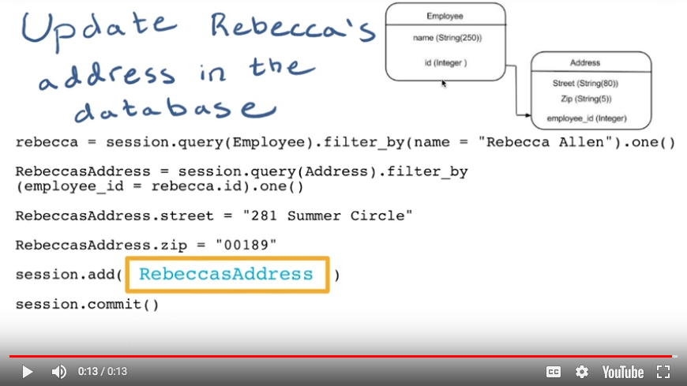

# CRUD

<a href="https://www.udacity.com/">
  
</a>

Udacity Full Stack Web Developer Nanodegree program

Brendon Smith

br3ndonland

[Full Stack Foundations](https://www.udacity.com/course/full-stack-foundations--ud088)

Lesson 1. Working with CRUD

## Table of Contents

- [Table of Contents](#table-of-contents)
- [Intro](#intro)
  - [01. Course Intro](#01-course-intro)
  - [02. Prerequisites & Preparation](#02-prerequisites-preparation)
- [CRUD intro](#crud-intro)
  - [03. Project Introduction - CRUD](#03-project-introduction---crud)
  - [04. Quiz: CRUD Review 1](#04-quiz-crud-review-1)
  - [05. Quiz: CRUD Review 2](#05-quiz-crud-review-2)
  - [06. Quiz: CRUD Review 3](#06-quiz-crud-review-3)
  - [07. Quiz: CRUD Review 4](#07-quiz-crud-review-4)
- [SQL](#sql)
  - [08. SQL](#08-sql)
  - [09. Quiz: SQL Quiz Select](#09-quiz-sql-quiz-select)
  - [10. Quiz: SQL Insert Into](#10-quiz-sql-insert-into)
  - [11. Quiz: SQL Update](#11-quiz-sql-update)
  - [12. Quiz: SQL Delete](#12-quiz-sql-delete)
  - [13. Creating a Database and ORMs](#13-creating-a-database-and-orms)
- [SQLAlchemy](#sqlalchemy)
  - [14. Introducing SQLAlchemy](#14-introducing-sqlalchemy)
  - [15. Creating a Database - Configuration](#15-creating-a-database---configuration)
  - [16. Creating a Database - Class and Table](#16-creating-a-database---class-and-table)
  - [17. Creating a Database - Mapper](#17-creating-a-database---mapper)
  - [18. Putting It All Together](#18-putting-it-all-together)
  - [19. Quiz: Database Setup Quiz Part 1](#19-quiz-database-setup-quiz-part-1)
  - [20. Quiz: Database Setup Quiz Part 2](#20-quiz-database-setup-quiz-part-2)
- [CRUD process](#crud-process)
  - [21. CRUD Create](#21-crud-create)
  - [22. Quiz: CRUD Create Quiz](#22-quiz-crud-create-quiz)
  - [23. CRUD Read](#23-crud-read)
  - [24. Quiz: CRUD Read Quiz](#24-quiz-crud-read-quiz)
  - [25. CRUD Update](#25-crud-update)
  - [2 Quiz: CRUD Update Quiz](#2-quiz-crud-update-quiz)
  - [27. CRUD Delete](#27-crud-delete)
  - [28. Quiz: CRUD Delete Quiz](#28-quiz-crud-delete-quiz)
  - [29. CRUD Review](#29-crud-review)
- [Outro](#outro)
  - [30. Wrap Up](#30-wrap-up)
- [Feedback on Lesson 1](#feedback-on-lesson-1)

## Intro

### 01. Course Intro

Lorenzo Brown will be the instructor for this course.

We will be making **data-driven web applications.**

- Web applications: Interactive user experience.
- Data-driven: Uses data to deliver customized content.

### 02. Prerequisites & Preparation

- Git
- VirtualBox
- Vagrant

Already ready!

## CRUD intro

### 03. Project Introduction - CRUD

We're going to be creating a restaurant menu app. We will be able to:

- CREATE menu items
- READ the items we've created
- UPDATE with new items
- DELETE items

Basically all our actions on the web can be summarized by CRUD.

### 04. Quiz: CRUD Review 1

Reading news articles is a READ.

### 05. Quiz: CRUD Review 2

Clearing out junk mail is a DELETE.

### 06. Quiz: CRUD Review 3

Making a new blog profile is a CREATE.

### 07. Quiz: CRUD Review 4

Changing the number of items in an online shopping cart would be an UPDATE.

## SQL

### 08. SQL

SQL can go between databases and application code.

### 09. Quiz: SQL Quiz Select

SQL `SELECT` is like CRUD READ.

### 10. Quiz: SQL Insert Into

SQL `INSERT INTO` is like CRUD CREATE. It inserts a new row into the database.

### 11. Quiz: SQL Update

SQL `UPDATE` is like CRUD UPDATE!

> Correct! An UPDATE in SQL changes an existing row of information in a database table, just like the UPDATE in CRUD

### 12. Quiz: SQL Delete

SQL `DELETE` is like CRUD DELETE!

### 13. Creating a Database and ORMs

Restaurant menus are all pretty similar. The menu belongs to a specific restaurant, and contains menu items.

We walked through construction of the database layout. Makes sense to me!

restaurantmenu.db

- `Restaurant` table
  - `name`
  - `id`
- `Menu_Item` table
  - `name`
  - `description`
  - `price`
  - `course`
  - `restaurant_id` as a foreign key referencing the `Restaurant` table.


We will use Object-Relational Mappers (ORMs) to transform code from Python objects to SQL statements.

## SQLAlchemy

### 14. Introducing SQLAlchemy

SQLAlchemy is an open-source ORM for Python. It was pre-installed in our Vagrant virtual machine.

### 15. Creating a Database - Configuration

- Configuration
  - At beginning of file:
    - Import necessary modules
    - Create instance of "declarative base"
  - At end of file:
    - Connect database and add tables and columns
- Class
  - Represent database tables as Python classes
    - `Restaurant` table
    - `Menu_Item` table
  - We will use CamelCase for class names.
  - We will include table and mapper code.
- Table
  - Represents specific table in database
- Mapper
  - Maps columns of the database tables to Python objects
  - `columnName = Column(attributes,...)`
  - Example attributes
    - String(250)
    - Integer
    - relationship(Class)
    - nullable = False
    - primary_key = True
    - ForeignKey('some_table.id')

I followed along and filled out the code in *database_setup.py*.

### 16. Creating a Database - Class and Table

### 17. Creating a Database - Mapper

### 18. Putting It All Together

### 19. Quiz: Database Setup Quiz Part 1

`Base` should be an instance of class `declarative_base`

### 20. Quiz: Database Setup Quiz Part 2

`id = Column(Integer,`
`employee = relationship(Employee)`

## CRUD process

### 21. CRUD Create

- We walked through database creation in the Python shell. I followed along in vagrant.
- I copied *database_setup.py* into *vagrant/crud*.
- SQLAlchemy uses "sessions" to connect to the database. We can store the commands we plan to use, but not send them to the database until we run a commit.
- Setup:

  ```python
  python
  >>> from sqlalchemy import create_engine
  >>> from sqlalchemy.orm import sessionmaker
  >>> from database_setup import Base, Restaurant, MenuItem
  >>> engine = create_engine('sqlite:///restaurantmenu.db')
  >>> Base.metadata.bind = engine
  >>> DBSession = sessionmaker(bind = engine)
  >>> session = DBSession()
  ```

  Note use of `database_setup` to import classes, not `database_setup.py`.
- Making a new entry in the database is as easy as making a new object in Python:

  ```python
  newEntry = ClassName(property = 'value', ...)
  session.add(newEntry)
  session.commit()
  ```

  I did this with the restaurant menu database:

  ```python
  >>> stokespurple = MenuItem(name = "Stokes Purple Sweet Potato", description = "The legendary and mysterious purple sweet potato, steamed to perfection", course = "Entree", price = "$11.99", restaurant = myFirstRestaurant)
  >>> session.add(stokespurple)
  >>> session.commit()
  ```

### 22. Quiz: CRUD Create Quiz

Rocked it. Entry 1 was `name`, entry 2 was `newEmployee` (the foreign key).

### 23. CRUD Read

I cloned the *Full-Stack-Foundations* repo into the *vagrant* directory.

### 24. Quiz: CRUD Read Quiz

Rocked it again. The code was working with an example database of employees. We selected all the employees, and stored them in a variable:

```python
employees = session.query(Employee).all()
```

then printed out the name of each employee:

```python
for employee in employees:
    print(employee.name)
```

### 25. CRUD Update

Simple four step process:

1. Query database with SQLAlchemy and store query as an object

    ```python
    query = session.query(ClassName).filter_by(name='Old Item Name')
    ```

2. Overwrite object with new info for database

    ```python
    query.name = 'New Item Name'
    ```

3. Add to SQLAlchemy database session with `session.add()`.

    ```python
    session.add(query)
    ```

4. Commit to SQLAlchemy database session with `session.commit()`.

    ```python
    session.commit()
    ```

For the restaurant example in this lesson:

1. Query database with SQLAlchemy and store query as an object

    ```python
    >>> veggieBurgers = session.query(MenuItem).filter_by(name='Veggie Burger')
    >>> for veggieBurger in veggieBurgers:
    ...     print veggieBurger.id
    ...     print veggieBurger.price
    ...     print veggieBurger.restaurant.name
    ...     print "\n"
    >>> UrbanVeggieBurger = session.query(MenuItem).filter_by(id=8).one()
    >>> print UrbanVeggieBurger.price
    ```

2. Overwrite object with new info for database

    ```python
    >>> UrbanVeggieBurger.price = '$2.99'
    ```

3. Add to SQLAlchemy database session with `session.add()`.

    ```python
    >>> session.add(UrbanVeggieBurger)
    ```

4. Commit to SQLAlchemy database session with `session.commit()`.

    ```python
    >>> session.commit()
    ```

  Lorenzo also created another `for` loop to change all the veggie burger prices to $2.99, if they are not already that price:

  ```python
  >>> for veggieBurger in veggieBurgers:
  ...     if veggieBurger.price != '$2.99':
  ...         veggieBurger.price = '$2.99'
  ...         session.add(veggieBurger)
  ...         session.commit()
  ...
  >>> for veggieBurger in veggieBurgers:
  ...     print veggieBurger.id
  ...     print veggieBurger.price
  ...     print veggieBurger.restaurant.name
  ...     print "\n"
  ```

The instructor notes explain:

>Note: The id numbers and restaurants for the Veggie Burgers will be a bit different on your machine than the ones in this lesson. lotsofmenus.py was updated to have a few more restaurant options and menu items.

### 2 Quiz: CRUD Update Quiz

Rocked it. Just needed `session.add(RebeccasAddress)`



### 27. CRUD Delete

Three step process

1. Find entry
2. `session.delete(entry)`
3. `session.commit()`

### 28. Quiz: CRUD Delete Quiz

`session.delete(Mark)`

### 29. CRUD Review

#### Operations with SQLAlchemy

In this lesson, we performed all of our CRUD operations with SQLAlchemy on an SQLite database. Before we perform any operations, we must first import the necessary libraries, connect to our restaurantMenu.db, and create a session to interface with the database:

```python
from sqlalchemy import create_engine
from sqlalchemy.orm import sessionmaker
from database_setup import Base, Restaurant, MenuItem

engine = create_engine('sqlite:///restaurantMenu.db')
Base.metadata.bind=engine
DBSession = sessionmaker(bind = engine)
session = DBSession()
```

#### CREATE

We created a new Restaurant and called it Pizza Palace:

```python
myFirstRestaurant = Restaurant(name = "Pizza Palace")
session.add(myFirstRestaurant)
sesssion.commit()
```

We created a cheese pizza menu item and added it to the Pizza Palace Menu:

```python
cheesepizza = menuItem(name="Cheese Pizza", description =
"Made with all natural ingredients and fresh mozzarella",
course="Entree", price="$8.99", restaurant=myFirstRestaurant)
session.add(cheesepizza)
session.commit()
```

#### READ

We read out information in our database using the query method in SQLAlchemy:

```python
firstResult = session.query(Restaurant).first()
firstResult.name

items = session.query(MenuItem).all()
for item in items:
    print item.name
```

#### UPDATE

In order to update and existing entry in our database, we must execute the following commands:

1. Query database with SQLAlchemy and store query as an object
2. Overwrite object with new info for database
3. Add to SQLAlchemy database session with `session.add()`.
4. Commit to SQLAlchemy database session with `session.commit()`.

We found the veggie burger that belonged to the Urban Burger restaurant by executing the following query:

```python
veggieBurgers = session.query(MenuItem).filter_by(name= 'Veggie Burger')
for veggieBurger in veggieBurgers:
    print veggieBurger.id
    print veggieBurger.price
    print veggieBurger.restaurant.name
    print "\\n"
```

Then we updated the price of the veggie burger to $2.99:

```python
UrbanVeggieBurger = session.query(MenuItem).filter_by(id=8).one()
UrbanVeggieBurger.price = '$2.99'
session.add(UrbanVeggieBurger)
session.commit()
```

#### DELETE

To delete an item from our database we must follow the following steps:

1. Find the entry
2. `Session.delete(Entry)`
3. `Session.commit()`

We deleted spinach Ice Cream from our Menu Items database with the following operations:

```python
spinach = session.query(MenuItem).filter_by(name = 'Spinach Ice Cream').one()
session.delete(spinach)
session.commit()
```

## Outro

### 30. Wrap Up

## Feedback on Lesson 1

Lorenzo did a good job with this lesson. It was informative and fun, and the quiz questions made sense to me.

[(Back to TOC)](#table-of-contents)