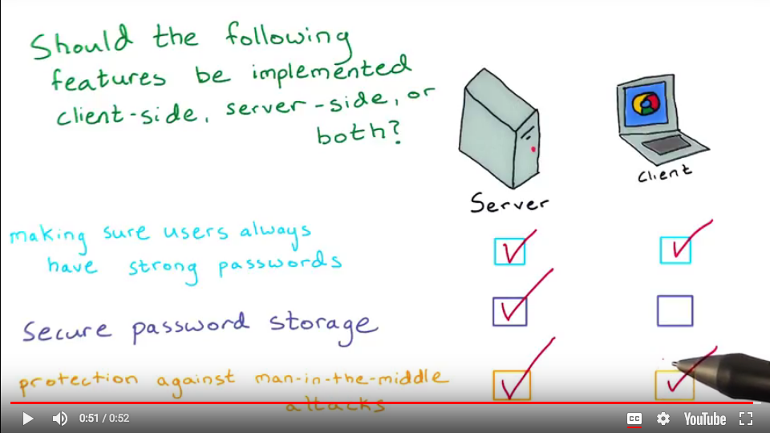

# Authentication and Authorization

<a href="https://www.udacity.com/">
  
</a>

Udacity Full Stack Web Developer Nanodegree program

Brendon Smith

br3ndonland

[Authentication & Authorization: OAuth](https://www.udacity.com/course/authentication-authorization-oauth--ud330)

## Table of Contents

- [Table of Contents](#table-of-contents)
- [Lesson 1. Authentication and Authorization](#lesson-1-authentication-and-authorization)
  - [1.01. Intro](#101-intro)
  - [1.02. Course Map](#102-course-map)
  - [1.03. Authentication](#103-authentication)
  - [1.04. Quiz: Authentication is hard](#104-quiz-authentication-is-hard)
  - [1.05. Quiz: Implementing Authentication is Hard](#105-quiz-implementing-authentication-is-hard)
  - [1.06. Using Third Party Auth Providers](#106-using-third-party-auth-providers)
  - [1.07. Authorization](#107-authorization)
  - [1.08. Authentication without Authorization](#108-authentication-without-authorization)
  - [1.09. Auth providers](#109-auth-providers)
  - [1.10. Pros and Cons using Third Party](#110-pros-and-cons-using-third-party)
  - [1.11](#111)
  - [1.12 Quiz: Follow the Flow](#112-quiz-follow-the-flow)
  - [1.13. Outro](#113-outro)
  - [Feedback on Lesson 1](#feedback-on-lesson-1)
- [Lesson 2. OAuth Flows and Google Sign-In](#lesson-2-oauth-flows-and-google-sign-in)
  - [2.01. Intro to Lesson 2](#201-intro-to-lesson-2)
  - [2.02. Types of Flow](#202-types-of-flow)
  - [2.03. Google+ Auth for server side apps](#203-google-auth-for-server-side-apps)
  - [2.04. Step 0 Get initial app running](#204-step-0-get-initial-app-running)
  - [2.05. Quiz: Step 1 Create Client ID & Secret](#205-quiz-step-1-create-client-id-secret)
  - [2.06. Quiz: Step 2 Create anti-forgery state token](#206-quiz-step-2-create-anti-forgery-state-token)
  - [2.07. Quiz: Step 3 Create login page](#207-quiz-step-3-create-login-page)
  - [2.08. Quiz: Step 4 Make a Callback Method](#208-quiz-step-4-make-a-callback-method)
  - [2.09. Quiz: Step 5 GConnect](#209-quiz-step-5-gconnect)
  - [2.10](#210)
  - [2.11. Quiz: Step 6 Disconnect](#211-quiz-step-6-disconnect)
  - [2.12. Quiz: Step 7 Protecting Pages](#212-quiz-step-7-protecting-pages)
  - [2.13. Wrap-up](#213-wrap-up)
  - [Feedback on Lesson 2](#feedback-on-lesson-2)
- [Lesson 3. Local permission system](#lesson-3-local-permission-system)
  - [3.01. Lesson 3 Introduction](#301-lesson-3-introduction)
  - [3.02. Implementing a Local Permission System](#302-implementing-a-local-permission-system)
  - [3.03. Quiz: Updating the User Model](#303-quiz-updating-the-user-model)
  - [3.04. Creating a New User](#304-creating-a-new-user)
  - [3.05. Quiz: Obtaining Credentials of an Existing User](#305-quiz-obtaining-credentials-of-an-existing-user)
  - [3.06. Quiz: Protect Menu Pages](#306-quiz-protect-menu-pages)
  - [3.07. Wrap-Up Lesson 3](#307-wrap-up-lesson-3)
  - [Feedback on Lesson 3](#feedback-on-lesson-3)
- [Lesson 4. Facebook OAuth](#lesson-4-facebook-oauth)
  - [4.01. Adding Additional OAuth Providers](#401-adding-additional-oauth-providers)
  - [4.02. Registering your App with Facebook](#402-registering-your-app-with-facebook)
  - [4.03. Client-Side Login with Facebook SDK](#403-client-side-login-with-facebook-sdk)
  - [4.04. Quiz: Updating login.html](#404-quiz-updating-loginhtml)
  - [4.05. Update project.py (part I)](#405-update-projectpy-part-i)
  - [4.06. Update project.py (part II)](#406-update-projectpy-part-ii)
  - [4.07. Quiz: Updating project.py Code](#407-quiz-updating-projectpy-code)
  - [4.08. Exploring other OAuth2.0 Providers](#408-exploring-other-oauth20-providers)
  - [4.09. Outro](#409-outro)
  - [Feedback on Lesson 4](#feedback-on-lesson-4)
- [General OAuth course feedback](#general-oauth-course-feedback)

## Lesson 1. Authentication and Authorization

### 1.01. Intro

Lorenzo Brown is teaching this course.

Instructor notes

> [Learn JavaScript](https://www.udacity.com/course/ud804)
>
> [Learn Ajax](https://www.udacity.com/course/ud2.0)
>
> [Learn jQuery](https://www.udacity.com/course/ud245)
>
> Set up your [Google](https://www.google.com/) account.
>
> Set up your [Facebook](https://www.facebook.com/) account.

### 1.02. Course Map

Four lessons again:

1. Authentication and Authorization
2. Google sign-in for oauth2
3. Local permission system to protect each user's data from other users
4. Facebook as another oauth2 provider

The material extends the restaurant menu app.

**The course code exists, confusingly, in two repos: [OAuth2.0](https://github.com/udacity/OAuth2.0) and [ud330](https://github.com/udacity/ud330/blob/master/Lesson2/step2/project.py). The code in ud330 is formatted a little better than the OAuth repo.**

Instructor notes

> Check out Udacity's awesome course on [Applied Cryptography](https://www.udacity.com/course/cs387) if you are interested in learning more about these concepts
>
> [Here](http://lepture.com/en/2013/create-oauth-server) is a blog on creating a your own auth system with Flask.

The instructor notes in Lesson 1.02 Authentication and Authorization link to [lepture's blog post about Flask-OAuthlib](http://lepture.com/en/2013/create-oauth-server). He was the creator of Flask-OAuthlib and has now replaced it with the [announcement of Authlib](https://lepture.com/en/2018/announcement-of-authlib). We don't even use Flask-OAuthlib in this course, so I felt like this link was more distracting than helpful.

### 1.03. Authentication

### 1.04. Quiz: Authentication is hard

Most important:

- Strong passwords
- Strong encryption
- Secure communication

Other security features:

- Password storage
- Two factor authentication
- Password recovery
- Man-in-the-middle attack protection

### 1.05. Quiz: Implementing Authentication is Hard



Instructor notes

> Read more about:
>
> [App for Checking password security](https://howsecureismypassword.net/)
>
> [Password Storage - Hashing vs. Encrypting](http://www.darkreading.com/safely-storing-user-passwords-hashing-vs-encrypting/a/d-id/1269374)
>
> [Man-in-the-Middle Attacks](http://en.wikipedia.org/wiki/Man-in-the-middle_attack)

### 1.06. Using Third Party Auth Providers

User authentication frameworks have already been developed, so we don't have to reinvent the wheel with each application.

### 1.07. Authorization

Authentication is verifying identity, authorization is access permissions.

### 1.08. Authentication without Authorization

I didn't get the quiz on the first few tries, and there were too many options to know where I was going wrong, so I just moved on.

### 1.09. Auth providers

OAuth

### 1.10. Pros and Cons using Third Party

People may be uncomfortable giving your app Google permissions because they may not want to give your app the ability to change unrelated aspects of their Google accounts. Establishing appropriate authorization permissions is key.

**Google created an [OAuth Playground](https://developers.google.com/oauthplayground/) to allow users to test their OAuth builds.** We didn't actually learn to use the OAuth Playground.

### 1.11

### 1.12 Quiz: Follow the Flow

### 1.13. Outro

### Feedback on Lesson 1

Helpful to distinguish between authentication and authorization, and think about the pros and cons of third party sign in.

## Lesson 2. OAuth Flows and Google Sign-In

### 2.01. Intro to Lesson 2

### 2.02. Types of Flow

OAuth flows

Flow refers to how information is exchanged between the client, server, and OAuth provider.

- Client-side authentication is performed by JavaScript from the user's browser. This is mostly for "single-page, browser-based web applications." Mobile devices can have full authentication functionality. It is quick and easy, but places a lot of trust in the browser or mobile device, and prevents the server from making API calls on behalf of the user.
- Server-side authentication can obtain an access token that allows the server to make API requests on behalf of the user.
- Google+ uses a hybridized flow. Client-side authentication is performed, but the server can still make API calls on behalf of the client. It is difficult for unauthorized users to obtain access codes.

> Check out this [blog](https://aaronparecki.com/articles/2012/07/29/1/oauth2-simplified) that explains some of the flow options using OAuth 2.0

### 2.03. Google+ Auth for server side apps

[Google OAuth2 documentation](https://developers.google.com/identity/protocols/OAuth2)


### 2.04. Step 0 Get initial app running

- We used Vagrant again here.
- I forked the [OAuth repo](https://github.com/udacity/OAuth2.0) and cloned it into the vagrant directory. The material extends the restaurant menu app.
- Logged into vagrant as usual.
- We will be using Flask again here. Also see Lesson 08. Frameworks (from free course [Full Stack Foundations](https://www.udacity.com/course/full-stack-foundations--ud088))
- Started up the Flask web server:

  ```text
  $ cd /vagrant/OAuth2.0
  vagrant@vagrant:/vagrant/OAuth2.0$ python database_setup.py
  vagrant@vagrant:/vagrant/OAuth2.0$ python lotsofmenus.py
  added menu items!
  vagrant@vagrant:/vagrant/OAuth2.0$ python project.py
   *Running on http://0.0.0.0:5000/ (Press CTRL+C to quit)
   *Restarting with stat
   *Debugger is active!
   *Debugger PIN: 769-024-554
  ```

### 2.05. Quiz: Step 1 Create Client ID & Secret

The client ID and secret allow the app to communicate with Google.

The video walks through Google API project creation.

Instructor notes

> Errata:
>
> Google has changed the user interface for obtaining OAuth credentials since this video was created. The functionality is the same, but the appearance is somewhat different from what's depicted here.
>
> 1. Go to your app's page in the [Google APIs Console](https://console.developers.google.com/apis)
> 2. Choose Credentials from the menu on the left.
> 3. Create an OAuth Client ID.
> 4. This will require you to configure the consent screen, with the same choices as in the video.
> 5. When you're presented with a list of application types, choose Web application.
> 6. You can then set the authorized JavaScript origins, with the same settings as in the video.
> 7. You will then be able to get the client ID and client secret.
>
> You can also download the client secret as a JSON data file once you have created it.

After creating the client ID and secret, set the "Authorized JavaScript Origins" to:

[http://localhost:5000](http://localhost:5000)

### 2.06. Quiz: Step 2 Create anti-forgery state token

- This helps verify the authenticated user and prevent attacks.
- We import Flask's version of sessions, and name it `login_session`:

  ```python
  from flask import session as login_session
  import random, string
  ```

  - `login_session` is a dictionary. We can store values there during the session.
- We then create the login page app route:

  ```python
  @app.route('/login')
  def login():
      """App route function to log in and generate token."""
      state = ''.join(random.choice(string.ascii_uppercase + string.digits)
                      for x in range(32))
      login_session['state'] = state
      return 'The current session state is {}'.format(login_session['state'])
  ```

  - Session works like a dictionary and can store values.
  - `random` and `string` are used to generate a random string, stored in an object with the name `state` here.
  - The `xrange` in Python 2 is replaced by `range` in Python 3.
  - The `state` token is stored in the `login_session` object.
  - To test this, we can just return a string in the browser with the token. Later, we will render the `login.html` template.

The code for this step is in [another repo](https://github.com/udacity/ud330/blob/master/Lesson2/step2/project.py) with code that is formatted a little better than the OAuth repo.

Got the authentication working.

[http://0.0.0.0:5000/login](http://0.0.0.0:5000/login)

```text
The current session state is 7T0F4XSE3DUWIMW39IV3Y35QR1TT8FS9
```

### 2.07. Quiz: Step 3 Create login page

I followed along by looking at /vagrant/ud330/Lesson2/step3/templates/login.html.

### 2.08. Quiz: Step 4 Make a Callback Method

Lorenzo adds JavaScript code to the login.html page inside script tags. He uses jQuery to make an AJAX call, which we haven't learned yet (should be in part 4 I think).

- `url: '/gconnect?state={{STATE}}',` passes the state token as an argument to protect against CSRF.
- `processData: false,` tells jQuery not to process the response into a string.
- A successful login returns a success message to the user.

Instructor notes:

> View the [login.html](https://github.com/udacity/ud330/blob/master/Lesson2/step4/templates/login.html) page now with the added callback function.
>
> At the 1:00 minute mark, Lorenzo adds a template variable called STATE.
>
> In order to populate that variable when the template is rendered, you need to pass it to the render_template function:
>
> ```python
> # Create anti-forgery state token
> @app.route('/login')
> def showLogin():
>     state = ''.join(random.choice(string.ascii_uppercase + string.digits)
>                     for x in xrange(32))
>     login_session['state'] = state
>     # return "The current session state is %s" % login_session['state']
>     return render_template('login.html', STATE=state)
> ```

### 2.09. Quiz: Step 5 GConnect

- Add new imports

  ```python
  # Import OAuth modules for user authentication
  from oauth2client.client import flow_from_clientsecrets, FlowExchangeError
  from flask import make_response
  import json
  import requests
  ```

- Go back to the [Google API console](https://console.developers.google.com/apis/dashboard) and download Google API credentials as JSON.
  - **Why not just do this in the first place? Lorenzo needs to be more organized.**
- Rename the file *client_secrets.json- and store in same directory as main application file.
- Create a server-side helper function to store the client secret as an object

  ```python
  CLIENT_ID = json.loads(open('client_secrets.json', 'r')
      .read())['web']['client_id']
  ```

- Create GConnect app route (see code in project.py)

Instructor notes

> The code from this video can be found [here](https://github.com/udacity/ud330/blob/master/Lesson2/step5/project.py).
>
> **IMPORTANT:** Depending on the version of Flask you have, you may or may not be able to store a credentials object in the `login_session` the same way that Lorenzo does. You may get the following error:
>
> OAuth2Credentials object is not JSON serializable
>
> What should you do to fix this? There are three options:
>
> 1. Rather than storing the entire `credentials` object you can store just the access token instead. It can be accessed using `credentials.access_token`.
> 2. The OAuth2Credentials class comes with methods that can help you. The `.to_json()` and `.from_json()` methods can help you store and retrieve the credentials object in json format.
> 3. Update your versions of Flask, ***and*** to match Lorenzo's. Use the following commands:
>
>     ```text
>     pip install werkzeug==0.8.3
>     pip install flask==0.9
>     pip install Flask-Login==0.1.3
>     ```
>
> **Note:** If you get a permissions error, you will need to include `sudo` at the beginning of each command. That should look like this: `sudo pip install flask==0.9`
>
> Go to the GoogleDevConsole> API & Auth> Credentials>Select your app> Authorized Redirect URIs and add the following URIS: [http://localhost:5000/login](http://localhost:5000/login) and [http://localhost:5000/gconnect](http://localhost:5000/gconnect) You may have to change the port number depending on the port number you have set your app to run on.
>
> Example code: [https://github.com/udacity/ud330/blob/master/Lesson2/step5/project.py](https://github.com/udacity/ud330/blob/master/Lesson2/step5/project.py)
>
> Have questions? Head to the [forums](https://forums.udacity.com?forum_path=c/nd004-full-stack-broadcast) for discussion with the Udacity Community.

### 2.10

### 2.11. Quiz: Step 6 Disconnect

See code in project.py

### 2.12. Quiz: Step 7 Protecting Pages

The quiz was about which pages should be publicly visible vs. private. Obviously any pages on which you are modifying the site should be private.

Pages are made private by adding login as a condition.

For example, on the new restaurant page:

```python
@app.route('/restaurant/new/', methods=['GET', 'POST'])
def newRestaurant():
    if 'username' not in login_session:
        return redirect('/login')
```

### 2.13. Wrap-up

### Feedback on Lesson 2

Lots of PEP 8 errors in the [OAuth2.0](https://github.com/udacity/OAuth2.0)/project.py file. I shouldn't have to lint the instructors' code.

For some reason there are two repos for this course, [OAuth2.0](https://github.com/udacity/OAuth2.0) and [ud330](https://github.com/udacity/ud330).

[(Back to TOC)](#table-of-contents)

## Lesson 3. Local permission system

### 3.01. Lesson 3 Introduction

The local permission system is an additional measure to ensure authenticity. It stores login credentials in a `login_session` object to control the experience by user.

### 3.02. Implementing a Local Permission System

The database should have a user table.

Update *database_setup.py- to include a user table:

```python
class User(Base):
    __tablename__ = 'user'

    id = Column(Integer, primary_key=True)
    name = Column(String(250), nullable=False)
    email = Column(String(250), nullable=False)
    picture = Column(String(250))

```

Add a foreign key to the `restaurant` and `menu_item` tables to reference the user table so that only the creators of the items can edit them:

```python
user_id = Column(Integer, ForeignKey('user.id'))
```


### 3.03. Quiz: Updating the User Model

### 3.04. Creating a New User

User helper functions:

The `createUser()` function will look up users in the database table based on their email addresses used for login.

There are three helpful methods here:

1. `createUser()` adds a user to the database.
2. `getUserInfo()` returns a user object associated with the user ID number.
3. `getUserID()` takes an email address as input and returns the user ID number if the user is stored in the database.

### 3.05. Quiz: Obtaining Credentials of an Existing User

Store in `user_id` objects.

### 3.06. Quiz: Protect Menu Pages

Lorenzo creates separate templates for public viewers and logged-in users.

He adds the local permission system to the app routes requiring login:

```python
@app.route('/restaurant/new/', methods=['GET', 'POST'])
def newRestaurant():
    if 'username' not in login_session:
        return redirect('/login')
    if request.method == 'POST':
        newRestaurant = Restaurant(name=request.form['name'])
        session.add(newRestaurant)
        flash('New Restaurant %s Successfully Created' % newRestaurant.name)
        session.commit()
        return redirect(url_for('showRestaurants'))
    else:
        return render_template('newRestaurant.html')
```

Instructor notes

> Click to view the [publicmenu.html](https://github.com/udacity/ud330/blob/master/Lesson3/step3/templates/publicmenu.html) and [publicrestaurants.html](https://github.com/udacity/ud330/blob/master/Lesson3/step3/templates/publicrestaurants.html) templates.
>
> Note:
>
> In order to view the profile picture of the creator of each menu, add code to your project.py file to query the creator:
> ```python
> creator = getUserInfo(restaurant.user_id)
> ```
> then pass in the creator object when you render the template:
> ```python
> return render_template('publicmenu.html', items = items, restaurant = restaurant, creator= creator)
> ```
> Inside your templates you can now use `{{creator.picture}}` and `{{creator.name}}` to share the name and picture of each restaurant creator.

### 3.07. Wrap-Up Lesson 3

### Feedback on Lesson 3

Brief lesson, no feedback

[(Back to TOC)](#table-of-contents)

## Lesson 4. Facebook OAuth

**Facebook login would probably be more effectively implemented with JavaScript. See the [Facebook login documentation](https://developers.facebook.com/docs/facebook-login).**

### 4.01. Adding Additional OAuth Providers

### 4.02. Registering your App with Facebook

### 4.03. Client-Side Login with Facebook SDK

### 4.04. Quiz: Updating login.html

### 4.05. Update project.py (part I)

The instructor notes warn against a change to the Facebook API URL, but the lesson code was updated.

Instructor notes

> **Important:** Facebook has updated their API since this course was released. This affects code that is shown in this video at 0:32 on line 194. Instead of...
>
> `url = 'https://graph.facebook.com/v2.2/me?%s' % token`
>
> ... the code must be...
>
> `url = 'https://graph.facebook.com/v2.8/me?access_token=%s&fields=name,id,email' % token`
>
> Here is some more information about the change:
>
> *An app can make calls to the version of the API that was the latest available when the app was created, as well as any newer, un-deprecated versions launched after the app is created.*
>
> Here is the main change from version 2.2 that will impact Full-Stack students:
>
> *Fewer default fields for faster performance: To help improve performance on mobile network connections, we've reduced the number of fields that the API returns by default. You should now use the `?fields=field1,field2` syntax to declare all the fields you want the API to return.*
>
> They say "we've reduced the number of fields that the API returns by default." This is important because one of the fields that is no longer returned by default is the `email` field. You must now explicitly request email to be returned (along with the other fields you want).
>
> The API version 2.2 that was used in this course has been officially deprecated by Facebook as of March 25th, 2017. Requests made to that version will no longer work. Please use the most current version of the Facebook API with your project code.
>
> Have questions? Head to the [forums](https://forums.udacity.com?forum_path=c/nd004-full-stack-broadcast) for discussion with the Udacity Community.

### 4.06. Update project.py (part II)

### 4.07. Quiz: Updating project.py Code

Instructor notes

> In order to properly log out of Facebook, the access token needs to be sent along with the facebook id in fbdisconnect. Please see the new code in the fbconnect and fbdisconnect methods in the [project.py](https://github.com/udacity/ud330/tree/master/Lesson4/step2/project.py) file.
>
> View the code for this activity on [GitHub](https://github.com/udacity/ud330/tree/master/Lesson4/step2).

### 4.08. Exploring other OAuth2.0 Providers

### 4.09. Outro

Instructor notes

The final code for this project can be found on [GitHub](https://github.com/udacity/ud330).

Here is the [Offical OAuth 2.0 website](http://oauth.net/2/).

### Feedback on Lesson 4

Another very brief lesson

## General OAuth course feedback

- I was disappointed in this course.
- The code is outdated and poorly formatted.
  - Python 2 instead of 3
  - HTTP requests use `httplib2` instead of `requests`
  - Code is not PEP 8 compliant.
  - Code mixes spaces and tabs.
  - JavaScript camelCase used instead of underscores for function names.
  - JavaScript camelCase even used for CSS classes! For example, in *login.html*, `<div id="signinButton">`. CSS classes are specified in lowercase, with hyphens in between.
  - Doesn't even have a proper Markdown-formatted README
  - Code exists, confusingly, in two repos: [OAuth2.0](https://github.com/udacity/OAuth2.0) and [ud330](https://github.com/udacity/ud330/blob/master/Lesson2/step2/project.py). The code in ud330 is formatted a little better than the OAuth repo.
- **GitHub repos are not maintained. Pull requests are ignored.** The GitHub repos are an opportunity to enrich the student experience by teaching good open source practices, but Udacity is not doing this.
- The instructor Lorenzo's method of storing many different versions of the files, and constantly going back and updating them, was confusing and time-consuming.
- I didn't find the lessons very useful until I started the item catalog project. The code didn't mean much to me until I was implementing it in my own project. I almost felt like I could have started the project before watching the lessons.

[(Back to TOC)](#table-of-contents)