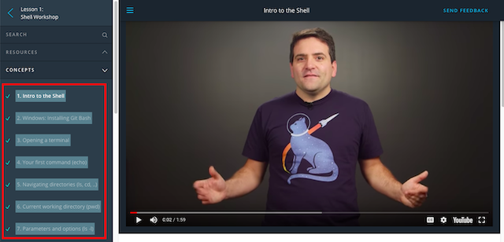
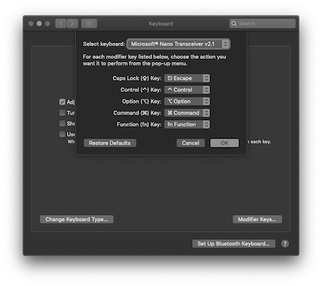

# README

<a href="https://www.udacity.com/">
  
</a>

[Udacity Full Stack Developer Nanodegree program](https://www.udacity.com/course/full-stack-web-developer-nanodegree--nd004)

Brendon Smith ([br3ndonland](https://github.com/br3ndonland))

[](https://choosealicense.com/licenses/mit/)

Code in this repository is provided under the terms of the [MIT license](https://choosealicense.com/licenses/mit/).

<a href="https://colab.research.google.com/github/br3ndonland/udacity-fsnd">
  
</a> Launch in Google Colaboratory

[](https://mybinder.org/v2/gh/br3ndonland/udacity-fsnd/master?urlpath=lab) Launch in Binder container

## Table of Contents <!-- omit in toc -->

- [Description](#description)
- [Strategies](#strategies)
  - [Projects](#projects)
  - [Lessons](#lessons)
- [Computing environment](#computing-environment)
  - [Keymapping](#keymapping)
  - [Package management](#package-management)
  - [Shell](#shell)
  - [Version control](#version-control)
  - [Text editor](#text-editor)
  - [Browsers](#browsers)
- [Code syntax](#code-syntax)
  - [JavaScript](#javascript)
  - [Python](#python)

## Description

This is a repository for [Udacity Full Stack Web Developer Nanodegree program](https://www.udacity.com/course/full-stack-web-developer-nanodegree--nd004) (FSND) course notes and materials. The full program description and syllabus can be found on the [Udacity website](https://www.udacity.com/course/full-stack-web-developer-nanodegree--nd004), in [this repo](info/fsnd-syllabus.md), and via [PDF download](https://d20vrrgs8k4bvw.cloudfront.net/documents/en-US/Full+Stack+Web+Developer+Nanodegree+Program+Syllabus.pdf).

Full stack web developers work on all aspects of websites and apps, from front end (features that users see) to back end (servers and databases). In this program, I built skills including:

- Developing webpages based on mockup images from designers
- Querying and manipulating large databases with SQL
- Creating functional multi-page web apps with databases and sign-ins
- Fetching data from Application Programming Interfaces (APIs)
- Deploying apps to Linux servers

The Full Stack Web Developer Nanodegree program is focused on projects, in which students can independently implement what they have learned in the lessons. I stored each project in its own repository.

1. [SQL database logs analysis](https://github.com/br3ndonland/udacity-fsnd-sql-logs)
2. [Python Flask catalog app](https://github.com/br3ndonland/udacity-fsnd-flask-catalog)
3. [Linux server deployment](https://github.com/br3ndonland/udacity-fsnd-flask-catalog-server)

The FSND program was recently reorganized. When I went through the program, it was longer, and I did three additional projects that are no longer included:

1. [Python web server movie trailer site](https://github.com/br3ndonland/udacity-fsnd-p1-python-movie-site)
2. [Portfolio website](https://github.com/br3ndonland/udacity-portfolio)
3. [Neighborhood map](https://github.com/br3ndonland/udacity-fsnd-p5-map)

## Strategies

### Projects

- **Focus on projects.** The Nanodegree is awarded for projects, not lessons and quizzes. As you advance past the fundamentals into the project topics, you may want to just skip directly to the projects, and go back through the lessons as needed. [Other students](https://medium.com/@MrsDragos/my-approach-to-udacitys-projects-db8db224f6f5) have succeeded with this project-focused approach.
- **Master Markdown.**
  - Markdown is a simplified HTML syntax that is very useful for notes and documentation.
  - Practicing Markdown will enable you to become fluent in a simple syntax.
  - Check out my Markdown guide at _[info/markdown-guide.md](./info/markdown-guide.md)_.
  - Helpful VSCode resources:
    - [Markdown and Visual Studio Code](https://code.visualstudio.com/Docs/languages/markdown)
- **Keep computational narratives.**
  - When coding projects, I keep computational narratives describing what I do at each step, like journals or lab notebooks. I learned how to keep computational narratives from scientific computing in Jupyter Notebook/JupyterLab and RMarkdown.
  - Computational narratives capture my train of thought, so I can retrace my steps, retain what I have learned, easily generate documentation, and teach others.
  - Here are some examples of my computational narratives:
    - [SQL logs analysis project narrative](https://github.com/br3ndonland/udacity-fsnd-sql-logs/blob/master/info/logs-methods.md)
    - [Flask catalog app narrative](https://github.com/br3ndonland/udacity-fsnd-flask-catalog/blob/master/info/flask-catalog-methods.md)
    - [Flask catalog app server deployment narrative](https://github.com/br3ndonland/udacity-fsnd-flask-catalog-server/blob/master/info/server-methods.md)
- **Break projects down into actionable steps.**
  - This is a key skill. As a developer, you will be given large tasks, like the projects in this Nanodegree program, without a clear step-by-step plan. You will need to plan out the project and make progress on each step.
  - I break the project down into steps, and make the steps headers in my computational narratives. I generate a Table of Contents from the headers, using the "Create Table of Contents" feature of the Markdown All In One VSCode extension.
  - As I work, I include code in Markdown fenced code blocks.
  - If you get stuck or blocked:
    - **Take a break.** Go do something else you enjoy. It's normal to get confused and frustrated. Don't let it get to you. When you are learning, expect to experience more [stretch](http://calnewport.com/blog/2012/11/21/knowledge-workers-are-bad-at-working-and-heres-what-to-do-about-it/) than [flow](https://www.wired.com/1996/09/czik/).
    - **Talk it out.** This is called "rubber duck debugging," because some people put a rubber duck on their desk and pretend they are talking to the duck. See the [rubber duck debugging website](https://rubberduckdebugging.com/) and [CS50 2018 - Lecture 4 - Data Structures: ddb50](https://youtu.be/ed2lnJNf7HU?t=1188).
    - **Write it down.** In addition to verbal rubber duck debugging, write the situation down in your computational narrative. Explain what you're stuck on.
    - **Break it down.** Break the problem down into smaller steps, and continue working through each step. Make sure you document the steps you take to solve the problem.

### Lessons

- **Limit lesson time.** Speed up videos to 1.5x or 2x, and set a timer when working through the lessons. I used the [Pomodoro technique](https://lifehacker.com/productivity-101-a-primer-to-the-pomodoro-technique-1598992730), and limited myself to 25 minutes max per lesson section. I would often complete 2-3 lesson sections per 25 minute interval.
- **Limit quiz attempts.** When I was getting started, I aimed to complete 100% of the lesson material, and I took the quizzes too seriously. I pushed myself to answer quiz questions correctly without checking solutions. This led me to hit sticking points, and I would sometimes take 1-2 days just to complete a quiz. As I went on, I set a limit of three quiz attempts. If I didn't get it in three attempts, I would check the solution and move on.
- **Take notes on the lessons.** See [_info/markdown-guide.md_](info/markdown-guide.md) for more information on Markdown, and [_info/udacity-lesson-notes-sample.md_](info/markdown-lesson-notes-sample.md) for an example.

  - When beginning a Udacity lesson, create a new Markdown file in your text editor.
  - Reserve `H1` for the title at the top, like `# Lesson 1. Shell workshop`.
  - Reserve `H2` (`##`) for breaking the lesson into different sections. If the lesson just has one section, I would recommend calling it `## Concepts`, like Udacity does.
  - Paste in the sections of the lesson from the Udacity interface, and set each one to `H3` (`###`).

    

  - As with projects, use the lesson notes file as a computational narrative while you work through each part of the lesson.
  - At the end of the lesson, I generate a Table of Contents from the headers, using the "Create Table of Contents" feature of the Markdown All In One VSCode extension.

See my [program feedback](info/fsnd-feedback.md) for more comments.

[(Back to top)](#top)

## Computing environment

Here are some suggestions for your computing environment. I use macOS, but these suggestions are easy to adapt for Linux or Windows. For full details on my personal setup, see my _[dotfiles](https://github.com/br3ndonland/dotfiles)_ repo on GitHub.

### Keymapping

- I use a [Microsoft Sculpt ergonomic keyboard](https://www.amazon.com/dp/B00CYX26BC).
- I remap the caps lock key to escape. This is built in to macOS now (System Preferences -> Keyboard -> Keyboard -> Modifier Keys)

  

- For more elaborate keymapping, check out [Karabiner](https://pqrs.org/osx/karabiner/).

### Package management

- I use [Homebrew](https://brew.sh/) on macOS.
  - Homebrew includes [Homebrew-Cask](https://caskroom.github.io/) to manage other macOS applications.
  - Note that [Homebrew 2.0.0](https://brew.sh/2019/02/02/homebrew-2.0.0/) now runs on Linux and Windows.
  - Linux and Windows can also work with another package manager, such as [apt](https://itsfoss.com/apt-command-guide/) on Linux or [Chocolatey](https://chocolatey.org/) on Windows.
- Install Homebrew from the command line:

  ```sh
  /usr/bin/ruby -e "$(curl -fsSL https://raw.githubusercontent.com/Homebrew/install/master/install)"
  ```

- Install Homebrew packages with `brew install`:

  ```sh
  # Homebrew packages
  brew install git node python3 pipenv zsh zsh-completions zsh-syntax-highlighting

  # Homebrew casks
  brew cask install visual-studio-code
  ```

- Update with `brew update` and `brew upgrade`.
- Check health of installation with `brew doctor`.
- Searching with `brew search <name>` now also searches casks.
- View info with `brew info <name>`.
- See the Homebrew [docs](https://docs.brew.sh) for further info.

### Shell

- A shell is a command-line interface that connects a user with the operating system.
- In order to see your shell, you need to use a terminal program, also sometimes called a terminal emulator. Popular terminal emulators include:
  - [Hyper](https://hyper.is/)
  - [iTerm2](https://iterm2.com)
  - [kitty](https://sw.kovidgoyal.net/kitty/)
  - [Terminal](https://support.apple.com/guide/terminal/welcome/mac) for macOS
- There are many different shells with unique features.
- I use Zsh, which is like Bash but with more features. See the [Wes Bos Command Line Power User course](https://commandlinepoweruser.com/) for a tutorial. There is a version included with macOS, but it may be out of date. Install with Homebrew (`brew install zsh`), and configure in _~/.zshrc_.
- The prompt is what shows up just before your cursor. I use the [Pure prompt](https://github.com/sindresorhus/pure).

  - Install from npm:

    ```sh
    npm install --global pure-prompt
    ```

  - Add the prompt to _~/.zshrc_:

    ```zsh
    # .zshrc continues above
    # Pure prompt: https://github.com/sindresorhus/pure
    autoload -U promptinit
    promptinit
    prompt pure
    # .zshrc continues below
    ```

  - Try it out:

    ```zsh
    brew --version
    echo 'stay udacious'
    ```

- [trash-cli](https://github.com/sindresorhus/trash-cli): Moves files to the trash instead of permanently deleting with `rm`.

  - Try it out:

    ```zsh
    touch file.txt
    trash file.txt
    ```

### Version control

- [Git](https://www.git-scm.com/) is recommended for version control.
- I use the following general Git commit practices.
  1. Separate subject from body with a blank line
  2. Limit the subject line to 50 characters
  3. Capitalize the subject line
  4. Do not end the subject line with a period
  5. Use the imperative mood in the subject line
     > A properly formed Git commit subject line should always be able to complete the following sentence: If applied, this commit will _[your subject line here]_
  6. Wrap the body at 72 characters
  7. Use the body to explain what and why vs. how
- Here's how the commit message might look:

  ```text
  Imperative commit title limited to 50 characters
  # Blank line
  - More detailed commit message body
  - List of key points and updates that the commit provides
  - Lines need to be manually wrapped at 72 characters
  ```

- See [how to make a Git commit message](https://chris.beams.io/posts/git-commit/) and the [Udacity Git Commit Message Style Guide](https://udacity.github.io/git-styleguide/). Udacity recommends specifying the type of commit, like `feat: commit title`.
- Branching may not be needed in these projects, but in more complicated projects:
  - The `master` and `dev` branches are generally long-running branches.
  - Short-lived feature branches are merged to `dev`, then deleted.
  - The only commits to `master` are production-ready merges from `dev`.
  - See [Atlassian's comparing workflows page](https://www.atlassian.com/git/tutorials/comparing-workflows) for more.
- Undoing commits
  - [GitHub Blog: How to undo almost anything with Git](https://github.com/blog/2019-how-to-undo-almost-anything-with-git)
  - [Atlassian: Rewriting history](https://www.atlassian.com/git/tutorials/rewriting-history)
- I [connect to GitHub with SSH](https://help.github.com/articles/connecting-to-github-with-ssh/).

### Text editor

- I use [Microsoft Visual Studio Code](https://code.visualstudio.com/) (VSCode). My complete settings are available in my _[dotfiles](https://github.com/br3ndonland/dotfiles)_ repo on GitHub.
- Theme: [Material Theme](https://marketplace.visualstudio.com/items?itemName=Equinusocio.vsc-material-theme) Palenight
- Font: [Dank Mono](https://dank.sh/) is my favorite. I particularly like the ligatures.
- See the [VSCode docs](https://code.visualstudio.com/docs) to get started.
- Key features:
  - [Command palette](https://code.visualstudio.com/docs/getstarted/tips-and-tricks#_command-palette): Cmd+shift+P opens a menu with available commands, based on your current context.
  - [Quick open](https://code.visualstudio.com/docs/getstarted/tips-and-tricks#_quick-open): Cmd+p to quickly open files.
  - [Breadcrumbs](https://code.visualstudio.com/updates/v1_26#_breadcrumbs): Cmd+shift+. opens up a navigation menu. Enables rapid navigation of files.
- Useful extensions:
  - [GitLens](https://marketplace.visualstudio.com/items?itemName=eamodio.gitlens)
  - [Markdown All in One](https://marketplace.visualstudio.com/items?itemName=yzhang.markdown-all-in-one)
  - [Material Theme](https://marketplace.visualstudio.com/items?itemName=Equinusocio.vsc-material-theme)
  - [Prettier](https://marketplace.visualstudio.com/items?itemName=esbenp.prettier-vscode)
  - [Python](https://marketplace.visualstudio.com/items?itemName=ms-python.python)

### Browsers

- [Firefox Quantum Developer Edition](https://www.mozilla.org/en-US/firefox/developer/)
  - Helpful dev tools, especially for CSS Grid
- [Brave](https://brave.com/)
  - Built on Chromium, the same engine as Google Chrome.
  - Has many of the features of Chrome, including dev tools.
  - Much better than Chrome for privacy. Blocks trackers by default, and loads websites up to 6x faster than Chrome.

[(Back to top)](#top)

## Code syntax

**Decisive autoformatters save time and prevent [bikeshedding](https://www.freebsd.org/doc/en/books/faq/misc.html#idp50244984).** Try changing the formatting of [_fizzbuzz.js_](/info/fizzbuzz.js) or [_fizzbuzz.py_](/info/fizzbuzz.py), then formatting with Standard (for JavaScript) or Black (for Python) as described below, to see what I mean.

### JavaScript

- **I recommend [JavaScript Standard Style](https://standardjs.com/) or [Prettier](https://prettier.io/)**.
- [JavaScript Standard Style](https://standardjs.com/):
  - Two-space indentations, no semicolons.
  - It is important to understand automatic semicolon insertion (ASI), but you do not need to write semicolons in your JavaScript files. For more info, see the helpful blog posts by [Isaac Schlueter](https://blog.izs.me/2010/12/an-open-letter-to-javascript-leaders-regarding) (npm) and [Feross Aboukhadijeh](https://feross.org/never-use-semicolons/) (JavaScript Standard Style).
  - Standard Style is different from the style recommended in the [Udacity Frontend Nanodegree Style Guide](https://udacity.github.io/frontend-nanodegree-styleguide/javascript.html). If you use Standard Style, just make a note of it in your README and project submission. I submitted my projects formatted with Standard Style, and the reviewers complemented me on how clean and readable it was.
  - There is a StandardJS [vscode extension](https://marketplace.visualstudio.com/items?itemName=chenxsan.vscode-standardjs) available for linting and autoformatting. I have noticed I sometimes need to save files more than once for all formatting to be applied.
- [Prettier](https://prettier.io/):
  - Another useful autoformatter.
  - Prettier supports more languages than Standard Style, including TypeScript, Markdown, HTML, and CSS (and maybe even Python, eventually).
  - [Configuration options](https://prettier.io/docs/en/options.html) are specified in a _.prettierrc_ file. There is minimal configuration needed. I add `"semi": false`. Some users may also want to add `"trailingComma": "es5"`, or extend the default 80 character line length to 100.
  - There is a [Prettier VSCode extension](https://marketplace.visualstudio.com/items?itemName=esbenp.prettier-vscode).

### Python

- Helpful VSCode resources:
  - [Python in Visual Studio Code](https://code.visualstudio.com/docs/languages/python)
  - [Getting Started with Python in VS Code](https://code.visualstudio.com/docs/python/python-tutorial)
  - [Editing Python in Visual Studio Code](https://code.visualstudio.com/docs/python/editing).
- **Use Python 3 (modern Python).** Python 2 (legacy Python) is nearing its [end of life](https://pythonclock.org/).
- I recommend installing `python3` and `pipenv` with Homebrew. After installing `python3`, `pip` can be updated with `pip3 install --upgrade pip setuptools wheel`.
- **I format Python code with [Black](https://black.readthedocs.io/en/stable/).**
  - VSCode provides built-in support for Black. I set VSCode to autoformat on save.
  - If you use Black to format your Python code, just make a note of it in your README and project submission.
  - Black is still considered a pre-release, and Pipenv may throw some errors. There are two key steps to using Black within a Pipenv:
    1. Installing Black with a `--dev` flag: `pipenv install black --dev`
    2. Allowing pre-releases into the lock file: `pipenv lock --pre`
  - If you prefer the less-decisive PEP 8 format, I recommend [autopep8](https://pypi.org/project/autopep8/) for autoformatting. VSCode also has built-in [Python formatting](https://code.visualstudio.com/docs/python/editing#_formatting) support for autopep8.
- Jupyter

  - I [install JupyterLab](https://jupyterlab.readthedocs.io/en/stable/getting_started/installation.html) with Pipenv.
  - Install Homebrew from the command line as described on the [Homebrew website](https://brew.sh).
  - After installing Homebrew, install the necessary Homebrew packages from the command line.
  - Once installation is complete, navigate to your project's directory, install dependencies, and run JupyterLab.
  - Here are the necessary command line arguments:

    ```sh
    brew install python3
    brew install pipenv
    brew install jupyter
    cd path/where/you/want/jupyterlab
    # On first install: pipenv install jupyterlab requests numpy statistics twilio
    # After Pipfile is generated
    pipenv install
    pipenv shell
    # Install any JupyterLab extensions at this point
    (pipenv) $ jupyter labextension install @jupyterlab/toc
    (pipenv) $ jupyter lab
    ```

  - I previously used [Anaconda](https://www.anaconda.com/) to manage my Python and R distributions, and now use Homebrew. I switched because Anaconda is a very large installation, not as flexible or general as Homebrew, and not as important for virtual environments now that we have Pipenv.
  - There are two options for running the Jupyter Notebooks in the cloud: [Google Colaboratory](https://colab.research.google.com/github/br3ndonland/udacity-fsnd) and [Binder](https://mybinder.org/v2/gh/br3ndonland/udacity-fsnd/master?urlpath=lab).

[(Back to top)](#top)
