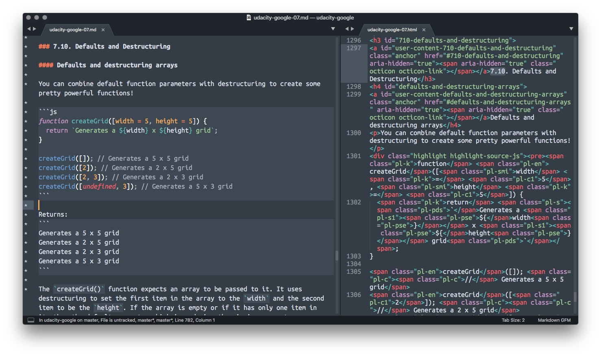

# Markdown guide

Brendon Smith ([br3ndonland](https://github.com/br3ndonland))

## Table of Contents <!-- omit in toc -->

- [Markdown syntax](#markdown-syntax)
  - [Syntactic suggestions](#syntactic-suggestions)
  - [General Markdown resources](#general-markdown-resources)
- [Markdown apps](#markdown-apps)
  - [Text editors](#text-editors)
  - [IDEs](#ides)
  - [Note apps](#note-apps)
  - [In-browser editors](#in-browser-editors)
  - [Social apps](#social-apps)

**Markdown is a simplified HTML syntax.** It has most of the functionality of HTML while being much easier to read, and is very widely used (for example, READMEs on GitHub).

Here's a comparison of the same code written in Markdown and HTML:



## Markdown syntax

### Syntactic suggestions

Suggestions for standardized Markdown formatting have been provided by [markdownlint](https://github.com/DavidAnson/markdownlint) and [Markdown Style Guide](http://www.cirosantilli.com/markdown-style-guide/). Here are a few personal pointers:

#### File extensions

- Several different extensions can be used, including .md, .mdown, and .markdown.
- **I prefer to use .md for brevity and consistency.**

#### Headers

- Create headers with `#`. Each `#` increases header level (`##` is outline level two), up to six levels.
- **For organization, I reserve H1 (`#`) for the title of the file at the top. Major headers begin with H2 (`##`).**
- I use headers to create a **Table of Contents (TOC)** at the beginning of the file.
  - **I add `## Table of Contents` before the TOC for navigation.** I also include `<!-- omit in toc -->`, which tells the VSCode Markdown All In One extension not to put the `## Table of Contents` header itself into the TOC.
  - **I include [(Back to top)](#top) links after each section for easy navigation back to the top of the page.** Simply write `[(Back to top)](#top)`.
  - I add and auto-update TOCs in vscode with the [Markdown All in One](https://marketplace.visualstudio.com/items?itemName=yzhang.markdown-all-in-one) extension.
  - [Markdown All in One](https://marketplace.visualstudio.com/items?itemName=yzhang.markdown-all-in-one), JupyterLab and RStudio provide inline TOC displays ([see below](#jupyterlab)).
  - Prior to vscode, I was adding and updating TOCs with [DocToc](https://github.com/thlorenz/doctoc) from the command line.

#### Text

- **Bold text:** use **double star at beginning and end of text to bold**
- **Italics:** _Single star with no space before and after._ Note that _underscores also work._
- **I prefer to indent Markdown text with two spaces.** Four spaces can be read by some systems as code blocks.

#### Lists

- **Lists should be preceded by a blank line.**
- Single `*`, `-`, or `+` at beginning of line, followed by tab or space.
  - Indent with tab for next outline level
    - Like this

1. Ordered lists
2. Like this
   - And you can add in unordered lists within ordered lists like this.
   - Adding an unordered list within an ordered list requires two levels of indentation.

#### Code

You can include `inline code inside single backticks`

```text
Fenced code blocks inside triple backticks
```

- Code blocks can be indented to match your lists

  ```text
  like this
  ```

- In GitHub-Flavored Markdown, you can specify the language next to the first set of triple backticks for syntax highlighting. Each language has a full name (like `python`), and an abbreviation (like `py`). The full list of supported languages can be found in [GitHub's Linguist repo](https://github.com/github/linguist), which is used to detect languages on GitHub. The _[languages.yml](https://github.com/github/linguist/blob/master/lib/linguist/languages.yml)_ contains a list of the available abbreviations (called "extensions" in the YAML) for each language.

  - Shell: `shell` or `sh`

    ```sh
    git status
    git commit
    ```

  - JavaScript ([_fizzbuzz.js_](/info/fizzbuzz.js), ES6, formatted with [Standard](https://standardjs.com/)): `javascript` or `js`

    ```js
    const fizzBuzz = () => {
      for (let i = 1; i <= 100; i++) {
        let out = ""
        if (i % 3 === 0) out += "Fizz"
        if (i % 5 === 0) out += "Buzz"
        console.log(out || i)
      }
    }
    ```

  - Python ([_fizzbuzz.py_](/info/fizzbuzz.py), Python 3, formatted with [Black](https://black.readthedocs.io/en/stable/)): `python` or `py`

    ```py
    def fizzbuzz():
        """Print 1-100
        Multiples of 3: Fizz
        Multiples of 5: Buzz
        Multiples of 3 and 5: FizzBuzz
        """
        for i in range(1, 101):
            out = ""
            if i % 3 == 0:
                out += "Fizz"
            if i % 5 == 0:
                out += "Buzz"
            print(out or i)
    ```

#### Images

```text
`
```

**I still prefer to use HTML image tags, because they allow for more customization.** In particular, it's useful to set width on SVG.

```text

```


[(Back to top)](#top)

### General Markdown resources

- [MarkdownGuide](https://www.markdownguide.org/)
- [markdownlint syntax suggestions](https://marketplace.visualstudio.com/items?itemName=DavidAnson.vscode-markdownlint)
- [Markdown Style Guide](http://www.cirosantilli.com/markdown-style-guide/)
- [GitHub-Flavored Markdown](https://guides.github.com/features/mastering-markdown/)
- [Dillinger](https://dillinger.io/) is a helpful online Markdown editor with live preview.
- [Turndown](https://domchristie.github.io/turndown/) is an HTML to Markdown converter.
- [Udacity README course](https://www.udacity.com/course/writing-readmes--ud777)

[(Back to top)](#top)

## Markdown apps

### Text editors

Most code editors have extensions for Markdown.

#### Atom

[Atom](https://atom.io/) has good Markdown support. See the [Flight Manual](https://flight-manual.atom.io/using-atom/sections/writing-in-atom/) for instructions.

#### Sublime Text

Here's how to set up Sublime Text for Markdown:

- Install [Sublime Text](http://www.sublimetext.com/)
  - I like the Mariana color scheme and the Adaptive theme.
- Install [Package Control](https://packagecontrol.io/)
- Use Package Control from within Sublime Text to install:
  - MarkdownEditing
  - Markdown Preview
  - MarkdownLivePreview: Has some issues with lack of wrapping in the previews. See [GitHub Issue tracker](https://github.com/math2001/MarkdownLivePreview/issues/34).

#### Visual Studio Code (vscode)

**In my opinion, vscode is currently the best editor for working with Markdown.** Here's why:

- [Markdown All in One](https://marketplace.visualstudio.com/items?itemName=yzhang.markdown-all-in-one)
  - TOC auto-generation and update
  - Live TOC in explorer panel
  - Easier keyboard shortcuts than Sublime Text (with the exception of hyperlink insertion, which I added with a [keybinding](https://github.com/neilsustc/vscode-markdown/issues/20))
- [markdownlint](https://marketplace.visualstudio.com/items?itemName=DavidAnson.vscode-markdownlint)
  - Lints Markdown files based on style recommendations for standardizing code.
- Built in live preview
  - The [Markdown preview can be extended](https://code.visualstudio.com/Docs/languages/markdown#_extending-the-markdown-preview) with custom CSS. The CSS must be placed within the current workspace folder. There isn't yet support for absolute file paths to the CSS, but this feature has been [requested](https://github.com/Microsoft/vscode/issues/65837). I have also tried using an HTTPS link to a GitHub Gist, but haven't had success with that yet.

Full vscode configuration is available via [Settings Sync](https://marketplace.visualstudio.com/items?itemName=Shan.code-settings-sync) with [this public GitHub gist](https://gist.github.com/br3ndonland/01b625629ef98ec7a919a7b927d0ddaf).

See [Markdown and Visual Studio Code](https://code.visualstudio.com/Docs/languages/markdown) for more info.

[(Back to top)](#top)

### IDEs

IDE = Integrated Development Environment

#### JupyterLab

[JupyterLab](http://jupyterlab.readthedocs.io/en/latest/) is produced by [Project Jupyter](http://jupyter.org/). It is most widely used for scientific computing with Python, but supports many programming languages. It allows you to create "reproducible computational narratives," containing Markdown text interspersed with code chunks that you can run. JupyterLab has [some awesome features](https://blog.jupyter.org/jupyterlab-is-ready-for-users-5a6f039b8906) and was previously Jupyter notebook.

I would suggest using [JupyterLab](https://jupyterlab.readthedocs.io/en/stable/) within a Pipenv virtual environment. I use the [Homebrew](https://brew.sh) package manager on macOS to install Python 3, the [Pipenv](https://pipenv.readthedocs.io/en/latest/) virtual environment tool, and [Jupyter](https://jupyter.org). Here are some setup instructions:

- Install Homebrew from the command line as described on the [Homebrew website](https://brew.sh).
- After installing Homebrew, install the necessary Homebrew packages from the command line:

  ```sh
  brew install python3
  brew install pipenv
  brew install jupyter
  ```

- Once installation of Homebrew and its packages is complete, navigate to the desired directory, or [clone a repository from GitHub](https://help.github.com/articles/cloning-a-repository/).

  ```sh
  cd path/to/a/directory
  git clone
  ```

- Finally, install the virtual environment with Pipenv, which includes [JupyterLab](https://jupyterlab.readthedocs.io/en/stable/getting_started/installation.html) and the other necessary packages, and launch JupyterLab to run the Jupyter Notebook.

  ```sh
  cd tdi-proposal
  pipenv install
  pipenv shell
  # Install any JupyterLab extensions at this point
  (pipenv) $ jupyter labextension install @jupyterlab/toc
  # Launch JupyterLab
  (pipenv) $ jupyter lab
  ```

I previously used [Anaconda](https://www.anaconda.com/) to manage my Python and R distributions, and now use Homebrew. I switched because Anaconda is not as flexible or general as Homebrew, not as important for virtual environments now that we have Pipenv, and is a very large installation that is difficult to manage and uninstall.

For examples of how to use Jupyter Notebook/JupyterLab, you can check out my [Udacity Full Stack Web Developer Nanodegree program repo](https://github.com/br3ndonland/udacity-fsnd).

#### RStudio

- [RStudio](https://www.rstudio.com/) is an IDE for the R programming language, used mostly for statistics and data science.
- Like JupyterLab, R Markdown documents contain Markdown text with functional R code chunks.
- I have provided an example of scientific data analysis with R Markdown on [GitHub](https://github.com/br3ndonland/R-proteomics-Nrf1).

[(Back to top)](#top)

### Note apps

Also see [Notable's comparison table](https://raw.githubusercontent.com/fabiospampinato/notable/master/resources/comparison/table.png).

#### [Bear](https://bear.app/)

##### Bear pros

- This is one of the best Markdown note apps.
- Supports Markdown. Uses a modified syntax called Polar Bear.
- Tags and subtags (nested tags)
- Untagged notes easily identified
- Themes
- Syntax highlighting
- Supports internal relative links
- Evernote migration and import (though not perfect-see cons below)
- Writing tools, like word counts and read time
- Reasonably-priced subscription plan

##### Bear cons

- Apple only (macOS, iOS, iCloud), with [no plans to support Android](https://bear.app/faq/What%20about%20Bear%20for%20web,%20Android,%20or%20Windows/).
- Not encrypted
- Collaboration features could be better. No shared notebooks.
- Sidebar should be more condensed.
- Web clipper needs some work. Doesn't properly capture text on all sites.
- Evernote import doesn't convert Evernote internal note links to Bear note links. Joplin also has this same issue, and it's a major barrier for switching from Evernote.

#### [Day One](https://dayoneapp.com/)

##### Day One pros

- Day One [supports Markdown](http://help.dayoneapp.com/tips-and-tutorials/markdown-guide).

##### Day One cons

- Subscription service
- Google Drive sync requires Google login, so you can't use it if you have [Advanced Protection](https://landing.google.com/advancedprotection/) enabled.

#### [Dropbox Paper](https://www.dropbox.com/paper)

##### Dropbox Paper pros

- Markdown export
- Collaboration
- Sync
- Embedding works well

##### Dropbox Paper cons

- Paper files don't show up in your regular Dropbox file structure
- No tags
- No themes
- No internal linking
- Only has H1-H2. H3 shows up as bold when downloading Markdown files.
- PDFs embedded in Dropbox Paper documents don’t lead to the actual PDF when clicked, in the mobile apps.
- PDF thumbnails are too large when inserted as single PDFs. When two or more files are inserted, the thumbnails are next to each other and the size is more reasonable. Needs a "view as attachment" option like Evernote.

#### [iA Writer](https://ia.net/writer)

iA = information Architects

##### iA Writer pros

- Cross-platform
- Light/dark themes
- Currently just a one-time payment model, though that will probably change.

##### iA Writer cons

- Lacks some of the features of Bear
- No syntax highlighting
- Multimedia?
- Evernote import?

#### [Inkdrop](https://www.inkdrop.info/)

##### Inkdrop pros

- [Features](https://www.inkdrop.info/features):
  - Markdown
  - Themes
  - Encryption
  - Cross-platform. Seems to be like Bear, but cross-platform.
  - Check out the developer's [Medium blog](https://blog.inkdrop.info).

##### Inkdrop cons

- Subscription plan
- Android app has poor reviews (~3.3 rating)

#### [Joplin](https://joplin.cozic.net/)

##### Joplin pros

- Open-source
- Desktop is Electron, mobile is React Native.
- Flexible cloud sync
- Markdown format
- Evernote import

##### Joplin cons

- Evernote to Joplin migration not ideal (see below).
- Documentation on the website is okay, but [contributing guidelines](https://github.com/laurent22/joplin/blob/master/CONTRIBUTING.md) are not well delineated. The code and stack should be clearly explained so people can easily contribute. I should know roughly where I need to go in the codebase to add a feature.
- Laurent Cozic only makes \$60/month on Patreon. Not sustainable.

##### Evernote to Joplin migration

- Tried this on 201809
- Export Evernote notebook to .enex.
- Joplin -> Import -> ENEX
  - Images came through
  - Formatting generally came through well.
- Updates needed
  - Critical
    - **Internal note links import as Evernote links, not Joplin links. This is a critical issue for me.**
      - Example:
        - Joplin internal note link: `:/cddf8681528148b9aad5077198e58a4a`
        - Evernote internal note link: `evernote:///view/6168869/s55/426ec3ae-6cad-48c7-aab3-b300845063ef/426ec3ae-6cad-48c7-aab3-b300845063ef/`
    - Links sometimes also just lead to the top note result in the notebook, rather than the specific note needed.
    - Note URL not yet available (issue #[427](https://github.com/laurent22/joplin/issues/427)). This will be important for clipped news articles.
    - Bold text comes through as big section breaks (see issue #[767](https://github.com/laurent22/joplin/issues/767))
      - I had to un-bold all the headers I put into my notes.
  - Enhancements
    - Evernote code blocks not transferring in as Markdown code blocks.
    - Markdown TOC (issue #[478](https://github.com/laurent22/joplin/issues/478))
    - Searching in notes: The search bar only searches notes, but doesn't reveal results within the note. See #[382](https://github.com/laurent22/joplin/issues/382).

#### [Jottings](http://jottingsapp.com/)

iOS-only note app with Markdown, tagging, and Dropbox sync.

#### [Journey](https://2appstudio.com/journey/)

##### Journey pros

- Encrypted
- Cross-platform
- Google Drive sync
- Import from Day One, Evernote, etc

##### Journey cons

- Forces Google login before allowing access to app on Mac. This is a problem because Google Drive sync is not allowed when [Google Advanced Protection Program](https://landing.google.com/advancedprotection/) is enabled.
- Subscription options
- Vague Evernote import capabilities

#### [Laverna](https://laverna.cc/)

##### Laverna pros

- Encrypted
- Markdown
- Multimedia
- Internal linking
- Make tags with #tag
- Open source
- Built with Electron

##### Laverna cons

- Evernote import?
- No Android app yet
- No dark themes yet
- No Markdown TOC
- Development coming along slowly

#### [Notable](https://github.com/fabiospampinato/notable)

Heard about Notable via the [Changelog weekly email #238](https://email.changelog.com/t/t-614770D9C810C3FD2540EF23F30FEDED).

##### Notable pros

From the [README](https://github.com/fabiospampinato/notable/blob/master/README.md):

> The markdown-based note-taking app that doesn't suck.
>
> I couldn't find a note-taking app that ticked all the boxes I'm interested in: notes are written and rendered in GitHub-flavored Markdown, no WYSIWYG, no proprietary formats, I can run a search & replace across all notes, notes support attachments, the app isn't bloated, the app has a pretty interface, tags are indefinitely nestable and can import Evernote notes (because that's what I was using before).
>
> So I built my own.

The developer has made extensive comparisons with other note apps. See [Notable's comparison table](https://raw.githubusercontent.com/fabiospampinato/notable/master/resources/comparison/table.png).

##### Notable cons

- No mobile app yet

#### [Simplenote](https://simplenote.com/)

From WordPress

##### Simplenote pros

- Markdown support

##### Simplenote cons

- Evernote import?
- Multimedia?

#### [Standard Notes](https://standardnotes.org/getting-started)

##### Standard Notes pros

- Simple, dependable text note app
- Note tagging
- Themes like solarized and dark
- Extensions to add features like Markdown
- Encrypted
- Backup to Dropbox and Google Drive
- "Built to last"

##### Standard Notes cons

- User interface is generally not intuitive.
  - The Account -> Encryption section says "8/8 notes and tags encrypted." Why would I want to combine the number of notes with the number of tags?
- Very difficult to even figure out how to log in to my account online. Apparently there are separate accounts for the web app and premium? I think it's the [dashboard](https://dashboard.standardnotes.org/).
- Extensions make it way too confusing.
  - I have to select different editors? I don't want a different editor for every task, I want to use one editor for all tasks.
  - Extensions used to only work on desktop and web (they now work on mobile apparently).
- Attachments
  - Can't attach files from mobile devices.
  - Not great with multimedia. Tried to drag and drop a movie, and it just displayed the movie instead of my notes.
- [Evernote import](https://standardnotes.org/evernote):
  - Formatting, images, and attachments will not be copied over.
  - Have to break up .enex into 250 MB segments.
  - Import is not intuitive. Importing anything goes through import backup, but most imports are not backups.
  - **Doesn't do a good job of Evernote HTML to Markdown conversion.** Loses file attachments and lists, doesn't recognize headers. The options are either retain HTML, or strip all formatting.
  - My response to email survey:
    > _Have you ever tried Standard Notes Extended?_
    > No. If I became a regular user, I would happily pay for Extended. I'm not regularly using Standard Notes because I'm heavily invested in Evernote. I've been using it for six years, and have a 4 GB database with ~4400 tagged notes. I would love to migrate from Evernote to another service, converting from rich text to Markdown and encrypting my data, while keeping my multimedia attachments. Bear is one example of this type of migration, but I don't use Bear because it's Apple-only.

#### [Trilium Notes](https://github.com/zadam/trilium)

Heard about Trilium via the [Changelog weekly email #237](https://email.changelog.com/t/t-2599C05F2D5B961E2540EF23F30FEDED).

##### Trilium pros

- Evernote import: I haven't tried it yet, so I can't comment on import of formatting, internal links, etc.
- Code editing with syntax highlighting
- Also supports mind mapping
- Encryption

##### Trilium cons

- Work in progress
- No mobile app yet

#### [Turtl](https://turtlapp.com/)

[Turtl blog on Tumblr](http://turtlapp.tumblr.com/)

##### Turtl pros

- Promising encrypted Evernote alternative
- Evernote import coming in 0.6.5
- Markdown
- Sharing
- Some multimedia support
- Android app

##### Turtl cons

- Still needs more development, and development has been very slow.
- Not sure how dependable this app will be. The developers don't even own a MacBook.
- No dark themes yet

#### [Typora](https://typora.io/)

##### Typora pros

- File list panel, allowing you to use any cloud service to sync.
- CSS configurable
- Support for images
- Document export
- Footnote feature is cool

##### Typora cons

- Feature-poor
- Not for android
- If it’s not for mobile and not multimedia, what’s the point beyond Sublime Text? Or Dillinger?

#### [Ulysses](https://ulyssesapp.com/)

##### Ulysses pros

- Nice interface
- Markdown
- Dark themes
- Can also manage journal articles and research

##### Ulysses cons

- Apple only (macOS/iOS)
- Encryption?
- Moved to subscription model
- Maintains article tags as "keywords," a fatal flaw shared by other apps like [Papers](https://www.readcube.com/papers/). See my notes on citation managers in [this public GitHub Gist](https://gist.github.com/br3ndonland/8d4a9853922b475918faf1687163e7fc)

### In-browser editors

- [Dillinger](https://dillinger.io/): In-browser Markdown editor with live preview.
- [GitBook](https://www.gitbook.com/): Online platform for writing documentation. It combines and converts Markdown files into multimedia-enabled notebooks, like book chapters.
- [Gnotes](https://notes.giggy.com/): Write Markdown, save to Dropbox, see in Evernote. One-way only.
- [Markdown Here](https://markdown-here.com/index.html): Allows Markdown formatting for in-browser web apps like Gmail. See [GitHub](https://github.com/adam-p/markdown-here).
- [Marxico](http://marxi.co/):
  - In-browser Markdown editor based on Dillinger.
  - Works with images.
  - Has live TOC.
  - Renders well on mobile browsers, but only selection capability available is "select all".
  - May not have seamless integration with Evernote. See [discussion on Evernote forums](https://discussion.evernote.com/topic/99861-native-markdown-support/?do=findComment&comment=448394).
- [StackEdit](https://stackedit.io/): In-browser Markdown editor with live preview. Uses PageDown, the engine powering the Markdown capabilities of the Stack Exchange forums.
- Udacity discussion forums: You can use Markdown formatting in your forum posts.

[(Back to top)](#top)

### Social apps

#### Gitter

[Gitter](https://gitter.im/) uses Markdown formatting for chats. See their [Markdown basics](https://gitter.zendesk.com/hc/en-us/articles/200176682-Markdown-basics) support article.

#### ~~Slack~~

Slack uses a simplified pseudo-Markdown to format messages. I call it "slackdown." On the [Slack "Format your messages" page](https://get.slack.help/hc/en-us/articles/202288908-Format-your-messages), Slack states that it will not be building in full Markdown capabilities.

[(Back to top)](#top)
